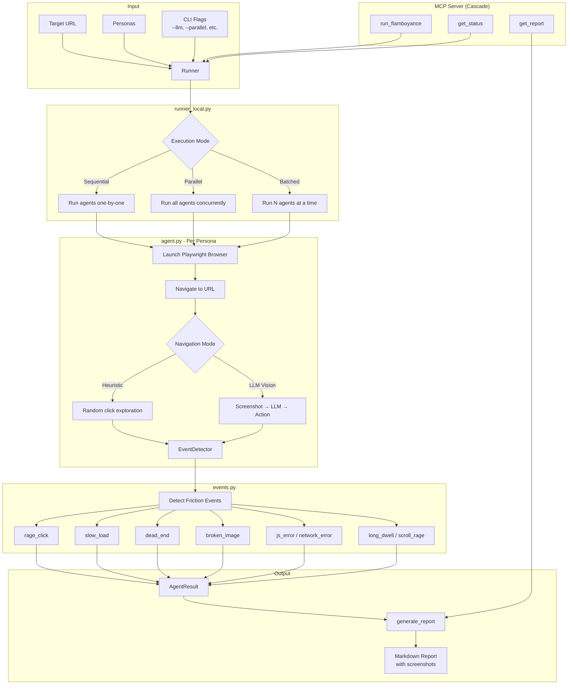

# flamboyance
noun: a group of flamingos


**Playwright-driven synthetic personas** that browse a web app, record UX friction, and expose tools via **MCP** for Cascade integration.

```
┌─────────────────────────────────────────────────────────────────┐
│  agents/           Playwright personas · local runner · reports │
│  flamboyance_mcp/  FastMCP tools (stdio or HTTP)               │
│  docker/           Agent + MCP images (compose)                │
└─────────────────────────────────────────────────────────────────┘
```

## Layout

| Path | Purpose |
| --- | --- |
| `agents/` | Personas, `runner_local`, `runner_mutation`, single-agent `agent` module, event detection, Markdown reports. |
| `flamboyance_mcp/` | `python -m flamboyance_mcp` — FastMCP server (`run_simulation`, `get_live_feed`, `get_report`, `stop_simulation`, `run_mutation_test_tool`). |
| `docker/` | `Dockerfile.agent` + `docker-compose.yml` for containerized agents / MCP HTTP. |
| `tests/` | `pytest` for agent report/persona/events. |

**Python dependencies** are declared in [`pyproject.toml`](./pyproject.toml) (`playwright`, `mcp[cli]`, `pydantic`).

---

## How It Works



### Flow Summary

1. **Input** — Target URL, persona selection, execution options
2. **Runner** — `runner_local.py` orchestrates execution (sequential, parallel, or batched)
3. **Agent** — Each persona launches a Playwright browser and navigates using heuristics or LLM vision
4. **Detection** — `EventDetector` monitors for UX friction patterns (rage clicks, slow loads, dead ends, etc.)
5. **Output** — Results aggregated into a Markdown report with screenshots
6. **MCP** — Tools exposed via MCP for Cascade integration

---

## Install

```bash
git clone <this-repo>
cd flamboyance
python3 -m pip install -e .
```

## CLI Reference

### Runner (Multiple Personas)

```bash
# Basic: run all personas sequentially
python -m agents.runner_local --url http://localhost:5173

# Watch browser (non-headless)
python -m agents.runner_local --url http://localhost:5173 --no-headless

# Run specific personas
python -m agents.runner_local --url http://localhost:5173 --personas frustrated_exec power_user

# Parallel execution (heuristic mode only)
python -m agents.runner_local --url http://localhost:5173 --parallel

# Batched execution (3 agents at a time, works with LLM too)
python -m agents.runner_local --url http://localhost:5173 --batch-size 3

# LLM vision mode (intelligent navigation)
python -m agents.runner_local --url http://localhost:5173 --llm

# Full test: heuristic + LLM modes for all personas
python -m agents.runner_local --url http://localhost:5173 --full

# Combined: all agents, batches of 3, browser visible, LLM mode, save to results/
python -m agents.runner_local --url http://localhost:5173 --llm --batch-size 3 --no-headless --output results
```

### Runner Flags

| Flag | Description |
|------|-------------|
| `--url URL` | Target URL (required) |
| `--personas NAME...` | Specific personas to run (default: all) |
| `--timeout N` | Per-agent timeout in seconds (default: 60) |
| `--no-headless` | Show browser window |
| `--output DIR` | Save reports to directory (default: `results/`) |
| `--llm` | Use LLM vision model for navigation |
| `--max-llm-calls N` | Max LLM calls per agent (default: 30) |
| `--parallel` | Run all heuristic agents in parallel |
| `--batch-size N` | Run agents in parallel batches of N |
| `--full` | Run both heuristic and LLM modes |
| `--quick` | Quick demo mode (2 personas, 30s timeout, ~45s total) |

### Quick Demo

```bash
# Pre-flight check (run before demos)
./scripts/demo-check.sh http://localhost:5173

# Quick demo (~45 seconds, LLM mode)
python -m agents.runner_local --url http://localhost:5173 --llm --quick

# Instant demo (heuristic mode, no API key needed)
python -m agents.runner_local --url http://localhost:5173 --quick
```

### Single Agent

```bash
# Quick test with one persona
python -m agents.agent --url http://localhost:5173 --persona frustrated_exec

# With browser visible
python -m agents.agent --url http://localhost:5173 --persona frustrated_exec --no-headless

# With LLM vision
python -m agents.agent --url http://localhost:5173 --persona frustrated_exec --llm
```

> **Note:** Single agent outputs JSON to stdout. Use `runner_local` to save reports to files.

## Cascade Integration

Add to your Windsurf MCP config (`~/.windsurf/mcp_config.json` on macOS):

```json
{
  "mcpServers": {
    "flamboyance": {
      "command": "python3",
      "args": ["-m", "flamboyance_mcp"],
      "cwd": "/path/to/flamboyance"
    }
  }
}
```

Restart Windsurf — Cascade will have access to:

| Tool | Description |
|------|-------------|
| `run_flamboyance` | Start UX friction test (LLM mode, batched) |
| `get_status` | Poll for progress/completion |
| `get_report` | Generate full Markdown report |
| `stop_simulation` | Cancel running test |
| `run_mutation_test_tool` | Test with UI mutations |

---

## Docker

From `docker/`:

```bash
TARGET_URL=http://host.docker.internal:3000 docker compose up
```

Build context must include `agents/` and `flamboyance_mcp/` (see `Dockerfile.agent`). Compose defines several agent services plus an `mcp-server` on port **8765**.

---

## Built-in Personas

| Name | Patience | Tech Literacy | Special Behavior |
|------|----------|---------------|------------------|
| `frustrated_exec` | 0.2 | 0.8 | Early exit (30%) |
| `non_tech_senior` | 0.5 | 0.2 | Skips hidden menus |
| `power_user` | 0.9 | 0.9 | — |
| `casual_browser` | 0.5 | 0.5 | — |
| `anxious_newbie` | 0.3 | 0.3 | Early exit, skips hidden |
| `methodical_tester` | 0.95 | 0.6 | 100 max actions |
| `mobile_commuter` | 0.25 | 0.85 | Mobile viewport (375x667) |
| `accessibility_user` | 0.7 | 0.35 | Prefers visible text |

**Behaviors:** Patience < 0.4 triggers early exit; tech literacy < 0.5 skips collapsed menus.

---

## Mutation Testing

Test how personas behave when UI elements are broken, hidden, or degraded:

```bash
# Use a built-in mutation scenario
python -m agents.runner_mutation --url http://localhost:3000 --mutation broken_checkout

# Use a custom mutation scenario (JSON)
python -m agents.runner_mutation --url http://localhost:3000 \
  --mutation '{"name": "custom", "hide": ["#checkout-btn"], "disable": [".nav"]}'
```

**Built-in scenarios:** `broken_checkout`, `no_nav`, `slow_submit`, `disabled_forms`, `hidden_cta`

---

## Testing

```bash
python3 -m pip install -e ".[dev]"
python3 -m pytest tests/ -v
```

---

## Benchmarking

```bash
python -m benchmark.run_benchmark --list      # List test apps
python -m benchmark.run_benchmark             # Run all
python -m benchmark.analyze                   # Analyze results
```

See [`benchmark/README.md`](./benchmark/README.md) for methodology.
