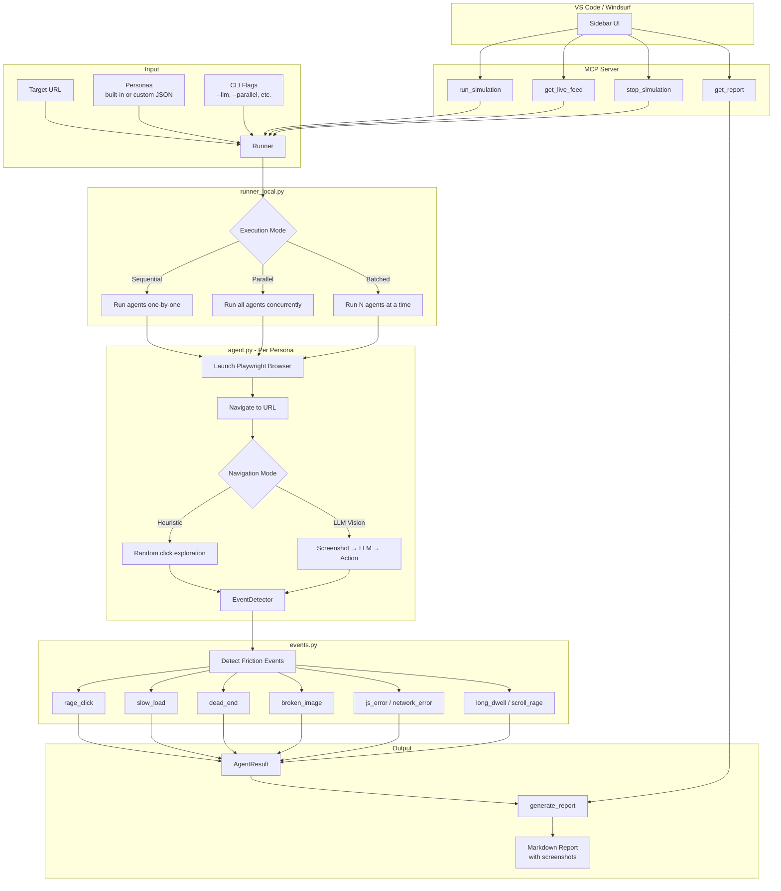

# Flamboyance


**Playwright-driven synthetic personas** that browse a web app, record UX friction, and expose tools via **MCP** plus a **VS Code / Windsurf** sidebar.

```
┌─────────────────────────────────────────────────────────────────┐
│  agents/           Playwright personas · local runner · reports │
│  mcp/              FastMCP tools (stdio or HTTP)               │
│  extension/        VS Code webview + MCP client                │
│  docker/           Agent + MCP images (compose)                │
└─────────────────────────────────────────────────────────────────┘
```

## Layout

| Path | Purpose |
| --- | --- |
| `agents/` | Personas, `runner_local`, `runner_mutation`, single-agent `agent` module, event detection, Markdown reports. |
| `flamboyance_mcp/` | `python -m flamboyance_mcp` — FastMCP server (`run_simulation`, `get_live_feed`, `get_report`, `stop_simulation`, `run_mutation_test_tool`). |
| `extension/` | TypeScript VS Code extension ("UX Friction Monitor"). |
| `docker/` | `Dockerfile.agent` + `docker-compose.yml` for containerized agents / MCP HTTP. |
| `tests/` | `pytest` for agent report/persona/events. |

**Python dependencies** are declared in [`pyproject.toml`](./pyproject.toml) (`playwright`, `mcp[cli]`, `pydantic`). **`requirements.txt`** only points at that file.

---

## How It Works



### Flow Summary

1. **Input** — User provides a target URL, selects personas (or uses defaults), and sets execution options
2. **Runner** — `runner_local.py` orchestrates execution (sequential, parallel, or batched)
3. **Agent** — Each persona launches a Playwright browser and navigates using heuristics or LLM vision
4. **Detection** — `EventDetector` monitors for UX friction patterns (rage clicks, slow loads, dead ends, etc.)
5. **Output** — Results are aggregated into a Markdown report with annotated screenshots
6. **MCP/Extension** — Tools exposed via MCP for IDE integration (Cascade, sidebar)

---

## Install

```bash
git clone <this-repo>
cd flamboyance
python3 -m pip install -e .
```

## CLI Reference

### Runner (Multiple Personas)

```bash
# Basic: run all personas sequentially
python -m agents.runner_local --url http://localhost:5173

# Watch browser (non-headless)
python -m agents.runner_local --url http://localhost:5173 --no-headless

# Run specific personas
python -m agents.runner_local --url http://localhost:5173 --personas frustrated_exec power_user

# Parallel execution (heuristic mode only)
python -m agents.runner_local --url http://localhost:5173 --parallel

# Batched execution (3 agents at a time, works with LLM too)
python -m agents.runner_local --url http://localhost:5173 --batch-size 3

# LLM vision mode (intelligent navigation)
python -m agents.runner_local --url http://localhost:5173 --llm

# Full test: heuristic + LLM modes for all personas
python -m agents.runner_local --url http://localhost:5173 --full

# Combined: all agents, batches of 3, browser visible, LLM mode, save to results/
python -m agents.runner_local --url http://localhost:5173 --llm --batch-size 3 --no-headless --output results
```

### Runner Flags

| Flag | Description |
|------|-------------|
| `--url URL` | Target URL (required) |
| `--personas NAME...` | Specific personas to run (default: all) |
| `--personas-file FILE` | JSON file with custom personas |
| `--timeout N` | Per-agent timeout in seconds (default: 60) |
| `--no-headless` | Show browser window |
| `--output DIR` | Save reports to directory (default: `results/`) |
| `--llm` | Use LLM vision model for navigation |
| `--max-llm-calls N` | Max LLM calls per agent (default: 30) |
| `--parallel` | Run all heuristic agents in parallel |
| `--batch-size N` | Run agents in parallel batches of N |
| `--full` | Run both heuristic and LLM modes |

### Single Agent

```bash
# Quick test with one persona
python -m agents.agent --url http://localhost:5173 --persona frustrated_exec

# With browser visible
python -m agents.agent --url http://localhost:5173 --persona frustrated_exec --no-headless

# With LLM vision
python -m agents.agent --url http://localhost:5173 --persona frustrated_exec --llm
```

> **Note:** Single agent outputs JSON to stdout. Use `runner_local` to save reports to files.

### MCP Server

The MCP server exposes Flamboyance tools to AI assistants (Cascade, Claude, etc.) via the Model Context Protocol.

**Prerequisites:**
```bash
cd flamboyance
pip install -e .
```

**Start the server:**
```bash
# Stdio transport (for Cascade / AI assistants)
python -m mcp.server

# HTTP transport (for extension sidebar or remote access)
python -m mcp.server --http
python -m mcp.server --http --port 9000  # custom port
```

**Available tools:**
| Tool | Description |
|------|-------------|
| `run_simulation` | Start UX friction test against a URL |
| `get_live_feed` | Poll real-time agent status |
| `get_report` | Generate Markdown friction report |
| `stop_simulation` | Cancel a running simulation |
| `run_mutation_test_tool` | Test with UI mutations (hidden/disabled elements) |

## VS Code / Windsurf Extension

The extension works in both VS Code and Windsurf with two transport modes:

| Transport | Description | Use Case |
|-----------|-------------|----------|
| **stdio** (default) | Spawns `python -m mcp.server` as child process | Local development |
| **http** | Connects to running MCP server | Docker, remote servers |

### Installation

```bash
cd extension
npm install
npm run compile
```

### Extension Settings

Configure via VS Code/Windsurf settings:

| Setting | Default | Description |
|---------|---------|-------------|
| `flamboyance.transport` | `"stdio"` | Transport mode: `"stdio"` or `"http"` |
| `flamboyance.pythonPath` | `"python3"` | Python executable for stdio transport |
| `flamboyance.httpUrl` | `"http://localhost:8765"` | MCP server URL for http transport |

### Usage

1. Open the Flamboyance sidebar (activity bar icon)
2. Enter target URL and click "Run Simulation"
3. Watch live agent status in the feed
4. Click "Get Report" when done

## Windsurf Cascade Integration

For direct MCP tool access in Cascade (without the sidebar):

1. Copy `mcp_config.json` to your Windsurf MCP config directory:
   - **macOS**: `~/.windsurf/mcp_config.json`
   - **Linux**: `~/.config/windsurf/mcp_config.json`
   - **Windows**: `%APPDATA%\windsurf\mcp_config.json`

2. Or merge into existing config:
   ```json
   {
     "mcpServers": {
       "flamboyance": {
         "command": "python3",
         "args": ["-m", "mcp.server"],
         "cwd": "/path/to/flamboyance"
       }
     }
   }
   ```

3. Restart Windsurf — Cascade will have access to:
   - `run_simulation` — Start UX friction test
   - `get_live_feed` — Poll agent status
   - `get_report` — Generate Markdown report
   - `stop_simulation` — Cancel running test
   - `run_mutation_test_tool` — Test with UI mutations

### IDE Compatibility

| IDE | Sidebar Extension | Cascade MCP Tools |
|-----|-------------------|-------------------|
| VS Code | ✅ (stdio or http) | ❌ (no Cascade) |
| Windsurf | ✅ (stdio or http) | ✅ (via mcp_config.json) |

## Docker

From `docker/`:

```bash
TARGET_URL=http://host.docker.internal:3000 docker compose up
```

Build context must include `agents/` and `mcp/` (see `Dockerfile.agent`). Compose defines several agent services plus an `mcp-server` on port **8765**.

---

## Built-in Personas

| Name | Patience | Tech Literacy | Special Behavior | Goal |
|------|----------|---------------|------------------|------|
| `frustrated_exec` | 0.2 | 0.8 | Early exit (30%) | Complete a purchase flow quickly |
| `non_tech_senior` | 0.5 | 0.2 | Skips hidden menus | Find and read account settings |
| `power_user` | 0.9 | 0.9 | — | Navigate all features and check edge cases |
| `casual_browser` | 0.5 | 0.5 | — | Browse around and see what's available |
| `anxious_newbie` | 0.3 | 0.3 | Early exit, skips hidden | Sign up without getting confused |
| `methodical_tester` | 0.95 | 0.6 | 100 max actions | Systematically check every link and form |
| `mobile_commuter` | 0.25 | 0.85 | Mobile viewport (375x667) | Quickly check order status on the go |
| `accessibility_user` | 0.7 | 0.35 | Prefers visible text | Navigate using clear labels and affordances |

**Derived behaviors:**
- **Patience < 0.4** triggers early give-up (exits after `early_exit_fraction` of timeout)
- **Tech literacy < 0.5** skips elements with `aria-expanded="false"` (collapsed menus)
- **`prefers_visible_text`** skips icon-only / unlabeled buttons

## Custom Personas

Load personas from a JSON file without editing code:

```bash
python -m agents.runner_local --url http://localhost:3000 --personas-file my_personas.json
```

File format:

```json
{
  "personas": [
    {
      "name": "my_custom",
      "patience": 0.4,
      "tech_literacy": 0.7,
      "goal": "Test the checkout flow",
      "viewport": [375, 667],
      "prefers_visible_text": true
    }
  ]
}
```

Custom personas merge with built-ins; same-name entries override.

## Mutation Testing

Test how personas behave when UI elements are broken, hidden, or degraded:

```bash
# Use a built-in mutation scenario
python -m agents.runner_mutation --url http://localhost:3000 --mutation broken_checkout

# Use a custom mutation scenario (JSON)
python -m agents.runner_mutation --url http://localhost:3000 \
  --mutation '{"name": "custom", "hide": ["#checkout-btn"], "disable": [".nav"]}'
```

### Built-in Mutation Scenarios

| Name | Effect |
|------|--------|
| `broken_checkout` | Hides checkout buttons |
| `no_nav` | Removes navigation elements |
| `slow_submit` | Adds 3s delay to form submissions |
| `disabled_forms` | Disables all form inputs |
| `hidden_cta` | Hides call-to-action buttons |

### MCP Tool

The `run_mutation_test_tool` MCP tool allows mutation testing via Cascade:

```python
# Example: Test with hidden checkout button
await run_mutation_test_tool(
    url="http://localhost:3000",
    mutations={"name": "test", "hide": ["#checkout-btn"]},
    personas=["frustrated_exec"],
    llm_mode=True,
)
```

### Mutation Schema

```python
MutationScenario(
    name="example",
    hide=["#selector"],           # visibility: hidden
    disable=[".selector"],        # pointer-events: none
    remove=["nav"],               # remove from DOM
    delay_clicks={"button": 3000} # delay clicks by ms
)
```

---

## Testing

```bash
python3 -m pip install -e ".[dev]"
python3 -m pytest tests/ -v
```

Tests cover report shape, persona validation, frustration event detection, custom persona loading, and mutation scenarios (`tests/test_report.py`, `tests/test_persona.py`, `tests/test_events.py`, `tests/test_persona_loader.py`, `tests/test_mutations.py`).
