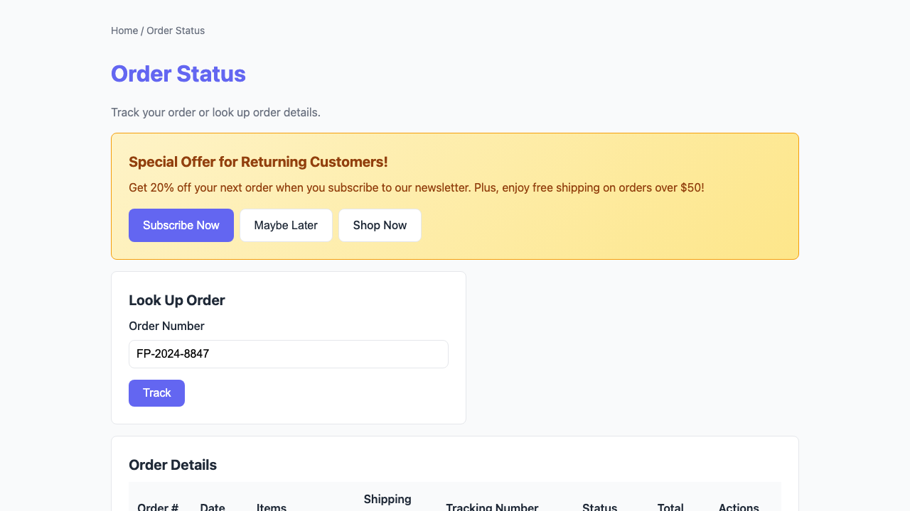
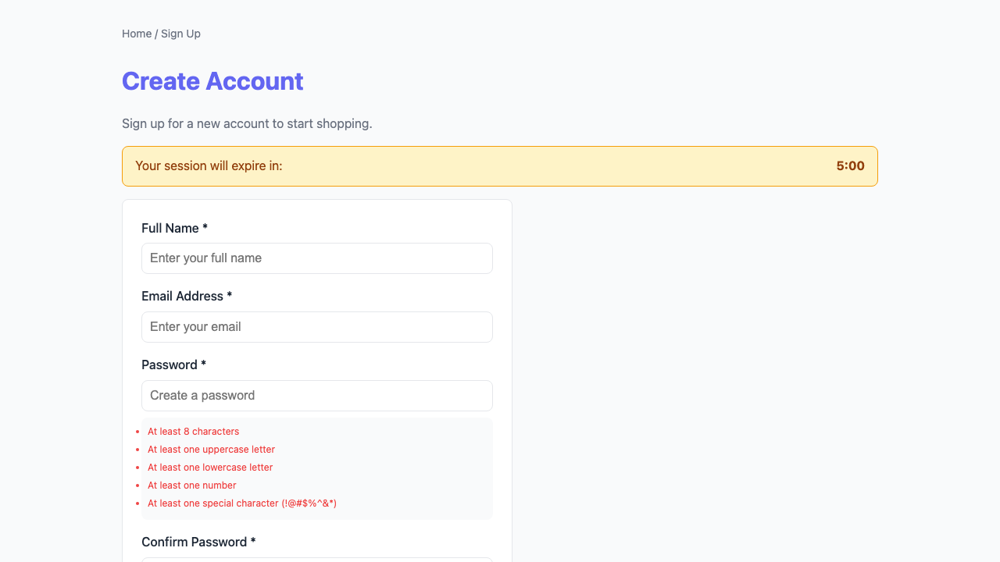
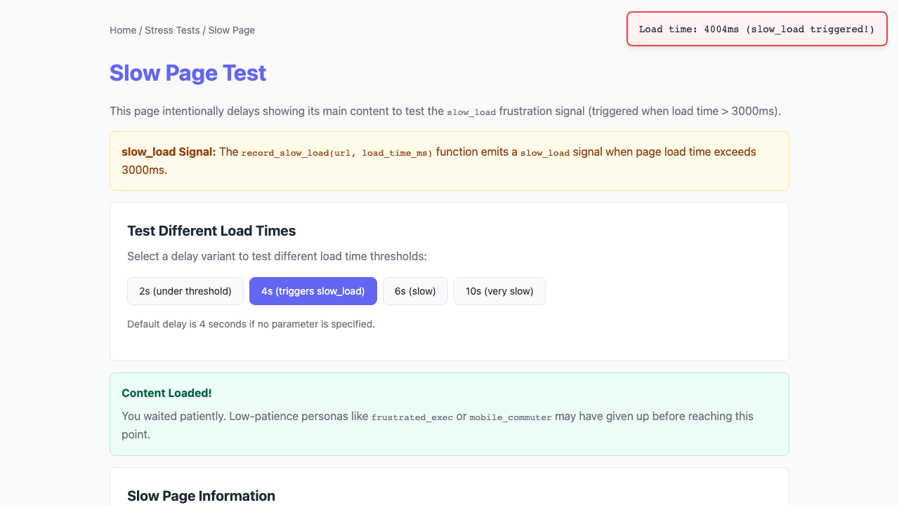

# Flamboyance UX Friction Report

- **Run ID:** `40a2bc5f-b231-4991-8b70-c636212e1228`
- **Target URL:** http://localhost:5173
- **Status:** done
- **Agents:** 8
- **Total friction events:** 16
- **Generated:** 2026-04-25 21:17:55 UTC

## Executive Summary

**Issues found:** 🔴 8 critical | 🟡 8 medium

**Top issues to address:**

1. 🔴 **unmet_goal**: Unmet goal (gave up): Complete a purchase flow quickly
2. 🔴 **unmet_goal**: Unmet goal (timeout): Find and read account settings
3. 🔴 **unmet_goal**: Unmet goal (timeout): Navigate all features and check edge cases

## Recommendations

- **rage_decoy** (8x): Either make this element interactive or remove clickable styling (cursor:pointer, hover effects).
- **unmet_goal** (8x): Review the user flow for this goal and remove friction points.

## Issues by Severity

### 🔴 Critical (8)

| Event | Description | URL | Persona |
|-------|-------------|-----|---------|
| unmet_goal | Unmet goal (gave up): Complete a purchase flow quickly |  | frustrated_exec |
| unmet_goal | Unmet goal (timeout): Find and read account settings |  | non_tech_senior |
| unmet_goal | Unmet goal (timeout): Navigate all features and check edge cases |  | power_user |
| unmet_goal | Unmet goal (timeout): Browse around and see what's available |  | casual_browser |
| unmet_goal | Unmet goal (gave up): Sign up for an account without getting confused |  | anxious_newbie |
| unmet_goal | Unmet goal (timeout): Systematically check every link and form |  | methodical_tester |
| unmet_goal | Unmet goal (gave up): Quickly check order status while on the go |  | mobile_commuter |
| unmet_goal | Unmet goal (gave up): Navigate using visible labels and clear affordances |  | accessibility_user |

### 🟡 Medium (8)

| Event | Description | URL | Persona |
|-------|-------------|-----|---------|
| rage_decoy | Rage decoy: element 'div:has-text('Persona	Patience	Tech	Target F')' looks click | http://localhost:5173 | frustrated_exec |
| rage_decoy | Rage decoy: element 'div:has-text('Persona	Patience	Tech	Target F')' looks click | http://localhost:5173 | non_tech_senior |
| rage_decoy | Rage decoy: element 'div:has-text('Persona	Patience	Tech	Target F')' looks click | http://localhost:5173 | power_user |
| rage_decoy | Rage decoy: element 'div:has-text('Persona	Patience	Tech	Target F')' looks click | http://localhost:5173 | casual_browser |
| rage_decoy | Rage decoy: element 'div:has-text('Persona	Patience	Tech	Target F')' looks click | http://localhost:5173 | anxious_newbie |
| rage_decoy | Rage decoy: element 'div:has-text('Persona	Patience	Tech	Target F')' looks click | http://localhost:5173 | methodical_tester |
| rage_decoy | Rage decoy: element 'div:has-text('Persona	Patience	Tech	Target F')' looks click | http://localhost:5173 | mobile_commuter |
| rage_decoy | Rage decoy: element 'div:has-text('Persona	Patience	Tech	Target F')' looks click | http://localhost:5173 | accessibility_user |

## Agent Summary

| Persona | Status | Events | Critical | High | Elapsed |
|---------|--------|--------|----------|------|---------|
| frustrated_exec | gave_up | 2 | 1 | 0 | 23.2s |
| non_tech_senior | done | 2 | 1 | 0 | 65.2s |
| power_user | done | 2 | 1 | 0 | 61.0s |
| casual_browser | done | 2 | 1 | 0 | 62.2s |
| anxious_newbie | gave_up | 2 | 1 | 0 | 12.2s |
| methodical_tester | done | 2 | 1 | 0 | 61.2s |
| mobile_commuter | gave_up | 2 | 1 | 0 | 18.8s |
| accessibility_user | done | 2 | 1 | 0 | 35.8s |

## Agent: frustrated_exec

- **Status:** gave_up
- **Elapsed:** 23.2s

### LLM Navigation Stats

- **LLM Calls:** 3
- **Tokens Used:** 116

### Navigation Path

1. http://localhost:5173
2. http://localhost:5173/
3. http://localhost:5173/order-status/

### Frustration Events

- 🔴 **unmet_goal** (critical): Unmet goal (gave up): Complete a purchase flow quickly
- 🟡 **rage_decoy** (medium): Rage decoy: element 'div:has-text('Persona	Patience	Tech	Target F')' looks clickable (clickable class name, button-like styling) but is not interactive

### Action History

| # | Action | Target | Result |
|---|--------|--------|--------|
| 1 | click | [320, 180] | clicked at (320, 180) |
| 2 | click | [645, 709] | clicked at (645, 709) |
| 3 | type | text | typed 'text' |

### Visual Evidence

**Page 1:** http://localhost:5173 (1 issue)

**Page 2:** http://localhost:5173/

**Page 3:** http://localhost:5173/order-status/

## Agent: non_tech_senior

- **Status:** done
- **Elapsed:** 65.2s

### LLM Navigation Stats

- **LLM Calls:** 10
- **Tokens Used:** 339

### Navigation Path

1. http://localhost:5173
2. http://localhost:5173/
3. http://localhost:5173/signup/

### Frustration Events

- 🔴 **unmet_goal** (critical): Unmet goal (timeout): Find and read account settings
- 🟡 **rage_decoy** (medium): Rage decoy: element 'div:has-text('Persona	Patience	Tech	Target F')' looks clickable (clickable class name, button-like styling) but is not interactive

### Action History

| # | Action | Target | Result |
|---|--------|--------|--------|
| 1 | click | [460, 595] | clicked at (460, 595) |
| 2 | click | [320, 180] | clicked at (320, 180) |
| 3 | click | [460, 595] | clicked at (460, 595) |
| 4 | click | [0, 180] | clicked at (0, 180) |
| 5 | click | [320, 180] | clicked at (320, 180) |
| 6 | click | [320, 180] | clicked at (320, 180) |
| 7 | click | [460, 595] | clicked at (460, 595) |
| 8 | click | [320, 180] | clicked at (320, 180) |
| 9 | scroll | down | scrolled down |
| 10 | click | [460, 595] | clicked at (460, 595) |

### Visual Evidence

**Page 1:** http://localhost:5173 (1 issue)

**Page 2:** http://localhost:5173/

**Page 3:** http://localhost:5173/signup/

## Agent: power_user

- **Status:** done
- **Elapsed:** 61.0s

### LLM Navigation Stats

- **LLM Calls:** 14
- **Tokens Used:** 539

### Navigation Path

1. http://localhost:5173
2. http://localhost:5173/
3. http://localhost:5173/stress/slow/

### Frustration Events

- 🔴 **unmet_goal** (critical): Unmet goal (timeout): Navigate all features and check edge cases
- 🟡 **rage_decoy** (medium): Rage decoy: element 'div:has-text('Persona	Patience	Tech	Target F')' looks clickable (clickable class name, button-like styling) but is not interactive

### Action History

| # | Action | Target | Result |
|---|--------|--------|--------|
| 1 | click | [0, 180] | clicked at (0, 180) |
| 2 | type | Flambey Playground | typed 'Flambey Playground' |
| 3 | click | [356, 497] | clicked at (356, 497) |
| 4 | click | [0, 0] | clicked at (0, 0) |
| 5 | click | [0, 0] | clicked at (0, 0) |
| 6 | click | [320, 180] | clicked at (320, 180) |
| 7 | click | [364, 579] | clicked at (364, 579) |
| 8 | click | [320, 180] | clicked at (320, 180) |
| 9 | type | text | typed 'text' |
| 10 | click | [364, 579] | clicked at (364, 579) |
| 11 | click | [320, 180] | clicked at (320, 180) |
| 12 | click | [364, 579] | clicked at (364, 579) |
| 13 | click | [320, 180] | clicked at (320, 180) |
| 14 | click | [464, 579] | clicked at (464, 579) |

### Visual Evidence

**Page 1:** http://localhost:5173 (1 issue)

**Page 2:** http://localhost:5173/

**Page 3:** http://localhost:5173/stress/slow/

## Agent: casual_browser

- **Status:** done
- **Elapsed:** 62.2s

### LLM Navigation Stats

- **LLM Calls:** 8
- **Tokens Used:** 284

### Navigation Path

1. http://localhost:5173
2. http://localhost:5173/
3. http://localhost:5173/signup/

### Frustration Events

- 🔴 **unmet_goal** (critical): Unmet goal (timeout): Browse around and see what's available
- 🟡 **rage_decoy** (medium): Rage decoy: element 'div:has-text('Persona	Patience	Tech	Target F')' looks clickable (clickable class name, button-like styling) but is not interactive

### Action History

| # | Action | Target | Result |
|---|--------|--------|--------|
| 1 | click | [450, 603] | clicked at (450, 603) |
| 2 | click | [320, 180] | clicked at (320, 180) |
| 3 | click | [320, 180] | clicked at (320, 180) |
| 4 | click | [450, 603] | clicked at (450, 603) |
| 5 | click | [320, 180] | clicked at (320, 180) |
| 6 | click | [320, 180] | clicked at (320, 180) |
| 7 | click | [450, 603] | clicked at (450, 603) |
| 8 | click | [320, 180] | clicked at (320, 180) |

### Visual Evidence

**Page 1:** http://localhost:5173 (1 issue)

**Page 2:** http://localhost:5173/

**Page 3:** http://localhost:5173/signup/

## Agent: anxious_newbie

- **Status:** gave_up
- **Elapsed:** 12.2s

### LLM Navigation Stats

- **LLM Calls:** 1
- **Tokens Used:** 40

### Navigation Path

1. http://localhost:5173

### Frustration Events

- 🔴 **unmet_goal** (critical): Unmet goal (gave up): Sign up for an account without getting confused
- 🟡 **rage_decoy** (medium): Rage decoy: element 'div:has-text('Persona	Patience	Tech	Target F')' looks clickable (clickable class name, button-like styling) but is not interactive

### Action History

| # | Action | Target | Result |
|---|--------|--------|--------|
| 1 | give_up | Invalid click coordinates | gave up: Invalid click coordinates |

### Visual Evidence

**Page 1:** http://localhost:5173 (1 issue)

## Agent: methodical_tester

- **Status:** done
- **Elapsed:** 61.2s

### LLM Navigation Stats

- **LLM Calls:** 8
- **Tokens Used:** 258

### Navigation Path

1. http://localhost:5173
2. http://localhost:5173/
3. http://localhost:5173/checkout/shipping/

### Frustration Events

- 🔴 **unmet_goal** (critical): Unmet goal (timeout): Systematically check every link and form
- 🟡 **rage_decoy** (medium): Rage decoy: element 'div:has-text('Persona	Patience	Tech	Target F')' looks clickable (clickable class name, button-like styling) but is not interactive

### Action History

| # | Action | Target | Result |
|---|--------|--------|--------|
| 1 | click | [456, 396] | clicked at (456, 396) |
| 2 | click | [0, 0] | clicked at (0, 0) |
| 3 | click | [184, 517] | clicked at (184, 517) |
| 4 | click | [268, 690] | clicked at (268, 690) |
| 5 | click | [320, 180] | clicked at (320, 180) |
| 6 | click | [476, 519] | clicked at (476, 519) |
| 7 | type | user@example.com | typed 'user@example.com' |
| 8 | type | password | typed 'password' |

### Visual Evidence

**Page 1:** http://localhost:5173 (1 issue)

**Page 2:** http://localhost:5173/

**Page 3:** http://localhost:5173/checkout/shipping/

## Agent: mobile_commuter

- **Status:** gave_up
- **Elapsed:** 18.8s

### LLM Navigation Stats

- **LLM Calls:** 2
- **Tokens Used:** 73

### Navigation Path

1. http://localhost:5173
2. http://localhost:5173/

### Frustration Events

- 🔴 **unmet_goal** (critical): Unmet goal (gave up): Quickly check order status while on the go
- 🟡 **rage_decoy** (medium): Rage decoy: element 'div:has-text('Persona	Patience	Tech	Target F')' looks clickable (clickable class name, button-like styling) but is not interactive

### Action History

| # | Action | Target | Result |
|---|--------|--------|--------|
| 1 | click | [0, 0] | clicked at (0, 0) |
| 2 | click | [0, 0] | clicked at (0, 0) |

### Visual Evidence

**Page 1:** http://localhost:5173 (1 issue)

**Page 2:** http://localhost:5173/

## Agent: accessibility_user

- **Status:** done
- **Elapsed:** 35.8s

### LLM Navigation Stats

- **LLM Calls:** 7
- **Tokens Used:** 261

### Navigation Path

1. http://localhost:5173
2. http://localhost:5173/

### Frustration Events

- 🔴 **unmet_goal** (critical): Unmet goal (gave up): Navigate using visible labels and clear affordances
- 🟡 **rage_decoy** (medium): Rage decoy: element 'div:has-text('Persona	Patience	Tech	Target F')' looks clickable (clickable class name, button-like styling) but is not interactive

### Action History

| # | Action | Target | Result |
|---|--------|--------|--------|
| 1 | click | [650, 495] | clicked at (650, 495) |
| 2 | click | [320, 180] | clicked at (320, 180) |
| 3 | click | [650, 495] | clicked at (650, 495) |
| 4 | click | [320, 180] | clicked at (320, 180) |
| 5 | click | [650, 495] | clicked at (650, 495) |
| 6 | click | [320, 180] | clicked at (320, 180) |
| 7 | click | [650, 495] | clicked at (650, 495) |
| 8 | click | [320, 180] | clicked at (320, 180) |
| 9 | click | [650, 495] | clicked at (650, 495) |
| 10 | click | [320, 180] | clicked at (320, 180) |
| 11 | click | [650, 495] | clicked at (650, 495) |
| 12 | click | [320, 180] | clicked at (320, 180) |
| 13 | click | [650, 495] | clicked at (650, 495) |
| 14 | click | [320, 180] | clicked at (320, 180) |
| 15 | click | [650, 495] | clicked at (650, 495) |
| 16 | click | [320, 180] | clicked at (320, 180) |
| 17 | click | [650, 495] | clicked at (650, 495) |
| 18 | click | [320, 180] | clicked at (320, 180) |
| 19 | click | [650, 495] | clicked at (650, 495) |
| 20 | click | [320, 180] | clicked at (320, 180) |
| ... | (30 more actions) | | |

### Visual Evidence

**Page 1:** http://localhost:5173 (1 issue)

**Page 2:** http://localhost:5173/

