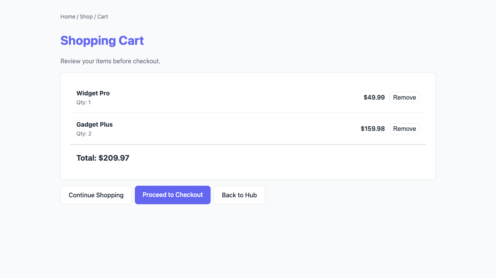
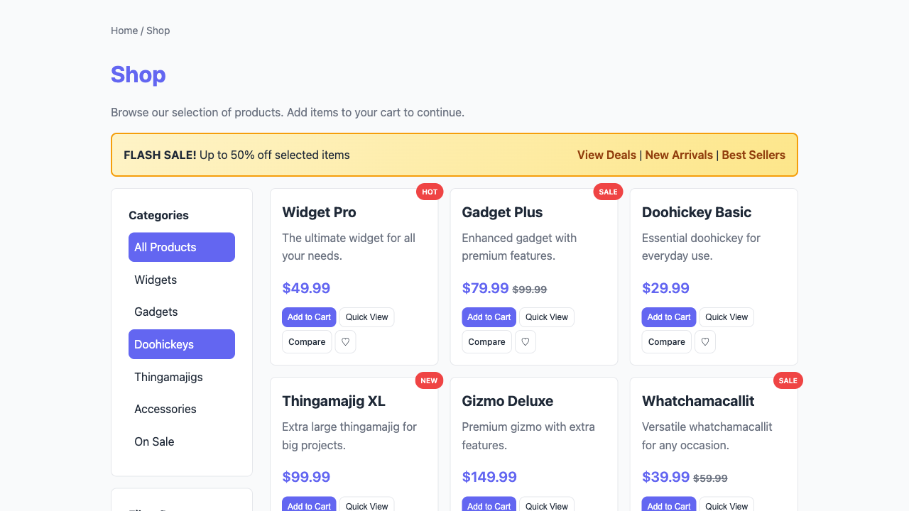
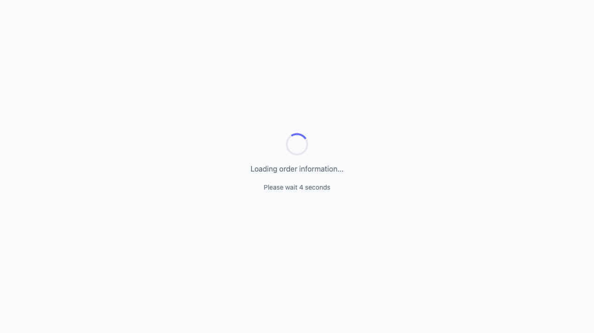

# Flamboyance UX Friction Report

- **Run ID:** `42cb2175-3b2e-400d-88e8-01043145e588`
- **Target URL:** http://localhost:5173
- **Status:** done
- **Agents:** 2
- **Total friction events:** 6
- **Generated:** 2026-04-26 09:53:53 UTC

## Executive Summary

**Issues found:** 🔴 2 critical | 🟠 4 high

**Top issues to address:**

1. 🔴 **unmet_goal**: Unmet goal (gave up): Complete a purchase flow quickly
2. 🔴 **unmet_goal**: Unmet goal (gave up): Navigate all features and check edge cases
3. 🟠 **js_error**: JavaScript error: Failed to load resource: the server responded with a status of 404 (Not Found) (so

## Recommendations

- **js_error** (2x): Fix the JavaScript error. Check the browser console for stack traces.
- **unmet_goal** (2x): Review the user flow for this goal and remove friction points.
- **cart_abandonment** (1x): Simplify checkout flow, show clear pricing, and offer guest checkout option.
- **dead_end** (1x): Add navigation options or call-to-action buttons to this page.

## Issues by Severity

### 🔴 Critical (2)

| Event | Description | Count | URL |
|-------|-------------|-------|-----|
| unmet_goal | Unmet goal (gave up): Complete a purchase flow quickly | 1 | http://localhost:5173/shop/ |
| unmet_goal | Unmet goal (gave up): Navigate all features and check edge c | 1 | http://localhost:5173/order-status/ |

### 🟠 High (4 total, 3 unique)

| Event | Description | Count | URL |
|-------|-------------|-------|-----|
| js_error | JavaScript error: Failed to load resource: the server respon | ×2 | http://localhost:5173/ |
| cart_abandonment | Cart abandonment: user left cart page without completing che | 1 | http://localhost:5173/shop/ |
| dead_end | Dead end: no clickable elements found on page | 1 | http://localhost:5173/order-status/ |

## Agent Summary

| Persona | Status | Events | Critical | High | Elapsed |
|---------|--------|--------|----------|------|---------|
| frustrated_exec | gave_up | 3 | 1 | 2 | 9.7s |
| power_user | done | 3 | 1 | 2 | 4.8s |

## Agent: frustrated_exec

- **Status:** gave_up
- **Elapsed:** 9.7s

### Navigation Path

1. http://localhost:5173
2. http://localhost:5173/cart/
3. http://localhost:5173/shop/

### Frustration Events

- 🔴 **unmet_goal** (critical): Unmet goal (gave up): Complete a purchase flow quickly
- 🟠 **js_error** (high): JavaScript error: Failed to load resource: the server responded with a status of
- 🟠 **cart_abandonment** (high): Cart abandonment: user left cart page without completing checkout

### Visual Evidence

**Page 1:** http://localhost:5173

**Page 2:** http://localhost:5173/cart/

**Page 3:** http://localhost:5173/shop/ (2 issues)

- 🔴 **unmet_goal**: Unmet goal (gave up): Complete a purchase flow quickly
- 🟠 **cart_abandonment**: Cart abandonment: user left cart page without completing checkout

## Agent: power_user

- **Status:** done
- **Elapsed:** 4.8s

### Navigation Path

1. http://localhost:5173
2. http://localhost:5173/order-status/

### Frustration Events

- 🔴 **unmet_goal** (critical): Unmet goal (gave up): Navigate all features and check edge cases
- 🟠 **js_error** (high): JavaScript error: Failed to load resource: the server responded with a status of
- 🟠 **dead_end** (high): Dead end: no clickable elements found on page

### Visual Evidence

**Page 1:** http://localhost:5173

**Page 2:** http://localhost:5173/order-status/ (2 issues)

- 🔴 **unmet_goal**: Unmet goal (gave up): Navigate all features and check edge cases
- 🟠 **dead_end**: Dead end: no clickable elements found on page
