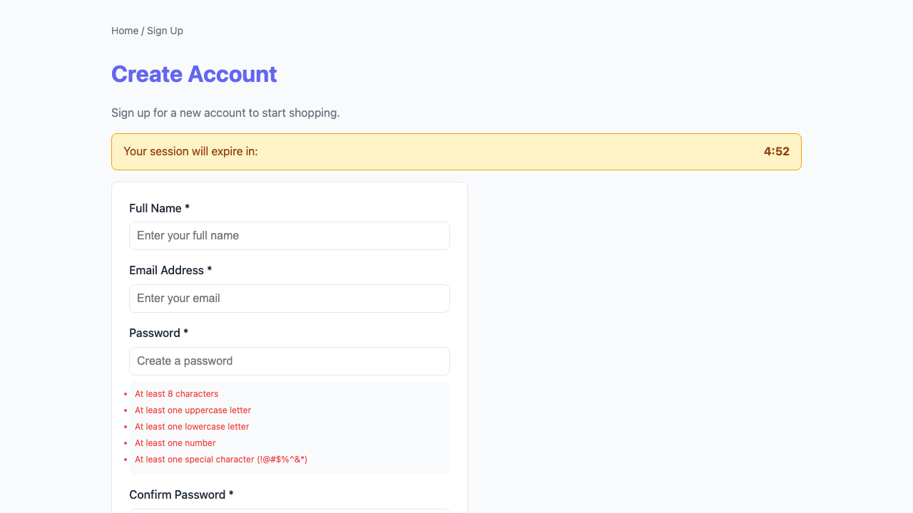
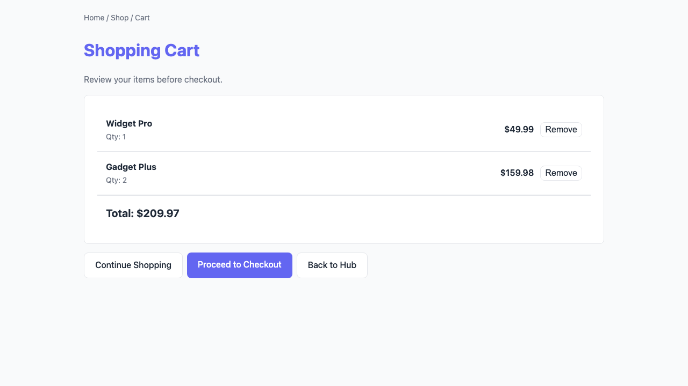
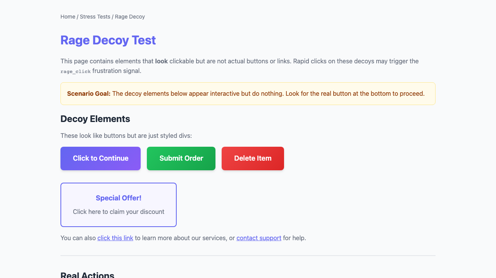

# Flamboyance UX Friction Report

- **Run ID:** `55076885-311b-430a-8e46-d0f5037d2c0f`
- **Target URL:** http://localhost:5173
- **Status:** done
- **Agents:** 11
- **Total friction events:** 14
- **Generated:** 2026-04-25 22:34:01 UTC

## Executive Summary

**Issues found:** 🔴 11 critical | 🟠 1 high | 🟡 2 medium

**Top issues to address:**

1. 🔴 **unmet_goal**: Unmet goal (gave up): Complete a purchase flow quickly
2. 🔴 **unmet_goal**: Unmet goal (timeout): Find and read account settings
3. 🔴 **unmet_goal**: Unmet goal (timeout): Navigate all features and check edge cases

## Recommendations

- **unmet_goal** (11x): Review the user flow for this goal and remove friction points.
- **mobile_tap_target** (2x): Increase tap target size to at least 44x44px. Fix horizontal scroll and viewport issues.
- **network_error** (1x): Ensure API endpoints are available and returning correct responses.

## Issues by Severity

### 🔴 Critical (11)

| Event | Description | URL | Persona |
|-------|-------------|-----|---------|
| unmet_goal | Unmet goal (gave up): Complete a purchase flow quickly |  | frustrated_exec |
| unmet_goal | Unmet goal (timeout): Find and read account settings |  | non_tech_senior |
| unmet_goal | Unmet goal (timeout): Navigate all features and check edge cases |  | power_user |
| unmet_goal | Unmet goal (timeout): Browse around and see what's available |  | casual_browser |
| unmet_goal | Unmet goal (gave up): Sign up for an account without getting confused |  | anxious_newbie |
| unmet_goal | Unmet goal (gave up): Systematically check every link and form |  | methodical_tester |
| unmet_goal | Unmet goal (gave up): Quickly check order status while on the go |  | mobile_commuter |
| unmet_goal | Unmet goal (gave up): Navigate using visible labels and clear affordances |  | accessibility_user |
| unmet_goal | Unmet goal (timeout): Complete a multi-step form without errors |  | form_filler |
| unmet_goal | Unmet goal (gave up): Find a specific product or information using search |  | search_user |
| unmet_goal | Unmet goal (gave up): Complete a purchase from cart to confirmation |  | checkout_user |

### 🟠 High (1)

| Event | Description | URL | Persona |
|-------|-------------|-----|---------|
| network_error | Network error: GET http://localhost:5173/checkout/shipping/ failed (net::ERR_ABO | http://localhost:5173/ | mobile_commuter |

### 🟡 Medium (2)

| Event | Description | URL | Persona |
|-------|-------------|-----|---------|
| mobile_tap_target | Mobile issue: horizontal_scroll | http://localhost:5173 | mobile_commuter |
| mobile_tap_target | Mobile issue: horizontal_scroll | http://localhost:5173/ | mobile_commuter |

## Agent Summary

| Persona | Status | Events | Critical | High | Elapsed |
|---------|--------|--------|----------|------|---------|
| frustrated_exec | gave_up | 1 | 1 | 0 | 20.7s |
| non_tech_senior | done | 1 | 1 | 0 | 60.1s |
| power_user | done | 1 | 1 | 0 | 61.3s |
| casual_browser | done | 1 | 1 | 0 | 62.2s |
| anxious_newbie | gave_up | 1 | 1 | 0 | 11.9s |
| methodical_tester | done | 1 | 1 | 0 | 54.1s |
| mobile_commuter | gave_up | 4 | 1 | 1 | 21.3s |
| accessibility_user | gave_up | 1 | 1 | 0 | 31.1s |
| form_filler | done | 1 | 1 | 0 | 67.4s |
| search_user | gave_up | 1 | 1 | 0 | 12.8s |
| checkout_user | gave_up | 1 | 1 | 0 | 30.1s |

## Agent: frustrated_exec

- **Status:** gave_up
- **Elapsed:** 20.7s

### LLM Navigation Stats

- **LLM Calls:** 2
- **Tokens Used:** 82

### Navigation Path

1. http://localhost:5173
2. http://localhost:5173/

### Frustration Events

- 🔴 **unmet_goal** (critical): Unmet goal (gave up): Complete a purchase flow quickly

### Action History

| # | Action | Target | Result |
|---|--------|--------|--------|
| 1 | click | [0, 0] | clicked at (0, 0) |
| 2 | click | [320, 180] | clicked at (320, 180) |

### Visual Evidence

**Page 1:** http://localhost:5173

**Page 2:** http://localhost:5173/

## Agent: non_tech_senior

- **Status:** done
- **Elapsed:** 60.1s

### LLM Navigation Stats

- **LLM Calls:** 12
- **Tokens Used:** 494

### Navigation Path

1. http://localhost:5173
2. http://localhost:5173/
3. http://localhost:5173/account/

### Frustration Events

- 🔴 **unmet_goal** (critical): Unmet goal (timeout): Find and read account settings

### Action History

| # | Action | Target | Result |
|---|--------|--------|--------|
| 1 | click | [496, 487] | clicked at (496, 487) |
| 2 | click | [0, 180] | clicked at (0, 180) |
| 3 | scroll | down | scrolled down |
| 4 | scroll | up | scrolled up |
| 5 | click | [256, 719] | clicked at (256, 719) |
| 6 | click | [496, 487] | clicked at (496, 487) |
| 7 | click | [0, 0] | clicked at (0, 0) |
| 8 | click | [320, 180] | clicked at (320, 180) |
| 9 | click | [496, 487] | clicked at (496, 487) |
| 10 | click | [256, 719] | clicked at (256, 719) |
| 11 | click | [320, 180] | clicked at (320, 180) |
| 12 | click | [496, 487] | clicked at (496, 487) |

### Visual Evidence

**Page 1:** http://localhost:5173

**Page 2:** http://localhost:5173/

**Page 3:** http://localhost:5173/account/

## Agent: power_user

- **Status:** done
- **Elapsed:** 61.3s

### LLM Navigation Stats

- **LLM Calls:** 9
- **Tokens Used:** 349

### Navigation Path

1. http://localhost:5173
2. http://localhost:5173/
3. http://localhost:5173/signup/

### Frustration Events

- 🔴 **unmet_goal** (critical): Unmet goal (timeout): Navigate all features and check edge cases

### Action History

| # | Action | Target | Result |
|---|--------|--------|--------|
| 1 | click | [320, 180] | clicked at (320, 180) |
| 2 | click | [436, 579] | clicked at (436, 579) |
| 3 | type | text | typed 'text' |
| 4 | click | [320, 180] | clicked at (320, 180) |
| 5 | click | [320, 180] | clicked at (320, 180) |
| 6 | click | [436, 579] | clicked at (436, 579) |
| 7 | click | [320, 180] | clicked at (320, 180) |
| 8 | type | email@example.com | typed 'email@example.com' |
| 9 | click | [436, 579] | clicked at (436, 579) |

### Visual Evidence

**Page 1:** http://localhost:5173

**Page 2:** http://localhost:5173/

**Page 3:** http://localhost:5173/signup/

## Agent: casual_browser

- **Status:** done
- **Elapsed:** 62.2s

### LLM Navigation Stats

- **LLM Calls:** 12
- **Tokens Used:** 407

### Navigation Path

1. http://localhost:5173
2. http://localhost:5173/
3. http://localhost:5173/cart/

### Frustration Events

- 🔴 **unmet_goal** (critical): Unmet goal (timeout): Browse around and see what's available

### Action History

| # | Action | Target | Result |
|---|--------|--------|--------|
| 1 | click | [456, 293] | clicked at (456, 293) |
| 2 | scroll | down | scrolled down |
| 3 | click | [0, 0] | clicked at (0, 0) |
| 4 | click | [456, 293] | clicked at (456, 293) |
| 5 | click | [456, 293] | clicked at (456, 293) |
| 6 | click | [0, 0] | clicked at (0, 0) |
| 7 | click | [456, 293] | clicked at (456, 293) |
| 8 | scroll | down | scrolled down |
| 9 | click | [0, 0] | clicked at (0, 0) |
| 10 | click | [456, 293] | clicked at (456, 293) |
| 11 | click | [370, 180] | clicked at (370, 180) |
| 12 | scroll | down | scrolled down |

### Visual Evidence

**Page 1:** http://localhost:5173

**Page 2:** http://localhost:5173/

**Page 3:** http://localhost:5173/cart/

## Agent: anxious_newbie

- **Status:** gave_up
- **Elapsed:** 11.9s

### LLM Navigation Stats

- **LLM Calls:** 1
- **Tokens Used:** 45

### Navigation Path

1. http://localhost:5173

### Frustration Events

- 🔴 **unmet_goal** (critical): Unmet goal (gave up): Sign up for an account without getting confused

### Action History

| # | Action | Target | Result |
|---|--------|--------|--------|
| 1 | give_up | Invalid click coordinates | gave up: Invalid click coordinates |

### Visual Evidence

**Page 1:** http://localhost:5173

## Agent: methodical_tester

- **Status:** done
- **Elapsed:** 54.1s

### LLM Navigation Stats

- **LLM Calls:** 11
- **Tokens Used:** 367

### Navigation Path

1. http://localhost:5173
2. http://localhost:5173/
3. http://localhost:5173/account/

### Frustration Events

- 🔴 **unmet_goal** (critical): Unmet goal (gave up): Systematically check every link and form

### Action History

| # | Action | Target | Result |
|---|--------|--------|--------|
| 1 | click | [0, 0] | clicked at (0, 0) |
| 2 | click | [320, 180] | clicked at (320, 180) |
| 3 | click | [320, 180] | clicked at (320, 180) |
| 4 | scroll | down | scrolled down |
| 5 | click | [320, 180] | clicked at (320, 180) |
| 6 | click | [0, 0] | clicked at (0, 0) |
| 7 | click | [320, 180] | clicked at (320, 180) |
| 8 | click | [0, 0] | clicked at (0, 0) |
| 9 | click | [320, 180] | clicked at (320, 180) |
| 10 | click | [0, 0] | clicked at (0, 0) |
| 11 | click | [320, 180] | clicked at (320, 180) |
| 12 | click | [0, 0] | clicked at (0, 0) |
| 13 | click | [320, 180] | clicked at (320, 180) |
| 14 | click | [0, 0] | clicked at (0, 0) |
| 15 | click | [320, 180] | clicked at (320, 180) |
| 16 | click | [0, 0] | clicked at (0, 0) |
| 17 | click | [320, 180] | clicked at (320, 180) |
| 18 | click | [0, 0] | clicked at (0, 0) |
| 19 | click | [320, 180] | clicked at (320, 180) |
| 20 | click | [0, 0] | clicked at (0, 0) |
| ... | (80 more actions) | | |

### Visual Evidence

**Page 1:** http://localhost:5173

**Page 2:** http://localhost:5173/

**Page 3:** http://localhost:5173/account/

## Agent: mobile_commuter

- **Status:** gave_up
- **Elapsed:** 21.3s

### LLM Navigation Stats

- **LLM Calls:** 3
- **Tokens Used:** 120

### Navigation Path

1. http://localhost:5173
2. http://localhost:5173/

### Frustration Events

- 🔴 **unmet_goal** (critical): Unmet goal (gave up): Quickly check order status while on the go
- 🟠 **network_error** (high): Network error: GET http://localhost:5173/checkout/shipping/ failed (net::ERR_ABORTED)
- 🟡 **mobile_tap_target** (medium): Mobile issue: horizontal_scroll
- 🟡 **mobile_tap_target** (medium): Mobile issue: horizontal_scroll

### Action History

| # | Action | Target | Result |
|---|--------|--------|--------|
| 1 | click | [0, 0] | clicked at (0, 0) |
| 2 | scroll | down | scrolled down |
| 3 | click | [345, 189] | clicked at (345, 189) |

### Visual Evidence

**Page 1:** http://localhost:5173 (1 issue)

- 🟡 **mobile_tap_target**: Mobile issue: horizontal_scroll

**Page 2:** http://localhost:5173/ (2 issues)

- 🟠 **network_error**: Network error: GET http://localhost:5173/checkout/shipping/ failed (net::ERR_ABORTED)
- 🟡 **mobile_tap_target**: Mobile issue: horizontal_scroll

## Agent: accessibility_user

- **Status:** gave_up
- **Elapsed:** 31.1s

### LLM Navigation Stats

- **LLM Calls:** 5
- **Tokens Used:** 281

### Navigation Path

1. http://localhost:5173
2. http://localhost:5173/

### Frustration Events

- 🔴 **unmet_goal** (critical): Unmet goal (gave up): Navigate using visible labels and clear affordances

### Action History

| # | Action | Target | Result |
|---|--------|--------|--------|
| 1 | click | [0, 0] | clicked at (0, 0) |
| 2 | click | [320, 180] | clicked at (320, 180) |
| 3 | click | [320, 180] | clicked at (320, 180) |
| 4 | click | [450, 675] | clicked at (450, 675) |
| 5 | give_up | Unable to proceed with order s | gave up: Unable to proceed with order st |

### Visual Evidence

**Page 1:** http://localhost:5173

**Page 2:** http://localhost:5173/

## Agent: form_filler

- **Status:** done
- **Elapsed:** 67.4s

### LLM Navigation Stats

- **LLM Calls:** 9
- **Tokens Used:** 318

### Navigation Path

1. http://localhost:5173
2. http://localhost:5173/
3. http://localhost:5173/stress/rage-decoy/

### Frustration Events

- 🔴 **unmet_goal** (critical): Unmet goal (timeout): Complete a multi-step form without errors

### Action History

| # | Action | Target | Result |
|---|--------|--------|--------|
| 1 | click | [320, 180] | clicked at (320, 180) |
| 2 | scroll | down | scrolled down |
| 3 | click | [320, 579] | clicked at (320, 579) |
| 4 | click | [320, 180] | clicked at (320, 180) |
| 5 | click | [320, 579] | clicked at (320, 579) |
| 6 | click | [320, 180] | clicked at (320, 180) |
| 7 | click | [320, 579] | clicked at (320, 579) |
| 8 | click | [320, 180] | clicked at (320, 180) |
| 9 | click | [320, 579] | clicked at (320, 579) |

### Visual Evidence

**Page 1:** http://localhost:5173

**Page 2:** http://localhost:5173/

**Page 3:** http://localhost:5173/stress/rage-decoy/

## Agent: search_user

- **Status:** gave_up
- **Elapsed:** 12.8s

### LLM Navigation Stats

- **LLM Calls:** 1
- **Tokens Used:** 52

### Navigation Path

1. http://localhost:5173

### Frustration Events

- 🔴 **unmet_goal** (critical): Unmet goal (gave up): Find a specific product or information using search

### Action History

| # | Action | Target | Result |
|---|--------|--------|--------|
| 1 | give_up | Invalid click coordinates | gave up: Invalid click coordinates |

### Visual Evidence

**Page 1:** http://localhost:5173

## Agent: checkout_user

- **Status:** gave_up
- **Elapsed:** 30.1s

### LLM Navigation Stats

- **LLM Calls:** 4
- **Tokens Used:** 150

### Navigation Path

1. http://localhost:5173
2. http://localhost:5173/
3. http://localhost:5173/checkout/shipping/

### Frustration Events

- 🔴 **unmet_goal** (critical): Unmet goal (gave up): Complete a purchase from cart to confirmation

### Action History

| # | Action | Target | Result |
|---|--------|--------|--------|
| 1 | click | [416, 395] | clicked at (416, 395) |
| 2 | click | [0, 0] | clicked at (0, 0) |
| 3 | click | [416, 395] | clicked at (416, 395) |
| 4 | click | [278, 620] | clicked at (278, 620) |

### Visual Evidence

**Page 1:** http://localhost:5173

**Page 2:** http://localhost:5173/

**Page 3:** http://localhost:5173/checkout/shipping/

