# Flamboyance UX Friction Report

- **Run ID:** `56e190f9-0fb9-479b-8101-19d34c630f64`
- **Target URL:** http://localhost:5173
- **Status:** done
- **Agents:** 11
- **Total friction events:** 434
- **Generated:** 2026-04-25 22:03:45 UTC

## Executive Summary

**Issues found:** 🔴 11 critical | 🟠 16 high | 🟡 407 medium

**Top issues to address:**

1. 🔴 **unmet_goal**: Unmet goal (gave up): Complete a purchase flow quickly
2. 🔴 **unmet_goal**: Unmet goal (gave up): Find and read account settings
3. 🔴 **unmet_goal**: Unmet goal (gave up): Navigate all features and check edge cases

## Recommendations

- **rage_decoy** (359x): Either make this element interactive or remove clickable styling (cursor:pointer, hover effects).
- **mobile_tap_target** (27x): Increase tap target size to at least 44x44px. Fix horizontal scroll and viewport issues.
- **unmet_goal** (11x): Review the user flow for this goal and remove friction points.
- **circular_navigation** (11x): Improve navigation flow to prevent users from going in circles.
- **error_message_visible** (10x): Review error message clarity and ensure users understand how to resolve the issue.
- **accessibility_failure** (9x): Add missing alt text, labels, or ARIA attributes. Ensure WCAG 2.1 AA compliance.
- **dead_end** (6x): Add navigation options or call-to-action buttons to this page.
- **cart_abandonment** (1x): Simplify checkout flow, show clear pricing, and offer guest checkout option.

## Issues by Severity

### 🔴 Critical (11)

| Event | Description | URL | Persona |
|-------|-------------|-----|---------|
| unmet_goal | Unmet goal (gave up): Complete a purchase flow quickly |  | frustrated_exec |
| unmet_goal | Unmet goal (gave up): Find and read account settings |  | non_tech_senior |
| unmet_goal | Unmet goal (gave up): Navigate all features and check edge cases |  | power_user |
| unmet_goal | Unmet goal (gave up): Browse around and see what's available |  | casual_browser |
| unmet_goal | Unmet goal (gave up): Sign up for an account without getting confused |  | anxious_newbie |
| unmet_goal | Unmet goal (gave up): Systematically check every link and form |  | methodical_tester |
| unmet_goal | Unmet goal (gave up): Quickly check order status while on the go |  | mobile_commuter |
| unmet_goal | Unmet goal (timeout): Navigate using visible labels and clear affordances |  | accessibility_user |
| unmet_goal | Unmet goal (gave up): Complete a multi-step form without errors |  | form_filler |
| unmet_goal | Unmet goal (gave up): Find a specific product or information using search |  | search_user |
| unmet_goal | Unmet goal (gave up): Complete a purchase from cart to confirmation |  | checkout_user |

### 🟠 High (16)

| Event | Description | URL | Persona |
|-------|-------------|-----|---------|
| dead_end | Dead end: no clickable elements found on page | http://localhost:5173/stress/dead-end/ | frustrated_exec |
| dead_end | Dead end: no clickable elements found on page | http://localhost:5173/stress/slow/ | non_tech_senior |
| dead_end | Dead end: no clickable elements found on page | http://localhost:5173/order-status/ | power_user |
| dead_end | Dead end: no clickable elements found on page | http://localhost:5173/stress/slow/ | casual_browser |
| accessibility_failure | Accessibility issue: missing_label | http://localhost:5173/stress/broken-form | anxious_newbie |
| accessibility_failure | Accessibility issue: missing_label | http://localhost:5173/stress/broken-form | anxious_newbie |
| accessibility_failure | Accessibility issue: missing_label | http://localhost:5173/stress/broken-form | anxious_newbie |
| dead_end | Dead end: no clickable elements found on page | http://localhost:5173/stress/slow/ | methodical_tester |
| accessibility_failure | Accessibility issue: missing_label | http://localhost:5173/stress/broken-form | mobile_commuter |
| accessibility_failure | Accessibility issue: missing_label | http://localhost:5173/stress/broken-form | mobile_commuter |
| accessibility_failure | Accessibility issue: missing_label | http://localhost:5173/stress/broken-form | mobile_commuter |
| cart_abandonment | Cart abandonment: user left cart page without completing checkout | http://localhost:5173/ | form_filler |
| dead_end | Dead end: no clickable elements found on page | http://localhost:5173/order-status/ | form_filler |
| accessibility_failure | Accessibility issue: missing_label | http://localhost:5173/stress/broken-form | search_user |
| accessibility_failure | Accessibility issue: missing_label | http://localhost:5173/stress/broken-form | search_user |
| accessibility_failure | Accessibility issue: missing_label | http://localhost:5173/stress/broken-form | search_user |

### 🟡 Medium (407)

| Event | Description | URL | Persona |
|-------|-------------|-----|---------|
| rage_decoy | Rage decoy: element 'div:has-text('Persona	Patience	Tech	Target F')' looks click | http://localhost:5173 | frustrated_exec |
| rage_decoy | Rage decoy: element 'div:has-text('Dead End Detection  The record')' looks click | http://localhost:5173/stress/dead-end/ | frustrated_exec |
| rage_decoy | Rage decoy: element 'div:has-text('How to Escape  Since there are')' looks click | http://localhost:5173/stress/dead-end/ | frustrated_exec |
| rage_decoy | Rage decoy: element 'div:has-text('Persona	Patience	Tech	Target F')' looks click | http://localhost:5173 | non_tech_senior |
| rage_decoy | Rage decoy: element 'div:has-text('Basic Mode Advanced Mode')' looks clickable ( | http://localhost:5173/account/settings/ | non_tech_senior |
| rage_decoy | Rage decoy: element 'div:has-text('Notification Preferences  Emai')' looks click | http://localhost:5173/account/settings/ | non_tech_senior |
| rage_decoy | Rage decoy: element 'div:has-text('Change Password Current Passwo')' looks click | http://localhost:5173/account/settings/ | non_tech_senior |
| rage_decoy | Rage decoy: element 'div:has-text('Looking for more options?  Swi')' looks click | http://localhost:5173/account/settings/ | non_tech_senior |
| rage_decoy | Rage decoy: element 'div:has-text('Settings Categories         Ex')' looks click | http://localhost:5173/account/settings/ | non_tech_senior |
| rage_decoy | Rage decoy: element 'div:has-text('Danger Zone             ▼     ')' looks click | http://localhost:5173/account/settings/ | non_tech_senior |
| rage_decoy | Rage decoy: element 'div:has-text('Persona	Patience	Tech	Target F')' looks click | http://localhost:5173/ | non_tech_senior |
| rage_decoy | Rage decoy: element 'div:has-text('Dwell: 0s')' looks clickable (button-like sty | http://localhost:5173/stress/long-dwell/ | non_tech_senior |
| rage_decoy | Rage decoy: element 'div:has-text('Scenario Goal: The record_long')' looks click | http://localhost:5173/stress/long-dwell/ | non_tech_senior |
| rage_decoy | Rage decoy: element 'div:has-text('Section 1: Terms and Condition')' looks click | http://localhost:5173/stress/long-dwell/ | non_tech_senior |
| rage_decoy | Rage decoy: element 'div:has-text('1. ACCEPTANCE OF TERMS  By acc')' looks click | http://localhost:5173/stress/long-dwell/ | non_tech_senior |
| rage_decoy | Rage decoy: element 'div:has-text('Section 2: Comprehension Quiz ')' looks click | http://localhost:5173/stress/long-dwell/ | non_tech_senior |
| rage_decoy | Rage decoy: element 'div:has-text('Question 1: What happens if yo')' looks click | http://localhost:5173/stress/long-dwell/ | non_tech_senior |
| rage_decoy | Rage decoy: element 'div:has-text('Question 2: What type of warra')' looks click | http://localhost:5173/stress/long-dwell/ | non_tech_senior |
| rage_decoy | Rage decoy: element 'div:has-text('Question 3: Who owns the intel')' looks click | http://localhost:5173/stress/long-dwell/ | non_tech_senior |
| rage_decoy | Rage decoy: element 'div:has-text('Section 3: Understanding Long ')' looks click | http://localhost:5173/stress/long-dwell/ | non_tech_senior |
| rage_decoy | Rage decoy: element 'div:has-text('Reading Progress:  Keep readin')' looks click | http://localhost:5173/stress/long-dwell/ | non_tech_senior |
| circular_navigation | Circular navigation detected: http://localhost:5173/ → http://localhost:5173/str | http://localhost:5173/ | non_tech_senior |
| rage_decoy | Rage decoy: element 'div:has-text('Persona	Patience	Tech	Target F')' looks click | http://localhost:5173/ | non_tech_senior |
| rage_decoy | Rage decoy: element 'div:has-text('Load time: calculating...')' looks clickable  | http://localhost:5173/stress/slow/ | non_tech_senior |
| rage_decoy | Rage decoy: element 'div:has-text('slow_load Signal: The record_s')' looks click | http://localhost:5173/stress/slow/ | non_tech_senior |
| rage_decoy | Rage decoy: element 'div:has-text('Test Different Load Times     ')' looks click | http://localhost:5173/stress/slow/ | non_tech_senior |
| rage_decoy | Rage decoy: element 'div:has-text('2s (under threshold)         4')' looks click | http://localhost:5173/stress/slow/ | non_tech_senior |
| rage_decoy | Rage decoy: element 'div:has-text('Content Loaded!               ')' looks click | http://localhost:5173/stress/slow/ | non_tech_senior |
| rage_decoy | Rage decoy: element 'div:has-text('Slow Page Information         ')' looks click | http://localhost:5173/stress/slow/ | non_tech_senior |
| rage_decoy | Rage decoy: element 'div:has-text('Persona	Patience	Tech	Target F')' looks click | http://localhost:5173 | power_user |
| rage_decoy | Rage decoy: element 'div:has-text('Scenario Goal: The decoy eleme')' looks click | http://localhost:5173/stress/rage-decoy/ | power_user |
| rage_decoy | Rage decoy: element 'div:has-text('Click to Continue')' looks clickable (cursor: | http://localhost:5173/stress/rage-decoy/ | power_user |
| rage_decoy | Rage decoy: element 'div:has-text('Submit Order')' looks clickable (cursor:point | http://localhost:5173/stress/rage-decoy/ | power_user |
| rage_decoy | Rage decoy: element 'div:has-text('Delete Item')' looks clickable (cursor:pointe | http://localhost:5173/stress/rage-decoy/ | power_user |
| rage_decoy | Rage decoy: element 'div:has-text('Special Offer!  Click here to ')' looks click | http://localhost:5173/stress/rage-decoy/ | power_user |
| rage_decoy | Rage decoy: element 'p:has-text('Click here to claim your disco')' looks clickab | http://localhost:5173/stress/rage-decoy/ | power_user |
| rage_decoy | Rage decoy: element 'span:has-text('click this link')' looks clickable (cursor:p | http://localhost:5173/stress/rage-decoy/ | power_user |
| rage_decoy | Rage decoy: element 'span:has-text('contact support')' looks clickable (cursor:p | http://localhost:5173/stress/rage-decoy/ | power_user |
| rage_decoy | Rage decoy: element 'div:has-text('Persona	Patience	Tech	Target F')' looks click | http://localhost:5173/ | power_user |
| rage_decoy | Rage decoy: element 'div:has-text('Special Offer for Returning Cu')' looks click | http://localhost:5173/order-status/ | power_user |
| rage_decoy | Rage decoy: element 'div:has-text('Look Up Order       ↓ Scroll d')' looks click | http://localhost:5173/order-status/ | power_user |
| rage_decoy | Rage decoy: element 'div:has-text('Order Details       ← Scroll h')' looks click | http://localhost:5173/order-status/ | power_user |
| rage_decoy | Rage decoy: element 'div:has-text('Order #FP-2024-8847 - Tracking')' looks click | http://localhost:5173/order-status/ | power_user |
| rage_decoy | Rage decoy: element 'div:has-text('✓')' looks clickable (button-like styling) bu | http://localhost:5173/order-status/ | power_user |
| rage_decoy | Rage decoy: element 'div:has-text('✓')' looks clickable (button-like styling) bu | http://localhost:5173/order-status/ | power_user |
| rage_decoy | Rage decoy: element 'div:has-text('✓')' looks clickable (button-like styling) bu | http://localhost:5173/order-status/ | power_user |
| rage_decoy | Rage decoy: element 'div:has-text('4')' looks clickable (button-like styling) bu | http://localhost:5173/order-status/ | power_user |
| rage_decoy | Rage decoy: element 'div:has-text('Persona	Patience	Tech	Target F')' looks click | http://localhost:5173 | casual_browser |
| rage_decoy | Rage decoy: element 'div:has-text('Basic Mode Advanced Mode')' looks clickable ( | http://localhost:5173/account/settings/ | casual_browser |
| rage_decoy | Rage decoy: element 'div:has-text('Notification Preferences  Emai')' looks click | http://localhost:5173/account/settings/ | casual_browser |
| rage_decoy | Rage decoy: element 'div:has-text('Change Password Current Passwo')' looks click | http://localhost:5173/account/settings/ | casual_browser |
| rage_decoy | Rage decoy: element 'div:has-text('Looking for more options?  Swi')' looks click | http://localhost:5173/account/settings/ | casual_browser |
| rage_decoy | Rage decoy: element 'div:has-text('Settings Categories         Ex')' looks click | http://localhost:5173/account/settings/ | casual_browser |
| rage_decoy | Rage decoy: element 'div:has-text('Danger Zone             ▼     ')' looks click | http://localhost:5173/account/settings/ | casual_browser |
| rage_decoy | Rage decoy: element 'div:has-text('Persona	Patience	Tech	Target F')' looks click | http://localhost:5173/ | casual_browser |
| rage_decoy | Rage decoy: element 'div:has-text('Load time: calculating...')' looks clickable  | http://localhost:5173/stress/slow/ | casual_browser |
| rage_decoy | Rage decoy: element 'div:has-text('slow_load Signal: The record_s')' looks click | http://localhost:5173/stress/slow/ | casual_browser |
| rage_decoy | Rage decoy: element 'div:has-text('Test Different Load Times     ')' looks click | http://localhost:5173/stress/slow/ | casual_browser |
| rage_decoy | Rage decoy: element 'div:has-text('2s (under threshold)         4')' looks click | http://localhost:5173/stress/slow/ | casual_browser |
| rage_decoy | Rage decoy: element 'div:has-text('Content Loaded!               ')' looks click | http://localhost:5173/stress/slow/ | casual_browser |
| rage_decoy | Rage decoy: element 'div:has-text('Slow Page Information         ')' looks click | http://localhost:5173/stress/slow/ | casual_browser |
| rage_decoy | Rage decoy: element 'div:has-text('Persona	Patience	Tech	Target F')' looks click | http://localhost:5173 | anxious_newbie |
| rage_decoy | Rage decoy: element 'div:has-text('Scenario Goal: Navigate betwee')' looks click | http://localhost:5173/stress/circular/ | anxious_newbie |
| rage_decoy | Rage decoy: element 'div:has-text('Page A  Start the loop from Pa')' looks click | http://localhost:5173/stress/circular/ | anxious_newbie |
| rage_decoy | Rage decoy: element 'div:has-text('Page B  Or start from Page B i')' looks click | http://localhost:5173/stress/circular/ | anxious_newbie |
| rage_decoy | Rage decoy: element 'div:has-text('Current Location: B  This page')' looks click | http://localhost:5173/stress/circular/b/ | anxious_newbie |
| rage_decoy | Rage decoy: element 'div:has-text('Escape Route: Use the link bel')' looks click | http://localhost:5173/stress/circular/b/ | anxious_newbie |
| circular_navigation | Circular navigation detected: http://localhost:5173/stress/circular/ → http://lo | http://localhost:5173/stress/circular/ | anxious_newbie |
| rage_decoy | Rage decoy: element 'div:has-text('Scenario Goal: Navigate betwee')' looks click | http://localhost:5173/stress/circular/ | anxious_newbie |
| rage_decoy | Rage decoy: element 'div:has-text('Page A  Start the loop from Pa')' looks click | http://localhost:5173/stress/circular/ | anxious_newbie |
| rage_decoy | Rage decoy: element 'div:has-text('Page B  Or start from Page B i')' looks click | http://localhost:5173/stress/circular/ | anxious_newbie |
| circular_navigation | Circular navigation detected: http://localhost:5173/stress/circular/b/ → http:// | http://localhost:5173/stress/circular/b/ | anxious_newbie |
| rage_decoy | Rage decoy: element 'div:has-text('Current Location: B  This page')' looks click | http://localhost:5173/stress/circular/b/ | anxious_newbie |
| rage_decoy | Rage decoy: element 'div:has-text('Escape Route: Use the link bel')' looks click | http://localhost:5173/stress/circular/b/ | anxious_newbie |
| rage_decoy | Rage decoy: element 'div:has-text('Persona	Patience	Tech	Target F')' looks click | http://localhost:5173/ | anxious_newbie |
| rage_decoy | Rage decoy: element 'div:has-text('Scenario Goal: Each form has a')' looks click | http://localhost:5173/stress/broken-form | anxious_newbie |
| rage_decoy | Rage decoy: element 'div:has-text('Contact Form (Broken Labels)  ')' looks click | http://localhost:5173/stress/broken-form | anxious_newbie |
| rage_decoy | Rage decoy: element 'div:has-text('Terms Agreement (Scroll to Ena')' looks click | http://localhost:5173/stress/broken-form | anxious_newbie |
| rage_decoy | Rage decoy: element 'div:has-text('Subscription Form (Hidden Requ')' looks click | http://localhost:5173/stress/broken-form | anxious_newbie |
| rage_decoy | Rage decoy: element 'div:has-text('Newsletter Preferences (Self-U')' looks click | http://localhost:5173/stress/broken-form | anxious_newbie |
| rage_decoy | Rage decoy: element 'div:has-text('Shipping Options (Bad Default)')' looks click | http://localhost:5173/stress/broken-form | anxious_newbie |
| rage_decoy | Rage decoy: element 'div:has-text('Payment Method (Broken Radio G')' looks click | http://localhost:5173/stress/broken-form | anxious_newbie |
| circular_navigation | Circular navigation detected: http://localhost:5173/ → http://localhost:5173/str | http://localhost:5173/ | anxious_newbie |
| rage_decoy | Rage decoy: element 'div:has-text('Persona	Patience	Tech	Target F')' looks click | http://localhost:5173/ | anxious_newbie |
| rage_decoy | Rage decoy: element 'div:has-text('Scenario Goal: The agent can o')' looks click | http://localhost:5173/stress/many-links/ | anxious_newbie |
| rage_decoy | Rage decoy: element 'div:has-text('Link 1 Link 2 Link 3 Link 4 Li')' looks click | http://localhost:5173/stress/many-links/ | anxious_newbie |
| rage_decoy | Rage decoy: element 'div:has-text('Total Interactive Elements  Th')' looks click | http://localhost:5173/stress/many-links/ | anxious_newbie |
| rage_decoy | Rage decoy: element 'div:has-text('Scenario Goal: The agent can o')' looks click | http://localhost:5173/stress/many-links/ | anxious_newbie |
| rage_decoy | Rage decoy: element 'div:has-text('Link 1 Link 2 Link 3 Link 4 Li')' looks click | http://localhost:5173/stress/many-links/ | anxious_newbie |
| rage_decoy | Rage decoy: element 'div:has-text('Total Interactive Elements  Th')' looks click | http://localhost:5173/stress/many-links/ | anxious_newbie |
| rage_decoy | Rage decoy: element 'div:has-text('Scenario Goal: The agent can o')' looks click | http://localhost:5173/stress/many-links/ | anxious_newbie |
| rage_decoy | Rage decoy: element 'div:has-text('Link 1 Link 2 Link 3 Link 4 Li')' looks click | http://localhost:5173/stress/many-links/ | anxious_newbie |
| rage_decoy | Rage decoy: element 'div:has-text('Total Interactive Elements  Th')' looks click | http://localhost:5173/stress/many-links/ | anxious_newbie |
| rage_decoy | Rage decoy: element 'div:has-text('Scenario Goal: The agent can o')' looks click | http://localhost:5173/stress/many-links/ | anxious_newbie |
| rage_decoy | Rage decoy: element 'div:has-text('Link 1 Link 2 Link 3 Link 4 Li')' looks click | http://localhost:5173/stress/many-links/ | anxious_newbie |
| rage_decoy | Rage decoy: element 'div:has-text('Total Interactive Elements  Th')' looks click | http://localhost:5173/stress/many-links/ | anxious_newbie |
| rage_decoy | Rage decoy: element 'div:has-text('Scenario Goal: The agent can o')' looks click | http://localhost:5173/stress/many-links/ | anxious_newbie |
| rage_decoy | Rage decoy: element 'div:has-text('Link 1 Link 2 Link 3 Link 4 Li')' looks click | http://localhost:5173/stress/many-links/ | anxious_newbie |
| rage_decoy | Rage decoy: element 'div:has-text('Total Interactive Elements  Th')' looks click | http://localhost:5173/stress/many-links/ | anxious_newbie |
| rage_decoy | Rage decoy: element 'div:has-text('Scenario Goal: The agent can o')' looks click | http://localhost:5173/stress/many-links/ | anxious_newbie |
| rage_decoy | Rage decoy: element 'div:has-text('Link 1 Link 2 Link 3 Link 4 Li')' looks click | http://localhost:5173/stress/many-links/ | anxious_newbie |
| rage_decoy | Rage decoy: element 'div:has-text('Total Interactive Elements  Th')' looks click | http://localhost:5173/stress/many-links/ | anxious_newbie |
| rage_decoy | Rage decoy: element 'div:has-text('Persona	Patience	Tech	Target F')' looks click | http://localhost:5173 | methodical_tester |
| rage_decoy | Rage decoy: element 'div:has-text('Scenario Goal: Complete the wo')' looks click | http://localhost:5173/stress/icon-bar/ | methodical_tester |
| rage_decoy | Rage decoy: element 'div:has-text('📄 📂 💾 ✂️ 📋 📌 ↩️ ↪️ B I U')' looks clickable ( | http://localhost:5173/stress/icon-bar/ | methodical_tester |
| rage_decoy | Rage decoy: element 'div:has-text('Critical Actions (Icon-Only)  ')' looks click | http://localhost:5173/stress/icon-bar/ | methodical_tester |
| rage_decoy | Rage decoy: element 'div:has-text('✓ → 👍 👎 ✕')' looks clickable (button-like sty | http://localhost:5173/stress/icon-bar/ | methodical_tester |
| rage_decoy | Rage decoy: element 'div:has-text('💾 Save (text) 📂 Open (text) ')' looks clickab | http://localhost:5173/stress/icon-bar/ | methodical_tester |
| rage_decoy | Rage decoy: element 'div:has-text('Document: Report_Q4_2024.docx ')' looks click | http://localhost:5173/stress/icon-bar/ | methodical_tester |
| rage_decoy | Rage decoy: element 'div:has-text('Action performed:')' looks clickable (button- | http://localhost:5173/stress/icon-bar/ | methodical_tester |
| rage_decoy | Rage decoy: element 'div:has-text('Persona	Patience	Tech	Target F')' looks click | http://localhost:5173/ | methodical_tester |
| rage_decoy | Rage decoy: element 'div:has-text('Load time: calculating...')' looks clickable  | http://localhost:5173/stress/slow/ | methodical_tester |
| rage_decoy | Rage decoy: element 'div:has-text('slow_load Signal: The record_s')' looks click | http://localhost:5173/stress/slow/ | methodical_tester |
| rage_decoy | Rage decoy: element 'div:has-text('Test Different Load Times     ')' looks click | http://localhost:5173/stress/slow/ | methodical_tester |
| rage_decoy | Rage decoy: element 'div:has-text('2s (under threshold)         4')' looks click | http://localhost:5173/stress/slow/ | methodical_tester |
| rage_decoy | Rage decoy: element 'div:has-text('Content Loaded!               ')' looks click | http://localhost:5173/stress/slow/ | methodical_tester |
| rage_decoy | Rage decoy: element 'div:has-text('Slow Page Information         ')' looks click | http://localhost:5173/stress/slow/ | methodical_tester |
| rage_decoy | Rage decoy: element 'div:has-text('Persona	Patience	Tech	Target F')' looks click | http://localhost:5173 | mobile_commuter |
| mobile_tap_target | Mobile issue: horizontal_scroll | http://localhost:5173 | mobile_commuter |
| rage_decoy | Rage decoy: element 'div:has-text('Scenario Goal: Each form has a')' looks click | http://localhost:5173/stress/broken-form | mobile_commuter |
| rage_decoy | Rage decoy: element 'div:has-text('Contact Form (Broken Labels)  ')' looks click | http://localhost:5173/stress/broken-form | mobile_commuter |
| rage_decoy | Rage decoy: element 'div:has-text('Terms Agreement (Scroll to Ena')' looks click | http://localhost:5173/stress/broken-form | mobile_commuter |
| rage_decoy | Rage decoy: element 'div:has-text('Subscription Form (Hidden Requ')' looks click | http://localhost:5173/stress/broken-form | mobile_commuter |
| rage_decoy | Rage decoy: element 'div:has-text('Newsletter Preferences (Self-U')' looks click | http://localhost:5173/stress/broken-form | mobile_commuter |
| rage_decoy | Rage decoy: element 'div:has-text('Shipping Options (Bad Default)')' looks click | http://localhost:5173/stress/broken-form | mobile_commuter |
| rage_decoy | Rage decoy: element 'div:has-text('Payment Method (Broken Radio G')' looks click | http://localhost:5173/stress/broken-form | mobile_commuter |
| mobile_tap_target | Mobile issue: small_tap_target | http://localhost:5173/stress/broken-form | mobile_commuter |
| mobile_tap_target | Mobile issue: small_tap_target | http://localhost:5173/stress/broken-form | mobile_commuter |
| mobile_tap_target | Mobile issue: small_tap_target | http://localhost:5173/stress/broken-form | mobile_commuter |
| mobile_tap_target | Mobile issue: small_tap_target | http://localhost:5173/stress/broken-form | mobile_commuter |
| mobile_tap_target | Mobile issue: small_tap_target | http://localhost:5173/stress/broken-form | mobile_commuter |
| mobile_tap_target | Mobile issue: small_tap_target | http://localhost:5173/stress/broken-form | mobile_commuter |
| mobile_tap_target | Mobile issue: small_tap_target | http://localhost:5173/stress/broken-form | mobile_commuter |
| mobile_tap_target | Mobile issue: small_tap_target | http://localhost:5173/stress/broken-form | mobile_commuter |
| mobile_tap_target | Mobile issue: small_tap_target | http://localhost:5173/stress/broken-form | mobile_commuter |
| mobile_tap_target | Mobile issue: small_tap_target | http://localhost:5173/stress/broken-form | mobile_commuter |
| rage_decoy | Rage decoy: element 'div:has-text('Persona	Patience	Tech	Target F')' looks click | http://localhost:5173/ | mobile_commuter |
| mobile_tap_target | Mobile issue: horizontal_scroll | http://localhost:5173/ | mobile_commuter |
| rage_decoy | Rage decoy: element 'div:has-text('Scenario Goal: The decoy eleme')' looks click | http://localhost:5173/stress/rage-decoy/ | mobile_commuter |
| rage_decoy | Rage decoy: element 'div:has-text('Click to Continue')' looks clickable (cursor: | http://localhost:5173/stress/rage-decoy/ | mobile_commuter |
| rage_decoy | Rage decoy: element 'div:has-text('Submit Order')' looks clickable (cursor:point | http://localhost:5173/stress/rage-decoy/ | mobile_commuter |
| rage_decoy | Rage decoy: element 'div:has-text('Delete Item')' looks clickable (cursor:pointe | http://localhost:5173/stress/rage-decoy/ | mobile_commuter |
| rage_decoy | Rage decoy: element 'div:has-text('Special Offer!  Click here to ')' looks click | http://localhost:5173/stress/rage-decoy/ | mobile_commuter |
| rage_decoy | Rage decoy: element 'p:has-text('Click here to claim your disco')' looks clickab | http://localhost:5173/stress/rage-decoy/ | mobile_commuter |
| rage_decoy | Rage decoy: element 'span:has-text('click this link')' looks clickable (cursor:p | http://localhost:5173/stress/rage-decoy/ | mobile_commuter |
| rage_decoy | Rage decoy: element 'span:has-text('contact support')' looks clickable (cursor:p | http://localhost:5173/stress/rage-decoy/ | mobile_commuter |
| mobile_tap_target | Mobile issue: small_tap_target | http://localhost:5173/stress/rage-decoy/ | mobile_commuter |
| mobile_tap_target | Mobile issue: small_tap_target | http://localhost:5173/stress/rage-decoy/ | mobile_commuter |
| mobile_tap_target | Mobile issue: small_tap_target | http://localhost:5173/stress/rage-decoy/ | mobile_commuter |
| mobile_tap_target | Mobile issue: small_tap_target | http://localhost:5173/stress/rage-decoy/ | mobile_commuter |
| mobile_tap_target | Mobile issue: small_tap_target | http://localhost:5173/stress/rage-decoy/ | mobile_commuter |
| rage_decoy | Rage decoy: element 'div:has-text('Categories All Products Widget')' looks click | http://localhost:5173/shop/ | mobile_commuter |
| rage_decoy | Rage decoy: element 'div:has-text('Filter By Price Range Any Pric')' looks click | http://localhost:5173/shop/ | mobile_commuter |
| rage_decoy | Rage decoy: element 'div:has-text('HOT Widget Pro  The ultimate w')' looks click | http://localhost:5173/shop/ | mobile_commuter |
| rage_decoy | Rage decoy: element 'span:has-text('HOT')' looks clickable (button-like styling) | http://localhost:5173/shop/ | mobile_commuter |
| rage_decoy | Rage decoy: element 'div:has-text('SALE Gadget Plus  Enhanced gad')' looks click | http://localhost:5173/shop/ | mobile_commuter |
| rage_decoy | Rage decoy: element 'span:has-text('SALE')' looks clickable (button-like styling | http://localhost:5173/shop/ | mobile_commuter |
| rage_decoy | Rage decoy: element 'div:has-text('Doohickey Basic  Essential doo')' looks click | http://localhost:5173/shop/ | mobile_commuter |
| rage_decoy | Rage decoy: element 'div:has-text('NEW Thingamajig XL  Extra larg')' looks click | http://localhost:5173/shop/ | mobile_commuter |
| rage_decoy | Rage decoy: element 'span:has-text('NEW')' looks clickable (button-like styling) | http://localhost:5173/shop/ | mobile_commuter |
| rage_decoy | Rage decoy: element 'div:has-text('Gizmo Deluxe  Premium gizmo wi')' looks click | http://localhost:5173/shop/ | mobile_commuter |
| mobile_tap_target | Mobile issue: small_tap_target | http://localhost:5173/shop/ | mobile_commuter |
| mobile_tap_target | Mobile issue: small_tap_target | http://localhost:5173/shop/ | mobile_commuter |
| mobile_tap_target | Mobile issue: small_tap_target | http://localhost:5173/shop/ | mobile_commuter |
| mobile_tap_target | Mobile issue: small_tap_target | http://localhost:5173/shop/ | mobile_commuter |
| mobile_tap_target | Mobile issue: small_tap_target | http://localhost:5173/shop/ | mobile_commuter |
| mobile_tap_target | Mobile issue: small_tap_target | http://localhost:5173/shop/ | mobile_commuter |
| mobile_tap_target | Mobile issue: small_tap_target | http://localhost:5173/shop/ | mobile_commuter |
| mobile_tap_target | Mobile issue: small_tap_target | http://localhost:5173/shop/ | mobile_commuter |
| mobile_tap_target | Mobile issue: small_tap_target | http://localhost:5173/shop/ | mobile_commuter |
| mobile_tap_target | Mobile issue: small_tap_target | http://localhost:5173/shop/ | mobile_commuter |
| rage_decoy | Rage decoy: element 'div:has-text('Persona	Patience	Tech	Target F')' looks click | http://localhost:5173 | accessibility_user |
| rage_decoy | Rage decoy: element 'div:has-text('Basic Mode Advanced Mode')' looks clickable ( | http://localhost:5173/account/settings/ | accessibility_user |
| rage_decoy | Rage decoy: element 'div:has-text('Notification Preferences  Emai')' looks click | http://localhost:5173/account/settings/ | accessibility_user |
| rage_decoy | Rage decoy: element 'div:has-text('Change Password Current Passwo')' looks click | http://localhost:5173/account/settings/ | accessibility_user |
| rage_decoy | Rage decoy: element 'div:has-text('Looking for more options?  Swi')' looks click | http://localhost:5173/account/settings/ | accessibility_user |
| rage_decoy | Rage decoy: element 'div:has-text('Settings Categories         Ex')' looks click | http://localhost:5173/account/settings/ | accessibility_user |
| rage_decoy | Rage decoy: element 'div:has-text('Danger Zone             ▼     ')' looks click | http://localhost:5173/account/settings/ | accessibility_user |
| rage_decoy | Rage decoy: element 'div:has-text('Persona	Patience	Tech	Target F')' looks click | http://localhost:5173/ | accessibility_user |
| rage_decoy | Rage decoy: element 'div:has-text('Scenario Goal: The agent can o')' looks click | http://localhost:5173/stress/many-links/ | accessibility_user |
| rage_decoy | Rage decoy: element 'div:has-text('Link 1 Link 2 Link 3 Link 4 Li')' looks click | http://localhost:5173/stress/many-links/ | accessibility_user |
| rage_decoy | Rage decoy: element 'div:has-text('Total Interactive Elements  Th')' looks click | http://localhost:5173/stress/many-links/ | accessibility_user |
| rage_decoy | Rage decoy: element 'div:has-text('Scenario Goal: The agent can o')' looks click | http://localhost:5173/stress/many-links/ | accessibility_user |
| rage_decoy | Rage decoy: element 'div:has-text('Link 1 Link 2 Link 3 Link 4 Li')' looks click | http://localhost:5173/stress/many-links/ | accessibility_user |
| rage_decoy | Rage decoy: element 'div:has-text('Total Interactive Elements  Th')' looks click | http://localhost:5173/stress/many-links/ | accessibility_user |
| rage_decoy | Rage decoy: element 'div:has-text('Scenario Goal: The agent can o')' looks click | http://localhost:5173/stress/many-links/ | accessibility_user |
| rage_decoy | Rage decoy: element 'div:has-text('Link 1 Link 2 Link 3 Link 4 Li')' looks click | http://localhost:5173/stress/many-links/ | accessibility_user |
| rage_decoy | Rage decoy: element 'div:has-text('Total Interactive Elements  Th')' looks click | http://localhost:5173/stress/many-links/ | accessibility_user |
| rage_decoy | Rage decoy: element 'div:has-text('Scenario Goal: The agent can o')' looks click | http://localhost:5173/stress/many-links/ | accessibility_user |
| rage_decoy | Rage decoy: element 'div:has-text('Link 1 Link 2 Link 3 Link 4 Li')' looks click | http://localhost:5173/stress/many-links/ | accessibility_user |
| rage_decoy | Rage decoy: element 'div:has-text('Total Interactive Elements  Th')' looks click | http://localhost:5173/stress/many-links/ | accessibility_user |
| rage_decoy | Rage decoy: element 'div:has-text('Scenario Goal: The agent can o')' looks click | http://localhost:5173/stress/many-links/ | accessibility_user |
| rage_decoy | Rage decoy: element 'div:has-text('Link 1 Link 2 Link 3 Link 4 Li')' looks click | http://localhost:5173/stress/many-links/ | accessibility_user |
| rage_decoy | Rage decoy: element 'div:has-text('Total Interactive Elements  Th')' looks click | http://localhost:5173/stress/many-links/ | accessibility_user |
| rage_decoy | Rage decoy: element 'div:has-text('Scenario Goal: The agent can o')' looks click | http://localhost:5173/stress/many-links/ | accessibility_user |
| rage_decoy | Rage decoy: element 'div:has-text('Link 1 Link 2 Link 3 Link 4 Li')' looks click | http://localhost:5173/stress/many-links/ | accessibility_user |
| rage_decoy | Rage decoy: element 'div:has-text('Total Interactive Elements  Th')' looks click | http://localhost:5173/stress/many-links/ | accessibility_user |
| rage_decoy | Rage decoy: element 'div:has-text('Scenario Goal: The agent can o')' looks click | http://localhost:5173/stress/many-links/ | accessibility_user |
| rage_decoy | Rage decoy: element 'div:has-text('Link 1 Link 2 Link 3 Link 4 Li')' looks click | http://localhost:5173/stress/many-links/ | accessibility_user |
| rage_decoy | Rage decoy: element 'div:has-text('Total Interactive Elements  Th')' looks click | http://localhost:5173/stress/many-links/ | accessibility_user |
| rage_decoy | Rage decoy: element 'div:has-text('Scenario Goal: The agent can o')' looks click | http://localhost:5173/stress/many-links/ | accessibility_user |
| rage_decoy | Rage decoy: element 'div:has-text('Link 1 Link 2 Link 3 Link 4 Li')' looks click | http://localhost:5173/stress/many-links/ | accessibility_user |
| rage_decoy | Rage decoy: element 'div:has-text('Total Interactive Elements  Th')' looks click | http://localhost:5173/stress/many-links/ | accessibility_user |
| rage_decoy | Rage decoy: element 'div:has-text('Scenario Goal: The agent can o')' looks click | http://localhost:5173/stress/many-links/ | accessibility_user |
| rage_decoy | Rage decoy: element 'div:has-text('Link 1 Link 2 Link 3 Link 4 Li')' looks click | http://localhost:5173/stress/many-links/ | accessibility_user |
| rage_decoy | Rage decoy: element 'div:has-text('Total Interactive Elements  Th')' looks click | http://localhost:5173/stress/many-links/ | accessibility_user |
| rage_decoy | Rage decoy: element 'div:has-text('Scenario Goal: The agent can o')' looks click | http://localhost:5173/stress/many-links/ | accessibility_user |
| rage_decoy | Rage decoy: element 'div:has-text('Link 1 Link 2 Link 3 Link 4 Li')' looks click | http://localhost:5173/stress/many-links/ | accessibility_user |
| rage_decoy | Rage decoy: element 'div:has-text('Total Interactive Elements  Th')' looks click | http://localhost:5173/stress/many-links/ | accessibility_user |
| rage_decoy | Rage decoy: element 'div:has-text('Scenario Goal: The agent can o')' looks click | http://localhost:5173/stress/many-links/ | accessibility_user |
| rage_decoy | Rage decoy: element 'div:has-text('Link 1 Link 2 Link 3 Link 4 Li')' looks click | http://localhost:5173/stress/many-links/ | accessibility_user |
| rage_decoy | Rage decoy: element 'div:has-text('Total Interactive Elements  Th')' looks click | http://localhost:5173/stress/many-links/ | accessibility_user |
| rage_decoy | Rage decoy: element 'div:has-text('Scenario Goal: The agent can o')' looks click | http://localhost:5173/stress/many-links/ | accessibility_user |
| rage_decoy | Rage decoy: element 'div:has-text('Link 1 Link 2 Link 3 Link 4 Li')' looks click | http://localhost:5173/stress/many-links/ | accessibility_user |
| rage_decoy | Rage decoy: element 'div:has-text('Total Interactive Elements  Th')' looks click | http://localhost:5173/stress/many-links/ | accessibility_user |
| rage_decoy | Rage decoy: element 'div:has-text('Scenario Goal: The agent can o')' looks click | http://localhost:5173/stress/many-links/ | accessibility_user |
| rage_decoy | Rage decoy: element 'div:has-text('Link 1 Link 2 Link 3 Link 4 Li')' looks click | http://localhost:5173/stress/many-links/ | accessibility_user |
| rage_decoy | Rage decoy: element 'div:has-text('Total Interactive Elements  Th')' looks click | http://localhost:5173/stress/many-links/ | accessibility_user |
| rage_decoy | Rage decoy: element 'div:has-text('Scenario Goal: The agent can o')' looks click | http://localhost:5173/stress/many-links/ | accessibility_user |
| rage_decoy | Rage decoy: element 'div:has-text('Link 1 Link 2 Link 3 Link 4 Li')' looks click | http://localhost:5173/stress/many-links/ | accessibility_user |
| rage_decoy | Rage decoy: element 'div:has-text('Total Interactive Elements  Th')' looks click | http://localhost:5173/stress/many-links/ | accessibility_user |
| rage_decoy | Rage decoy: element 'div:has-text('Scenario Goal: The agent can o')' looks click | http://localhost:5173/stress/many-links/ | accessibility_user |
| rage_decoy | Rage decoy: element 'div:has-text('Link 1 Link 2 Link 3 Link 4 Li')' looks click | http://localhost:5173/stress/many-links/ | accessibility_user |
| rage_decoy | Rage decoy: element 'div:has-text('Total Interactive Elements  Th')' looks click | http://localhost:5173/stress/many-links/ | accessibility_user |
| rage_decoy | Rage decoy: element 'div:has-text('Scenario Goal: The agent can o')' looks click | http://localhost:5173/stress/many-links/ | accessibility_user |
| rage_decoy | Rage decoy: element 'div:has-text('Link 1 Link 2 Link 3 Link 4 Li')' looks click | http://localhost:5173/stress/many-links/ | accessibility_user |
| rage_decoy | Rage decoy: element 'div:has-text('Total Interactive Elements  Th')' looks click | http://localhost:5173/stress/many-links/ | accessibility_user |
| rage_decoy | Rage decoy: element 'div:has-text('Scenario Goal: The agent can o')' looks click | http://localhost:5173/stress/many-links/ | accessibility_user |
| rage_decoy | Rage decoy: element 'div:has-text('Link 1 Link 2 Link 3 Link 4 Li')' looks click | http://localhost:5173/stress/many-links/ | accessibility_user |
| rage_decoy | Rage decoy: element 'div:has-text('Total Interactive Elements  Th')' looks click | http://localhost:5173/stress/many-links/ | accessibility_user |
| rage_decoy | Rage decoy: element 'div:has-text('Scenario Goal: The agent can o')' looks click | http://localhost:5173/stress/many-links/ | accessibility_user |
| rage_decoy | Rage decoy: element 'div:has-text('Link 1 Link 2 Link 3 Link 4 Li')' looks click | http://localhost:5173/stress/many-links/ | accessibility_user |
| rage_decoy | Rage decoy: element 'div:has-text('Total Interactive Elements  Th')' looks click | http://localhost:5173/stress/many-links/ | accessibility_user |
| rage_decoy | Rage decoy: element 'div:has-text('Scenario Goal: The agent can o')' looks click | http://localhost:5173/stress/many-links/ | accessibility_user |
| rage_decoy | Rage decoy: element 'div:has-text('Link 1 Link 2 Link 3 Link 4 Li')' looks click | http://localhost:5173/stress/many-links/ | accessibility_user |
| rage_decoy | Rage decoy: element 'div:has-text('Total Interactive Elements  Th')' looks click | http://localhost:5173/stress/many-links/ | accessibility_user |
| rage_decoy | Rage decoy: element 'div:has-text('Scenario Goal: The agent can o')' looks click | http://localhost:5173/stress/many-links/ | accessibility_user |
| rage_decoy | Rage decoy: element 'div:has-text('Link 1 Link 2 Link 3 Link 4 Li')' looks click | http://localhost:5173/stress/many-links/ | accessibility_user |
| rage_decoy | Rage decoy: element 'div:has-text('Total Interactive Elements  Th')' looks click | http://localhost:5173/stress/many-links/ | accessibility_user |
| circular_navigation | Circular navigation detected: http://localhost:5173/stress/many-links/#item-4 →  | http://localhost:5173/stress/many-links/ | accessibility_user |
| rage_decoy | Rage decoy: element 'div:has-text('Scenario Goal: The agent can o')' looks click | http://localhost:5173/stress/many-links/ | accessibility_user |
| rage_decoy | Rage decoy: element 'div:has-text('Link 1 Link 2 Link 3 Link 4 Li')' looks click | http://localhost:5173/stress/many-links/ | accessibility_user |
| rage_decoy | Rage decoy: element 'div:has-text('Total Interactive Elements  Th')' looks click | http://localhost:5173/stress/many-links/ | accessibility_user |
| rage_decoy | Rage decoy: element 'div:has-text('Scenario Goal: The agent can o')' looks click | http://localhost:5173/stress/many-links/ | accessibility_user |
| rage_decoy | Rage decoy: element 'div:has-text('Link 1 Link 2 Link 3 Link 4 Li')' looks click | http://localhost:5173/stress/many-links/ | accessibility_user |
| rage_decoy | Rage decoy: element 'div:has-text('Total Interactive Elements  Th')' looks click | http://localhost:5173/stress/many-links/ | accessibility_user |
| rage_decoy | Rage decoy: element 'div:has-text('Scenario Goal: The agent can o')' looks click | http://localhost:5173/stress/many-links/ | accessibility_user |
| rage_decoy | Rage decoy: element 'div:has-text('Link 1 Link 2 Link 3 Link 4 Li')' looks click | http://localhost:5173/stress/many-links/ | accessibility_user |
| rage_decoy | Rage decoy: element 'div:has-text('Total Interactive Elements  Th')' looks click | http://localhost:5173/stress/many-links/ | accessibility_user |
| rage_decoy | Rage decoy: element 'div:has-text('Scenario Goal: The agent can o')' looks click | http://localhost:5173/stress/many-links/ | accessibility_user |
| rage_decoy | Rage decoy: element 'div:has-text('Link 1 Link 2 Link 3 Link 4 Li')' looks click | http://localhost:5173/stress/many-links/ | accessibility_user |
| rage_decoy | Rage decoy: element 'div:has-text('Total Interactive Elements  Th')' looks click | http://localhost:5173/stress/many-links/ | accessibility_user |
| rage_decoy | Rage decoy: element 'div:has-text('Scenario Goal: The agent can o')' looks click | http://localhost:5173/stress/many-links/ | accessibility_user |
| rage_decoy | Rage decoy: element 'div:has-text('Link 1 Link 2 Link 3 Link 4 Li')' looks click | http://localhost:5173/stress/many-links/ | accessibility_user |
| rage_decoy | Rage decoy: element 'div:has-text('Total Interactive Elements  Th')' looks click | http://localhost:5173/stress/many-links/ | accessibility_user |
| rage_decoy | Rage decoy: element 'div:has-text('Persona	Patience	Tech	Target F')' looks click | http://localhost:5173 | form_filler |
| rage_decoy | Rage decoy: element 'div:has-text('Scenario Goal: Test edge cases')' looks click | http://localhost:5173/stress/edge-cases/ | form_filler |
| rage_decoy | Rage decoy: element 'div:has-text('Inconsistent Button  This butt')' looks click | http://localhost:5173/stress/edge-cases/ | form_filler |
| rage_decoy | Rage decoy: element 'div:has-text('Dead End Link  This link appea')' looks click | http://localhost:5173/stress/edge-cases/ | form_filler |
| rage_decoy | Rage decoy: element 'div:has-text('Silent Failure Form  This form')' looks click | http://localhost:5173/stress/edge-cases/ | form_filler |
| rage_decoy | Rage decoy: element 'div:has-text('Resetting Dropdown  This dropd')' looks click | http://localhost:5173/stress/edge-cases/ | form_filler |
| rage_decoy | Rage decoy: element 'div:has-text('Load More (Duplicates)  The "L')' looks click | http://localhost:5173/stress/edge-cases/ | form_filler |
| rage_decoy | Rage decoy: element 'div:has-text('Item 1: Widget Pro')' looks clickable (button | http://localhost:5173/stress/edge-cases/ | form_filler |
| rage_decoy | Rage decoy: element 'div:has-text('Item 2: Gadget Plus')' looks clickable (butto | http://localhost:5173/stress/edge-cases/ | form_filler |
| rage_decoy | Rage decoy: element 'div:has-text('Item 3: Doohickey Basic')' looks clickable (b | http://localhost:5173/stress/edge-cases/ | form_filler |
| rage_decoy | Rage decoy: element 'div:has-text('Non-Persistent Toggle  This to')' looks click | http://localhost:5173/stress/edge-cases/ | form_filler |
| rage_decoy | Rage decoy: element 'div:has-text('Persona	Patience	Tech	Target F')' looks click | http://localhost:5173/features/premium-d | form_filler |
| rage_decoy | Rage decoy: element 'div:has-text('Full Name * Address Line 1 * A')' looks click | http://localhost:5173/checkout/shipping/ | form_filler |
| rage_decoy | Rage decoy: element 'div:has-text('Order Summary Widget Pro × 1 $')' looks click | http://localhost:5173/checkout/shipping/ | form_filler |
| rage_decoy | Rage decoy: element 'div:has-text('Widget Pro Qty: 1 $49.99 Remov')' looks click | http://localhost:5173/cart/ | form_filler |
| rage_decoy | Rage decoy: element 'div:has-text('Persona	Patience	Tech	Target F')' looks click | http://localhost:5173/ | form_filler |
| rage_decoy | Rage decoy: element 'div:has-text('Scenario Goal: The agent can o')' looks click | http://localhost:5173/stress/many-links/ | form_filler |
| rage_decoy | Rage decoy: element 'div:has-text('Link 1 Link 2 Link 3 Link 4 Li')' looks click | http://localhost:5173/stress/many-links/ | form_filler |
| rage_decoy | Rage decoy: element 'div:has-text('Total Interactive Elements  Th')' looks click | http://localhost:5173/stress/many-links/ | form_filler |
| rage_decoy | Rage decoy: element 'div:has-text('Scenario Goal: The agent can o')' looks click | http://localhost:5173/stress/many-links/ | form_filler |
| rage_decoy | Rage decoy: element 'div:has-text('Link 1 Link 2 Link 3 Link 4 Li')' looks click | http://localhost:5173/stress/many-links/ | form_filler |
| rage_decoy | Rage decoy: element 'div:has-text('Total Interactive Elements  Th')' looks click | http://localhost:5173/stress/many-links/ | form_filler |
| rage_decoy | Rage decoy: element 'div:has-text('Scenario Goal: The agent can o')' looks click | http://localhost:5173/stress/many-links/ | form_filler |
| rage_decoy | Rage decoy: element 'div:has-text('Link 1 Link 2 Link 3 Link 4 Li')' looks click | http://localhost:5173/stress/many-links/ | form_filler |
| rage_decoy | Rage decoy: element 'div:has-text('Total Interactive Elements  Th')' looks click | http://localhost:5173/stress/many-links/ | form_filler |
| rage_decoy | Rage decoy: element 'div:has-text('Scenario Goal: The agent can o')' looks click | http://localhost:5173/stress/many-links/ | form_filler |
| rage_decoy | Rage decoy: element 'div:has-text('Link 1 Link 2 Link 3 Link 4 Li')' looks click | http://localhost:5173/stress/many-links/ | form_filler |
| rage_decoy | Rage decoy: element 'div:has-text('Total Interactive Elements  Th')' looks click | http://localhost:5173/stress/many-links/ | form_filler |
| rage_decoy | Rage decoy: element 'div:has-text('Scenario Goal: The agent can o')' looks click | http://localhost:5173/stress/many-links/ | form_filler |
| rage_decoy | Rage decoy: element 'div:has-text('Link 1 Link 2 Link 3 Link 4 Li')' looks click | http://localhost:5173/stress/many-links/ | form_filler |
| rage_decoy | Rage decoy: element 'div:has-text('Total Interactive Elements  Th')' looks click | http://localhost:5173/stress/many-links/ | form_filler |
| rage_decoy | Rage decoy: element 'div:has-text('Scenario Goal: The agent can o')' looks click | http://localhost:5173/stress/many-links/ | form_filler |
| rage_decoy | Rage decoy: element 'div:has-text('Link 1 Link 2 Link 3 Link 4 Li')' looks click | http://localhost:5173/stress/many-links/ | form_filler |
| rage_decoy | Rage decoy: element 'div:has-text('Total Interactive Elements  Th')' looks click | http://localhost:5173/stress/many-links/ | form_filler |
| rage_decoy | Rage decoy: element 'div:has-text('Scenario Goal: The agent can o')' looks click | http://localhost:5173/stress/many-links/ | form_filler |
| rage_decoy | Rage decoy: element 'div:has-text('Link 1 Link 2 Link 3 Link 4 Li')' looks click | http://localhost:5173/stress/many-links/ | form_filler |
| rage_decoy | Rage decoy: element 'div:has-text('Total Interactive Elements  Th')' looks click | http://localhost:5173/stress/many-links/ | form_filler |
| rage_decoy | Rage decoy: element 'div:has-text('Scenario Goal: The agent can o')' looks click | http://localhost:5173/stress/many-links/ | form_filler |
| rage_decoy | Rage decoy: element 'div:has-text('Link 1 Link 2 Link 3 Link 4 Li')' looks click | http://localhost:5173/stress/many-links/ | form_filler |
| rage_decoy | Rage decoy: element 'div:has-text('Total Interactive Elements  Th')' looks click | http://localhost:5173/stress/many-links/ | form_filler |
| rage_decoy | Rage decoy: element 'div:has-text('Scenario Goal: The agent can o')' looks click | http://localhost:5173/stress/many-links/ | form_filler |
| rage_decoy | Rage decoy: element 'div:has-text('Link 1 Link 2 Link 3 Link 4 Li')' looks click | http://localhost:5173/stress/many-links/ | form_filler |
| rage_decoy | Rage decoy: element 'div:has-text('Total Interactive Elements  Th')' looks click | http://localhost:5173/stress/many-links/ | form_filler |
| rage_decoy | Rage decoy: element 'div:has-text('Scenario Goal: The agent can o')' looks click | http://localhost:5173/stress/many-links/ | form_filler |
| rage_decoy | Rage decoy: element 'div:has-text('Link 1 Link 2 Link 3 Link 4 Li')' looks click | http://localhost:5173/stress/many-links/ | form_filler |
| rage_decoy | Rage decoy: element 'div:has-text('Total Interactive Elements  Th')' looks click | http://localhost:5173/stress/many-links/ | form_filler |
| rage_decoy | Rage decoy: element 'div:has-text('Scenario Goal: The agent can o')' looks click | http://localhost:5173/stress/many-links/ | form_filler |
| rage_decoy | Rage decoy: element 'div:has-text('Link 1 Link 2 Link 3 Link 4 Li')' looks click | http://localhost:5173/stress/many-links/ | form_filler |
| rage_decoy | Rage decoy: element 'div:has-text('Total Interactive Elements  Th')' looks click | http://localhost:5173/stress/many-links/ | form_filler |
| rage_decoy | Rage decoy: element 'div:has-text('Persona	Patience	Tech	Target F')' looks click | http://localhost:5173/ | form_filler |
| rage_decoy | Rage decoy: element 'div:has-text('Scenario Goal: Navigate betwee')' looks click | http://localhost:5173/stress/circular/ | form_filler |
| rage_decoy | Rage decoy: element 'div:has-text('Page A  Start the loop from Pa')' looks click | http://localhost:5173/stress/circular/ | form_filler |
| rage_decoy | Rage decoy: element 'div:has-text('Page B  Or start from Page B i')' looks click | http://localhost:5173/stress/circular/ | form_filler |
| rage_decoy | Rage decoy: element 'div:has-text('Current Location: A  This page')' looks click | http://localhost:5173/stress/circular/a/ | form_filler |
| rage_decoy | Rage decoy: element 'div:has-text('Escape Route: Use the link bel')' looks click | http://localhost:5173/stress/circular/a/ | form_filler |
| circular_navigation | Circular navigation detected: http://localhost:5173/stress/circular/ → http://lo | http://localhost:5173/stress/circular/ | form_filler |
| rage_decoy | Rage decoy: element 'div:has-text('Scenario Goal: Navigate betwee')' looks click | http://localhost:5173/stress/circular/ | form_filler |
| rage_decoy | Rage decoy: element 'div:has-text('Page A  Start the loop from Pa')' looks click | http://localhost:5173/stress/circular/ | form_filler |
| rage_decoy | Rage decoy: element 'div:has-text('Page B  Or start from Page B i')' looks click | http://localhost:5173/stress/circular/ | form_filler |
| circular_navigation | Circular navigation detected: http://localhost:5173/stress/circular/a/ → http:// | http://localhost:5173/stress/circular/a/ | form_filler |
| rage_decoy | Rage decoy: element 'div:has-text('Current Location: A  This page')' looks click | http://localhost:5173/stress/circular/a/ | form_filler |
| rage_decoy | Rage decoy: element 'div:has-text('Escape Route: Use the link bel')' looks click | http://localhost:5173/stress/circular/a/ | form_filler |
| rage_decoy | Rage decoy: element 'div:has-text('Current Location: B  This page')' looks click | http://localhost:5173/stress/circular/b/ | form_filler |
| rage_decoy | Rage decoy: element 'div:has-text('Escape Route: Use the link bel')' looks click | http://localhost:5173/stress/circular/b/ | form_filler |
| rage_decoy | Rage decoy: element 'div:has-text('Scenario Goal: Navigate betwee')' looks click | http://localhost:5173/stress/circular/ | form_filler |
| rage_decoy | Rage decoy: element 'div:has-text('Page A  Start the loop from Pa')' looks click | http://localhost:5173/stress/circular/ | form_filler |
| rage_decoy | Rage decoy: element 'div:has-text('Page B  Or start from Page B i')' looks click | http://localhost:5173/stress/circular/ | form_filler |
| circular_navigation | Circular navigation detected: http://localhost:5173/stress/circular/b/ → http:// | http://localhost:5173/stress/circular/b/ | form_filler |
| rage_decoy | Rage decoy: element 'div:has-text('Current Location: B  This page')' looks click | http://localhost:5173/stress/circular/b/ | form_filler |
| rage_decoy | Rage decoy: element 'div:has-text('Escape Route: Use the link bel')' looks click | http://localhost:5173/stress/circular/b/ | form_filler |
| circular_navigation | Circular navigation detected: http://localhost:5173/stress/circular/ → http://lo | http://localhost:5173/stress/circular/ | form_filler |
| rage_decoy | Rage decoy: element 'div:has-text('Scenario Goal: Navigate betwee')' looks click | http://localhost:5173/stress/circular/ | form_filler |
| rage_decoy | Rage decoy: element 'div:has-text('Page A  Start the loop from Pa')' looks click | http://localhost:5173/stress/circular/ | form_filler |
| rage_decoy | Rage decoy: element 'div:has-text('Page B  Or start from Page B i')' looks click | http://localhost:5173/stress/circular/ | form_filler |
| rage_decoy | Rage decoy: element 'div:has-text('Persona	Patience	Tech	Target F')' looks click | http://localhost:5173/ | form_filler |
| rage_decoy | Rage decoy: element 'div:has-text('Special Offer for Returning Cu')' looks click | http://localhost:5173/order-status/ | form_filler |
| rage_decoy | Rage decoy: element 'div:has-text('Look Up Order       ↓ Scroll d')' looks click | http://localhost:5173/order-status/ | form_filler |
| rage_decoy | Rage decoy: element 'div:has-text('Order Details       ← Scroll h')' looks click | http://localhost:5173/order-status/ | form_filler |
| rage_decoy | Rage decoy: element 'div:has-text('Order #FP-2024-8847 - Tracking')' looks click | http://localhost:5173/order-status/ | form_filler |
| rage_decoy | Rage decoy: element 'div:has-text('✓')' looks clickable (button-like styling) bu | http://localhost:5173/order-status/ | form_filler |
| rage_decoy | Rage decoy: element 'div:has-text('✓')' looks clickable (button-like styling) bu | http://localhost:5173/order-status/ | form_filler |
| rage_decoy | Rage decoy: element 'div:has-text('✓')' looks clickable (button-like styling) bu | http://localhost:5173/order-status/ | form_filler |
| rage_decoy | Rage decoy: element 'div:has-text('4')' looks clickable (button-like styling) bu | http://localhost:5173/order-status/ | form_filler |
| rage_decoy | Rage decoy: element 'div:has-text('Persona	Patience	Tech	Target F')' looks click | http://localhost:5173 | search_user |
| rage_decoy | Rage decoy: element 'div:has-text('Scenario Goal: Each form has a')' looks click | http://localhost:5173/stress/broken-form | search_user |
| rage_decoy | Rage decoy: element 'div:has-text('Contact Form (Broken Labels)  ')' looks click | http://localhost:5173/stress/broken-form | search_user |
| rage_decoy | Rage decoy: element 'div:has-text('Terms Agreement (Scroll to Ena')' looks click | http://localhost:5173/stress/broken-form | search_user |
| rage_decoy | Rage decoy: element 'div:has-text('Subscription Form (Hidden Requ')' looks click | http://localhost:5173/stress/broken-form | search_user |
| rage_decoy | Rage decoy: element 'div:has-text('Newsletter Preferences (Self-U')' looks click | http://localhost:5173/stress/broken-form | search_user |
| rage_decoy | Rage decoy: element 'div:has-text('Shipping Options (Bad Default)')' looks click | http://localhost:5173/stress/broken-form | search_user |
| rage_decoy | Rage decoy: element 'div:has-text('Payment Method (Broken Radio G')' looks click | http://localhost:5173/stress/broken-form | search_user |
| rage_decoy | Rage decoy: element 'div:has-text('Persona	Patience	Tech	Target F')' looks click | http://localhost:5173/ | search_user |
| rage_decoy | Rage decoy: element 'div:has-text('Your session will expire in: 5')' looks click | http://localhost:5173/signup/ | search_user |
| rage_decoy | Rage decoy: element 'div:has-text('Full Name * Email Address * Pa')' looks click | http://localhost:5173/signup/ | search_user |
| rage_decoy | Rage decoy: element 'div:has-text('⚠️ This email may already be r')' looks click | http://localhost:5173/signup/ | search_user |
| rage_decoy | Rage decoy: element 'div:has-text('I'm not a robot')' looks clickable (button-li | http://localhost:5173/signup/ | search_user |
| rage_decoy | Rage decoy: element 'div:has-text('Important: By creating an acco')' looks click | http://localhost:5173/signup/ | search_user |
| rage_decoy | Rage decoy: element 'div:has-text('Account Created!              ')' looks click | http://localhost:5173/signup/ | search_user |
| rage_decoy | Rage decoy: element 'div:has-text('Your session will expire in: 4')' looks click | http://localhost:5173/signup/# | search_user |
| rage_decoy | Rage decoy: element 'div:has-text('Full Name * Please enter your ')' looks click | http://localhost:5173/signup/# | search_user |
| rage_decoy | Rage decoy: element 'div:has-text('⚠️ This email may already be r')' looks click | http://localhost:5173/signup/# | search_user |
| rage_decoy | Rage decoy: element 'div:has-text('I'm not a robot')' looks clickable (button-li | http://localhost:5173/signup/# | search_user |
| rage_decoy | Rage decoy: element 'div:has-text('Important: By creating an acco')' looks click | http://localhost:5173/signup/# | search_user |
| rage_decoy | Rage decoy: element 'div:has-text('Account Created!              ')' looks click | http://localhost:5173/signup/# | search_user |
| error_message_visible | Error message visible: Please enter your full name (first and last name required | http://localhost:5173/signup/# | search_user |
| error_message_visible | Error message visible: Please enter a valid email address | http://localhost:5173/signup/# | search_user |
| error_message_visible | Error message visible: You must agree to the terms to continue | http://localhost:5173/signup/# | search_user |
| error_message_visible | Error message visible: Full Name * Please enter your full name (first and last n | http://localhost:5173/signup/# | search_user |
| error_message_visible | Error message visible: Email Address * Please enter a valid email address | http://localhost:5173/signup/# | search_user |
| error_message_visible | Error message visible: I agree to the Terms of Service and Privacy Policy * You  | http://localhost:5173/signup/# | search_user |
| error_message_visible | Error message visible: Full Name * Please enter your full name (first and last n | http://localhost:5173/signup/# | search_user |
| error_message_visible | Error message visible: Please enter your full name (first and last name required | http://localhost:5173/signup/# | search_user |
| error_message_visible | Error message visible: Email Address * Please enter a valid email address | http://localhost:5173/signup/# | search_user |
| error_message_visible | Error message visible: Please enter a valid email address | http://localhost:5173/signup/# | search_user |
| rage_decoy | Rage decoy: element 'div:has-text('Persona	Patience	Tech	Target F')' looks click | http://localhost:5173 | checkout_user |
| rage_decoy | Rage decoy: element 'div:has-text('Scenario Goal: Complete the wo')' looks click | http://localhost:5173/stress/icon-bar/ | checkout_user |
| rage_decoy | Rage decoy: element 'div:has-text('📄 📂 💾 ✂️ 📋 📌 ↩️ ↪️ B I U')' looks clickable ( | http://localhost:5173/stress/icon-bar/ | checkout_user |
| rage_decoy | Rage decoy: element 'div:has-text('Critical Actions (Icon-Only)  ')' looks click | http://localhost:5173/stress/icon-bar/ | checkout_user |
| rage_decoy | Rage decoy: element 'div:has-text('✓ → 👍 👎 ✕')' looks clickable (button-like sty | http://localhost:5173/stress/icon-bar/ | checkout_user |
| rage_decoy | Rage decoy: element 'div:has-text('💾 Save (text) 📂 Open (text) ')' looks clickab | http://localhost:5173/stress/icon-bar/ | checkout_user |
| rage_decoy | Rage decoy: element 'div:has-text('Document: Report_Q4_2024.docx ')' looks click | http://localhost:5173/stress/icon-bar/ | checkout_user |
| rage_decoy | Rage decoy: element 'div:has-text('Action performed:')' looks clickable (button- | http://localhost:5173/stress/icon-bar/ | checkout_user |
| rage_decoy | Rage decoy: element 'div:has-text('Persona	Patience	Tech	Target F')' looks click | http://localhost:5173/ | checkout_user |
| rage_decoy | Rage decoy: element 'div:has-text('Scenario Goal: The decoy eleme')' looks click | http://localhost:5173/stress/rage-decoy/ | checkout_user |
| rage_decoy | Rage decoy: element 'div:has-text('Click to Continue')' looks clickable (cursor: | http://localhost:5173/stress/rage-decoy/ | checkout_user |
| rage_decoy | Rage decoy: element 'div:has-text('Submit Order')' looks clickable (cursor:point | http://localhost:5173/stress/rage-decoy/ | checkout_user |
| rage_decoy | Rage decoy: element 'div:has-text('Delete Item')' looks clickable (cursor:pointe | http://localhost:5173/stress/rage-decoy/ | checkout_user |
| rage_decoy | Rage decoy: element 'div:has-text('Special Offer!  Click here to ')' looks click | http://localhost:5173/stress/rage-decoy/ | checkout_user |
| rage_decoy | Rage decoy: element 'p:has-text('Click here to claim your disco')' looks clickab | http://localhost:5173/stress/rage-decoy/ | checkout_user |
| rage_decoy | Rage decoy: element 'span:has-text('click this link')' looks clickable (cursor:p | http://localhost:5173/stress/rage-decoy/ | checkout_user |
| rage_decoy | Rage decoy: element 'span:has-text('contact support')' looks clickable (cursor:p | http://localhost:5173/stress/rage-decoy/ | checkout_user |
| circular_navigation | Circular navigation detected: http://localhost:5173/ → http://localhost:5173/str | http://localhost:5173/ | checkout_user |
| rage_decoy | Rage decoy: element 'div:has-text('Persona	Patience	Tech	Target F')' looks click | http://localhost:5173/ | checkout_user |
| circular_navigation | Circular navigation detected: http://localhost:5173/stress/rage-decoy/ → http:// | http://localhost:5173/stress/rage-decoy/ | checkout_user |
| rage_decoy | Rage decoy: element 'div:has-text('Scenario Goal: The decoy eleme')' looks click | http://localhost:5173/stress/rage-decoy/ | checkout_user |
| rage_decoy | Rage decoy: element 'div:has-text('Click to Continue')' looks clickable (cursor: | http://localhost:5173/stress/rage-decoy/ | checkout_user |
| rage_decoy | Rage decoy: element 'div:has-text('Submit Order')' looks clickable (cursor:point | http://localhost:5173/stress/rage-decoy/ | checkout_user |
| rage_decoy | Rage decoy: element 'div:has-text('Delete Item')' looks clickable (cursor:pointe | http://localhost:5173/stress/rage-decoy/ | checkout_user |
| rage_decoy | Rage decoy: element 'div:has-text('Special Offer!  Click here to ')' looks click | http://localhost:5173/stress/rage-decoy/ | checkout_user |
| rage_decoy | Rage decoy: element 'p:has-text('Click here to claim your disco')' looks clickab | http://localhost:5173/stress/rage-decoy/ | checkout_user |
| rage_decoy | Rage decoy: element 'span:has-text('click this link')' looks clickable (cursor:p | http://localhost:5173/stress/rage-decoy/ | checkout_user |
| rage_decoy | Rage decoy: element 'span:has-text('contact support')' looks clickable (cursor:p | http://localhost:5173/stress/rage-decoy/ | checkout_user |
| rage_decoy | Rage decoy: element 'div:has-text('Categories All Products Widget')' looks click | http://localhost:5173/shop/ | checkout_user |
| rage_decoy | Rage decoy: element 'div:has-text('Filter By Price Range Any Pric')' looks click | http://localhost:5173/shop/ | checkout_user |
| rage_decoy | Rage decoy: element 'div:has-text('HOT Widget Pro  The ultimate w')' looks click | http://localhost:5173/shop/ | checkout_user |
| rage_decoy | Rage decoy: element 'span:has-text('HOT')' looks clickable (button-like styling) | http://localhost:5173/shop/ | checkout_user |
| rage_decoy | Rage decoy: element 'div:has-text('SALE Gadget Plus  Enhanced gad')' looks click | http://localhost:5173/shop/ | checkout_user |
| rage_decoy | Rage decoy: element 'span:has-text('SALE')' looks clickable (button-like styling | http://localhost:5173/shop/ | checkout_user |
| rage_decoy | Rage decoy: element 'div:has-text('Doohickey Basic  Essential doo')' looks click | http://localhost:5173/shop/ | checkout_user |
| rage_decoy | Rage decoy: element 'div:has-text('NEW Thingamajig XL  Extra larg')' looks click | http://localhost:5173/shop/ | checkout_user |
| rage_decoy | Rage decoy: element 'span:has-text('NEW')' looks clickable (button-like styling) | http://localhost:5173/shop/ | checkout_user |
| rage_decoy | Rage decoy: element 'div:has-text('Gizmo Deluxe  Premium gizmo wi')' looks click | http://localhost:5173/shop/ | checkout_user |

## Agent Summary

| Persona | Status | Events | Critical | High | Elapsed |
|---------|--------|--------|----------|------|---------|
| frustrated_exec | done | 5 | 1 | 1 | 3.9s |
| non_tech_senior | done | 28 | 1 | 1 | 11.0s |
| power_user | done | 20 | 1 | 1 | 6.2s |
| casual_browser | done | 16 | 1 | 1 | 13.6s |
| anxious_newbie | gave_up | 45 | 1 | 3 | 24.8s |
| methodical_tester | done | 17 | 1 | 1 | 22.3s |
| mobile_commuter | gave_up | 58 | 1 | 3 | 18.7s |
| accessibility_user | done | 85 | 1 | 0 | 60.2s |
| form_filler | done | 86 | 1 | 2 | 41.5s |
| search_user | gave_up | 35 | 1 | 3 | 27.2s |
| checkout_user | gave_up | 39 | 1 | 0 | 24.8s |

## Agent: frustrated_exec

- **Status:** done
- **Elapsed:** 3.9s

### Navigation Path

1. http://localhost:5173
2. http://localhost:5173/stress/dead-end/

### Frustration Events

- 🔴 **unmet_goal** (critical): Unmet goal (gave up): Complete a purchase flow quickly
- 🟠 **dead_end** (high): Dead end: no clickable elements found on page
- 🟡 **rage_decoy** (medium): Rage decoy: element 'div:has-text('Persona	Patience	Tech	Target F')' looks clickable (clickable class name, button-like styling) but is not interactive
- 🟡 **rage_decoy** (medium): Rage decoy: element 'div:has-text('Dead End Detection  The record')' looks clickable (button-like styling) but is not interactive
- 🟡 **rage_decoy** (medium): Rage decoy: element 'div:has-text('How to Escape  Since there are')' looks clickable (button-like styling) but is not interactive

### Visual Evidence

**Page 1:** http://localhost:5173 (1 issue)

**Page 2:** http://localhost:5173/stress/dead-end/ (3 issues)

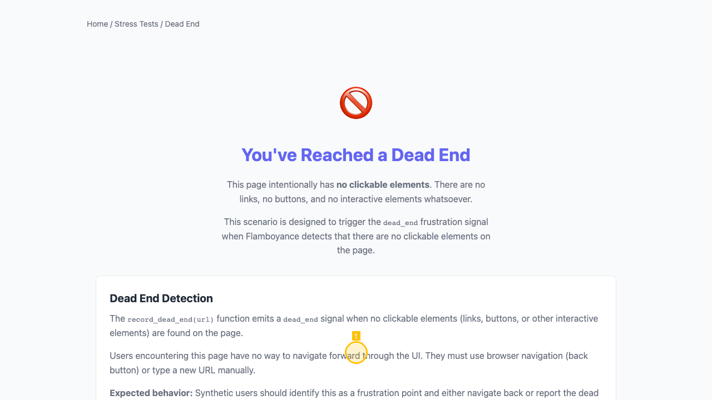

## Agent: non_tech_senior

- **Status:** done
- **Elapsed:** 11.0s

### Navigation Path

1. http://localhost:5173
2. http://localhost:5173/account/settings/
3. http://localhost:5173/
4. http://localhost:5173/stress/long-dwell/
5. http://localhost:5173/
6. http://localhost:5173/stress/slow/

### Frustration Events

- 🔴 **unmet_goal** (critical): Unmet goal (gave up): Find and read account settings
- 🟠 **dead_end** (high): Dead end: no clickable elements found on page
- 🟡 **rage_decoy** (medium): Rage decoy: element 'div:has-text('Persona	Patience	Tech	Target F')' looks clickable (clickable class name, button-like styling) but is not interactive
- 🟡 **rage_decoy** (medium): Rage decoy: element 'div:has-text('Basic Mode Advanced Mode')' looks clickable (button-like styling) but is not interactive
- 🟡 **rage_decoy** (medium): Rage decoy: element 'div:has-text('Notification Preferences  Emai')' looks clickable (clickable class name, button-like styling) but is not interactive
- 🟡 **rage_decoy** (medium): Rage decoy: element 'div:has-text('Change Password Current Passwo')' looks clickable (clickable class name, button-like styling) but is not interactive
- 🟡 **rage_decoy** (medium): Rage decoy: element 'div:has-text('Looking for more options?  Swi')' looks clickable (button-like styling) but is not interactive
- 🟡 **rage_decoy** (medium): Rage decoy: element 'div:has-text('Settings Categories         Ex')' looks clickable (clickable class name, button-like styling) but is not interactive
- 🟡 **rage_decoy** (medium): Rage decoy: element 'div:has-text('Danger Zone             ▼     ')' looks clickable (clickable class name, button-like styling) but is not interactive
- 🟡 **rage_decoy** (medium): Rage decoy: element 'div:has-text('Persona	Patience	Tech	Target F')' looks clickable (clickable class name, button-like styling) but is not interactive
- 🟡 **rage_decoy** (medium): Rage decoy: element 'div:has-text('Dwell: 0s')' looks clickable (button-like styling) but is not interactive
- 🟡 **rage_decoy** (medium): Rage decoy: element 'div:has-text('Scenario Goal: The record_long')' looks clickable (button-like styling) but is not interactive
- 🟡 **rage_decoy** (medium): Rage decoy: element 'div:has-text('Section 1: Terms and Condition')' looks clickable (button-like styling) but is not interactive
- 🟡 **rage_decoy** (medium): Rage decoy: element 'div:has-text('1. ACCEPTANCE OF TERMS  By acc')' looks clickable (button-like styling) but is not interactive
- 🟡 **rage_decoy** (medium): Rage decoy: element 'div:has-text('Section 2: Comprehension Quiz ')' looks clickable (button-like styling) but is not interactive
- 🟡 **rage_decoy** (medium): Rage decoy: element 'div:has-text('Question 1: What happens if yo')' looks clickable (button-like styling) but is not interactive
- 🟡 **rage_decoy** (medium): Rage decoy: element 'div:has-text('Question 2: What type of warra')' looks clickable (button-like styling) but is not interactive
- 🟡 **rage_decoy** (medium): Rage decoy: element 'div:has-text('Question 3: Who owns the intel')' looks clickable (button-like styling) but is not interactive
- 🟡 **rage_decoy** (medium): Rage decoy: element 'div:has-text('Section 3: Understanding Long ')' looks clickable (button-like styling) but is not interactive
- 🟡 **rage_decoy** (medium): Rage decoy: element 'div:has-text('Reading Progress:  Keep readin')' looks clickable (button-like styling) but is not interactive
- 🟡 **circular_navigation** (medium): Circular navigation detected: http://localhost:5173/ → http://localhost:5173/stress/long-dwell/ → http://localhost:5173/
- 🟡 **rage_decoy** (medium): Rage decoy: element 'div:has-text('Persona	Patience	Tech	Target F')' looks clickable (clickable class name, button-like styling) but is not interactive
- 🟡 **rage_decoy** (medium): Rage decoy: element 'div:has-text('Load time: calculating...')' looks clickable (button-like styling) but is not interactive
- 🟡 **rage_decoy** (medium): Rage decoy: element 'div:has-text('slow_load Signal: The record_s')' looks clickable (button-like styling) but is not interactive
- 🟡 **rage_decoy** (medium): Rage decoy: element 'div:has-text('Test Different Load Times     ')' looks clickable (clickable class name, button-like styling) but is not interactive
- 🟡 **rage_decoy** (medium): Rage decoy: element 'div:has-text('2s (under threshold)         4')' looks clickable (clickable class name) but is not interactive
- 🟡 **rage_decoy** (medium): Rage decoy: element 'div:has-text('Content Loaded!               ')' looks clickable (button-like styling) but is not interactive
- 🟡 **rage_decoy** (medium): Rage decoy: element 'div:has-text('Slow Page Information         ')' looks clickable (clickable class name, button-like styling) but is not interactive

### Visual Evidence

**Page 1:** http://localhost:5173 (1 issue)

**Page 2:** http://localhost:5173/account/settings/ (6 issues)

**Page 3:** http://localhost:5173/ (3 issues)

**Page 4:** http://localhost:5173/stress/long-dwell/ (10 issues)

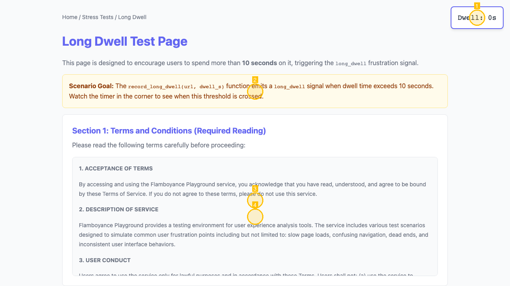

**Page 5:** http://localhost:5173/stress/slow/ (7 issues)

## Agent: power_user

- **Status:** done
- **Elapsed:** 6.2s

### Navigation Path

1. http://localhost:5173
2. http://localhost:5173/stress/rage-decoy/
3. http://localhost:5173/
4. http://localhost:5173/order-status/

### Frustration Events

- 🔴 **unmet_goal** (critical): Unmet goal (gave up): Navigate all features and check edge cases
- 🟠 **dead_end** (high): Dead end: no clickable elements found on page
- 🟡 **rage_decoy** (medium): Rage decoy: element 'div:has-text('Persona	Patience	Tech	Target F')' looks clickable (clickable class name, button-like styling) but is not interactive
- 🟡 **rage_decoy** (medium): Rage decoy: element 'div:has-text('Scenario Goal: The decoy eleme')' looks clickable (button-like styling) but is not interactive
- 🟡 **rage_decoy** (medium): Rage decoy: element 'div:has-text('Click to Continue')' looks clickable (cursor:pointer, clickable class name, box-shadow with pointer, interactive transition) but is not interactive
- 🟡 **rage_decoy** (medium): Rage decoy: element 'div:has-text('Submit Order')' looks clickable (cursor:pointer, clickable class name, box-shadow with pointer, interactive transition) but is not interactive
- 🟡 **rage_decoy** (medium): Rage decoy: element 'div:has-text('Delete Item')' looks clickable (cursor:pointer, clickable class name, box-shadow with pointer, interactive transition) but is not interactive
- 🟡 **rage_decoy** (medium): Rage decoy: element 'div:has-text('Special Offer!  Click here to ')' looks clickable (cursor:pointer, clickable class name, button-like styling) but is not interactive
- 🟡 **rage_decoy** (medium): Rage decoy: element 'p:has-text('Click here to claim your disco')' looks clickable (cursor:pointer) but is not interactive
- 🟡 **rage_decoy** (medium): Rage decoy: element 'span:has-text('click this link')' looks clickable (cursor:pointer, clickable class name) but is not interactive
- 🟡 **rage_decoy** (medium): Rage decoy: element 'span:has-text('contact support')' looks clickable (cursor:pointer, clickable class name) but is not interactive
- 🟡 **rage_decoy** (medium): Rage decoy: element 'div:has-text('Persona	Patience	Tech	Target F')' looks clickable (clickable class name, button-like styling) but is not interactive
- 🟡 **rage_decoy** (medium): Rage decoy: element 'div:has-text('Special Offer for Returning Cu')' looks clickable (clickable class name) but is not interactive
- 🟡 **rage_decoy** (medium): Rage decoy: element 'div:has-text('Look Up Order       ↓ Scroll d')' looks clickable (clickable class name, button-like styling) but is not interactive
- 🟡 **rage_decoy** (medium): Rage decoy: element 'div:has-text('Order Details       ← Scroll h')' looks clickable (clickable class name, button-like styling) but is not interactive
- 🟡 **rage_decoy** (medium): Rage decoy: element 'div:has-text('Order #FP-2024-8847 - Tracking')' looks clickable (clickable class name, button-like styling) but is not interactive
- 🟡 **rage_decoy** (medium): Rage decoy: element 'div:has-text('✓')' looks clickable (button-like styling) but is not interactive
- 🟡 **rage_decoy** (medium): Rage decoy: element 'div:has-text('✓')' looks clickable (button-like styling) but is not interactive
- 🟡 **rage_decoy** (medium): Rage decoy: element 'div:has-text('✓')' looks clickable (button-like styling) but is not interactive
- 🟡 **rage_decoy** (medium): Rage decoy: element 'div:has-text('4')' looks clickable (button-like styling) but is not interactive

### Visual Evidence

**Page 1:** http://localhost:5173 (1 issue)

**Page 2:** http://localhost:5173/stress/rage-decoy/ (8 issues)

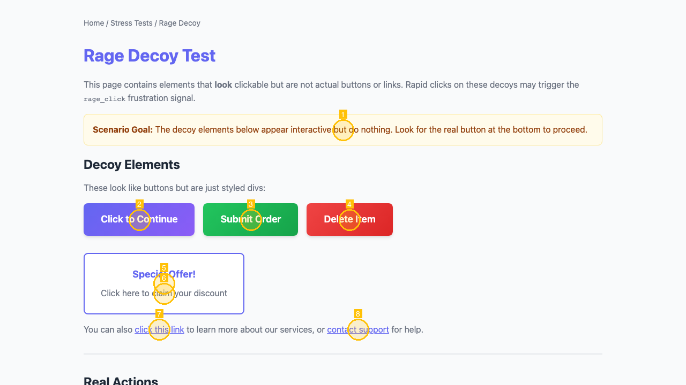

**Page 3:** http://localhost:5173/ (1 issue)

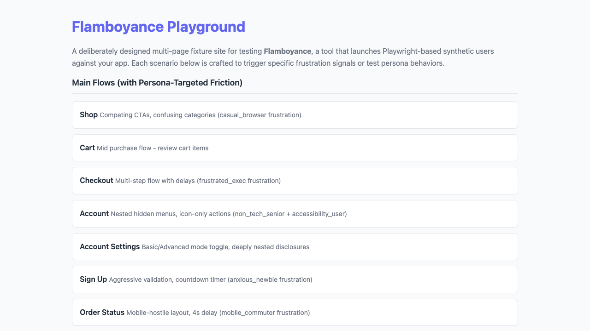

**Page 4:** http://localhost:5173/order-status/ (9 issues)

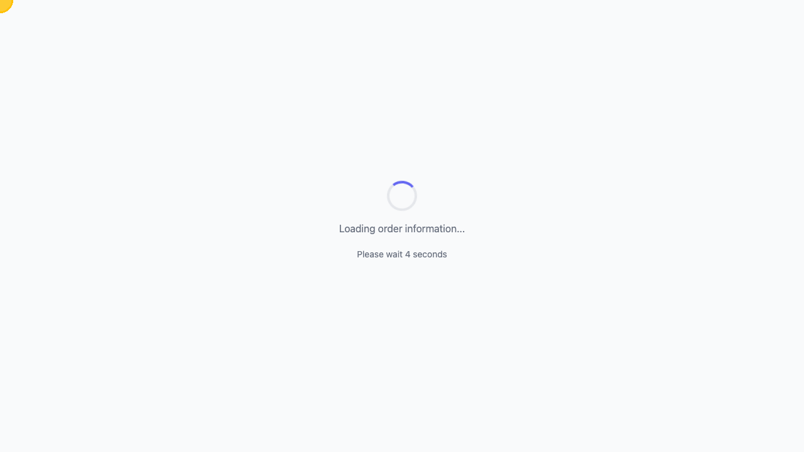

## Agent: casual_browser

- **Status:** done
- **Elapsed:** 13.6s

### Navigation Path

1. http://localhost:5173
2. http://localhost:5173/account/settings/
3. http://localhost:5173/
4. http://localhost:5173/stress/slow/

### Frustration Events

- 🔴 **unmet_goal** (critical): Unmet goal (gave up): Browse around and see what's available
- 🟠 **dead_end** (high): Dead end: no clickable elements found on page
- 🟡 **rage_decoy** (medium): Rage decoy: element 'div:has-text('Persona	Patience	Tech	Target F')' looks clickable (clickable class name, button-like styling) but is not interactive
- 🟡 **rage_decoy** (medium): Rage decoy: element 'div:has-text('Basic Mode Advanced Mode')' looks clickable (button-like styling) but is not interactive
- 🟡 **rage_decoy** (medium): Rage decoy: element 'div:has-text('Notification Preferences  Emai')' looks clickable (clickable class name, button-like styling) but is not interactive
- 🟡 **rage_decoy** (medium): Rage decoy: element 'div:has-text('Change Password Current Passwo')' looks clickable (clickable class name, button-like styling) but is not interactive
- 🟡 **rage_decoy** (medium): Rage decoy: element 'div:has-text('Looking for more options?  Swi')' looks clickable (button-like styling) but is not interactive
- 🟡 **rage_decoy** (medium): Rage decoy: element 'div:has-text('Settings Categories         Ex')' looks clickable (clickable class name, button-like styling) but is not interactive
- 🟡 **rage_decoy** (medium): Rage decoy: element 'div:has-text('Danger Zone             ▼     ')' looks clickable (clickable class name, button-like styling) but is not interactive
- 🟡 **rage_decoy** (medium): Rage decoy: element 'div:has-text('Persona	Patience	Tech	Target F')' looks clickable (clickable class name, button-like styling) but is not interactive
- 🟡 **rage_decoy** (medium): Rage decoy: element 'div:has-text('Load time: calculating...')' looks clickable (button-like styling) but is not interactive
- 🟡 **rage_decoy** (medium): Rage decoy: element 'div:has-text('slow_load Signal: The record_s')' looks clickable (button-like styling) but is not interactive
- 🟡 **rage_decoy** (medium): Rage decoy: element 'div:has-text('Test Different Load Times     ')' looks clickable (clickable class name, button-like styling) but is not interactive
- 🟡 **rage_decoy** (medium): Rage decoy: element 'div:has-text('2s (under threshold)         4')' looks clickable (clickable class name) but is not interactive
- 🟡 **rage_decoy** (medium): Rage decoy: element 'div:has-text('Content Loaded!               ')' looks clickable (button-like styling) but is not interactive
- 🟡 **rage_decoy** (medium): Rage decoy: element 'div:has-text('Slow Page Information         ')' looks clickable (clickable class name, button-like styling) but is not interactive

### Visual Evidence

**Page 1:** http://localhost:5173 (1 issue)

**Page 2:** http://localhost:5173/account/settings/ (6 issues)

**Page 3:** http://localhost:5173/ (1 issue)

**Page 4:** http://localhost:5173/stress/slow/ (7 issues)

## Agent: anxious_newbie

- **Status:** gave_up
- **Elapsed:** 24.8s

### Navigation Path

1. http://localhost:5173
2. http://localhost:5173/stress/circular/
3. http://localhost:5173/stress/circular/b/
4. http://localhost:5173/stress/circular/
5. http://localhost:5173/stress/circular/b/
6. http://localhost:5173/
7. http://localhost:5173/stress/broken-forms/
8. http://localhost:5173/
9. http://localhost:5173/stress/many-links/
10. http://localhost:5173/stress/many-links/#item-8
11. http://localhost:5173/stress/many-links/#item-20
12. http://localhost:5173/stress/many-links/#item-16
13. http://localhost:5173/stress/many-links/#item-2
14. http://localhost:5173/stress/many-links/#item-8

### Frustration Events

- 🔴 **unmet_goal** (critical): Unmet goal (gave up): Sign up for an account without getting confused
- 🟠 **accessibility_failure** (high): Accessibility issue: missing_label
- 🟠 **accessibility_failure** (high): Accessibility issue: missing_label
- 🟠 **accessibility_failure** (high): Accessibility issue: missing_label
- 🟡 **rage_decoy** (medium): Rage decoy: element 'div:has-text('Persona	Patience	Tech	Target F')' looks clickable (clickable class name, button-like styling) but is not interactive
- 🟡 **rage_decoy** (medium): Rage decoy: element 'div:has-text('Scenario Goal: Navigate betwee')' looks clickable (button-like styling) but is not interactive
- 🟡 **rage_decoy** (medium): Rage decoy: element 'div:has-text('Page A  Start the loop from Pa')' looks clickable (clickable class name, button-like styling) but is not interactive
- 🟡 **rage_decoy** (medium): Rage decoy: element 'div:has-text('Page B  Or start from Page B i')' looks clickable (clickable class name, button-like styling) but is not interactive
- 🟡 **rage_decoy** (medium): Rage decoy: element 'div:has-text('Current Location: B  This page')' looks clickable (clickable class name, button-like styling) but is not interactive
- 🟡 **rage_decoy** (medium): Rage decoy: element 'div:has-text('Escape Route: Use the link bel')' looks clickable (button-like styling) but is not interactive
- 🟡 **circular_navigation** (medium): Circular navigation detected: http://localhost:5173/stress/circular/ → http://localhost:5173/stress/circular/b/ → http://localhost:5173/stress/circular/
- 🟡 **rage_decoy** (medium): Rage decoy: element 'div:has-text('Scenario Goal: Navigate betwee')' looks clickable (button-like styling) but is not interactive
- 🟡 **rage_decoy** (medium): Rage decoy: element 'div:has-text('Page A  Start the loop from Pa')' looks clickable (clickable class name, button-like styling) but is not interactive
- 🟡 **rage_decoy** (medium): Rage decoy: element 'div:has-text('Page B  Or start from Page B i')' looks clickable (clickable class name, button-like styling) but is not interactive
- 🟡 **circular_navigation** (medium): Circular navigation detected: http://localhost:5173/stress/circular/b/ → http://localhost:5173/stress/circular/ → http://localhost:5173/stress/circular/b/
- 🟡 **rage_decoy** (medium): Rage decoy: element 'div:has-text('Current Location: B  This page')' looks clickable (clickable class name, button-like styling) but is not interactive
- 🟡 **rage_decoy** (medium): Rage decoy: element 'div:has-text('Escape Route: Use the link bel')' looks clickable (button-like styling) but is not interactive
- 🟡 **rage_decoy** (medium): Rage decoy: element 'div:has-text('Persona	Patience	Tech	Target F')' looks clickable (clickable class name, button-like styling) but is not interactive
- 🟡 **rage_decoy** (medium): Rage decoy: element 'div:has-text('Scenario Goal: Each form has a')' looks clickable (button-like styling) but is not interactive
- 🟡 **rage_decoy** (medium): Rage decoy: element 'div:has-text('Contact Form (Broken Labels)  ')' looks clickable (clickable class name, button-like styling) but is not interactive
- 🟡 **rage_decoy** (medium): Rage decoy: element 'div:has-text('Terms Agreement (Scroll to Ena')' looks clickable (clickable class name, button-like styling) but is not interactive
- 🟡 **rage_decoy** (medium): Rage decoy: element 'div:has-text('Subscription Form (Hidden Requ')' looks clickable (clickable class name, button-like styling) but is not interactive
- 🟡 **rage_decoy** (medium): Rage decoy: element 'div:has-text('Newsletter Preferences (Self-U')' looks clickable (clickable class name, button-like styling) but is not interactive
- 🟡 **rage_decoy** (medium): Rage decoy: element 'div:has-text('Shipping Options (Bad Default)')' looks clickable (clickable class name, button-like styling) but is not interactive
- 🟡 **rage_decoy** (medium): Rage decoy: element 'div:has-text('Payment Method (Broken Radio G')' looks clickable (clickable class name, button-like styling) but is not interactive
- 🟡 **circular_navigation** (medium): Circular navigation detected: http://localhost:5173/ → http://localhost:5173/stress/broken-forms/ → http://localhost:5173/
- 🟡 **rage_decoy** (medium): Rage decoy: element 'div:has-text('Persona	Patience	Tech	Target F')' looks clickable (clickable class name, button-like styling) but is not interactive
- 🟡 **rage_decoy** (medium): Rage decoy: element 'div:has-text('Scenario Goal: The agent can o')' looks clickable (button-like styling) but is not interactive
- 🟡 **rage_decoy** (medium): Rage decoy: element 'div:has-text('Link 1 Link 2 Link 3 Link 4 Li')' looks clickable (clickable class name) but is not interactive
- 🟡 **rage_decoy** (medium): Rage decoy: element 'div:has-text('Total Interactive Elements  Th')' looks clickable (clickable class name, button-like styling) but is not interactive
- 🟡 **rage_decoy** (medium): Rage decoy: element 'div:has-text('Scenario Goal: The agent can o')' looks clickable (button-like styling) but is not interactive
- 🟡 **rage_decoy** (medium): Rage decoy: element 'div:has-text('Link 1 Link 2 Link 3 Link 4 Li')' looks clickable (clickable class name) but is not interactive
- 🟡 **rage_decoy** (medium): Rage decoy: element 'div:has-text('Total Interactive Elements  Th')' looks clickable (clickable class name, button-like styling) but is not interactive
- 🟡 **rage_decoy** (medium): Rage decoy: element 'div:has-text('Scenario Goal: The agent can o')' looks clickable (button-like styling) but is not interactive
- 🟡 **rage_decoy** (medium): Rage decoy: element 'div:has-text('Link 1 Link 2 Link 3 Link 4 Li')' looks clickable (clickable class name) but is not interactive
- 🟡 **rage_decoy** (medium): Rage decoy: element 'div:has-text('Total Interactive Elements  Th')' looks clickable (clickable class name, button-like styling) but is not interactive
- 🟡 **rage_decoy** (medium): Rage decoy: element 'div:has-text('Scenario Goal: The agent can o')' looks clickable (button-like styling) but is not interactive
- 🟡 **rage_decoy** (medium): Rage decoy: element 'div:has-text('Link 1 Link 2 Link 3 Link 4 Li')' looks clickable (clickable class name) but is not interactive
- 🟡 **rage_decoy** (medium): Rage decoy: element 'div:has-text('Total Interactive Elements  Th')' looks clickable (clickable class name, button-like styling) but is not interactive
- 🟡 **rage_decoy** (medium): Rage decoy: element 'div:has-text('Scenario Goal: The agent can o')' looks clickable (button-like styling) but is not interactive
- 🟡 **rage_decoy** (medium): Rage decoy: element 'div:has-text('Link 1 Link 2 Link 3 Link 4 Li')' looks clickable (clickable class name) but is not interactive
- 🟡 **rage_decoy** (medium): Rage decoy: element 'div:has-text('Total Interactive Elements  Th')' looks clickable (clickable class name, button-like styling) but is not interactive
- 🟡 **rage_decoy** (medium): Rage decoy: element 'div:has-text('Scenario Goal: The agent can o')' looks clickable (button-like styling) but is not interactive
- 🟡 **rage_decoy** (medium): Rage decoy: element 'div:has-text('Link 1 Link 2 Link 3 Link 4 Li')' looks clickable (clickable class name) but is not interactive
- 🟡 **rage_decoy** (medium): Rage decoy: element 'div:has-text('Total Interactive Elements  Th')' looks clickable (clickable class name, button-like styling) but is not interactive

### Visual Evidence

**Page 1:** http://localhost:5173 (1 issue)

**Page 2:** http://localhost:5173/stress/circular/ (7 issues)

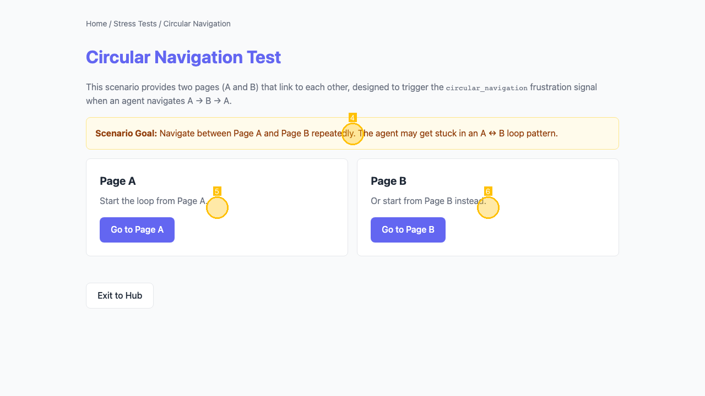

**Page 3:** http://localhost:5173/stress/circular/b/ (5 issues)

**Page 4:** http://localhost:5173/ (3 issues)

**Page 5:** http://localhost:5173/stress/broken-forms/ (10 issues)

**Page 6:** http://localhost:5173/stress/many-links/ (3 issues)

**Page 7:** http://localhost:5173/stress/many-links/#item-8 (6 issues)

**Page 8:** http://localhost:5173/stress/many-links/#item-20 (3 issues)

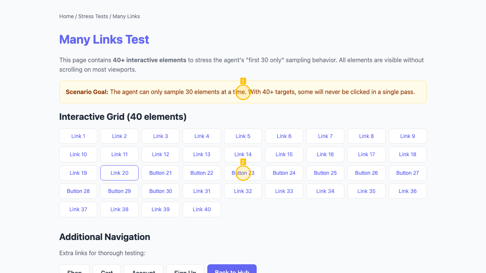

**Page 9:** http://localhost:5173/stress/many-links/#item-16 (3 issues)

**Page 10:** http://localhost:5173/stress/many-links/#item-2 (3 issues)

## Agent: methodical_tester

- **Status:** done
- **Elapsed:** 22.3s

### Navigation Path

1. http://localhost:5173
2. http://localhost:5173/stress/icon-bar/
3. http://localhost:5173/
4. http://localhost:5173/stress/slow/

### Frustration Events

- 🔴 **unmet_goal** (critical): Unmet goal (gave up): Systematically check every link and form
- 🟠 **dead_end** (high): Dead end: no clickable elements found on page
- 🟡 **rage_decoy** (medium): Rage decoy: element 'div:has-text('Persona	Patience	Tech	Target F')' looks clickable (clickable class name, button-like styling) but is not interactive
- 🟡 **rage_decoy** (medium): Rage decoy: element 'div:has-text('Scenario Goal: Complete the wo')' looks clickable (button-like styling) but is not interactive
- 🟡 **rage_decoy** (medium): Rage decoy: element 'div:has-text('📄 📂 💾 ✂️ 📋 📌 ↩️ ↪️ B I U')' looks clickable (button-like styling) but is not interactive
- 🟡 **rage_decoy** (medium): Rage decoy: element 'div:has-text('Critical Actions (Icon-Only)  ')' looks clickable (clickable class name, button-like styling) but is not interactive
- 🟡 **rage_decoy** (medium): Rage decoy: element 'div:has-text('✓ → 👍 👎 ✕')' looks clickable (button-like styling) but is not interactive
- 🟡 **rage_decoy** (medium): Rage decoy: element 'div:has-text('💾 Save (text) 📂 Open (text) ')' looks clickable (clickable class name) but is not interactive
- 🟡 **rage_decoy** (medium): Rage decoy: element 'div:has-text('Document: Report_Q4_2024.docx ')' looks clickable (clickable class name, button-like styling) but is not interactive
- 🟡 **rage_decoy** (medium): Rage decoy: element 'div:has-text('Action performed:')' looks clickable (button-like styling) but is not interactive
- 🟡 **rage_decoy** (medium): Rage decoy: element 'div:has-text('Persona	Patience	Tech	Target F')' looks clickable (clickable class name, button-like styling) but is not interactive
- 🟡 **rage_decoy** (medium): Rage decoy: element 'div:has-text('Load time: calculating...')' looks clickable (button-like styling) but is not interactive
- 🟡 **rage_decoy** (medium): Rage decoy: element 'div:has-text('slow_load Signal: The record_s')' looks clickable (button-like styling) but is not interactive
- 🟡 **rage_decoy** (medium): Rage decoy: element 'div:has-text('Test Different Load Times     ')' looks clickable (clickable class name, button-like styling) but is not interactive
- 🟡 **rage_decoy** (medium): Rage decoy: element 'div:has-text('2s (under threshold)         4')' looks clickable (clickable class name) but is not interactive
- 🟡 **rage_decoy** (medium): Rage decoy: element 'div:has-text('Content Loaded!               ')' looks clickable (button-like styling) but is not interactive
- 🟡 **rage_decoy** (medium): Rage decoy: element 'div:has-text('Slow Page Information         ')' looks clickable (clickable class name, button-like styling) but is not interactive

### Visual Evidence

**Page 1:** http://localhost:5173 (1 issue)

**Page 2:** http://localhost:5173/stress/icon-bar/ (7 issues)

**Page 3:** http://localhost:5173/ (1 issue)

**Page 4:** http://localhost:5173/stress/slow/ (7 issues)

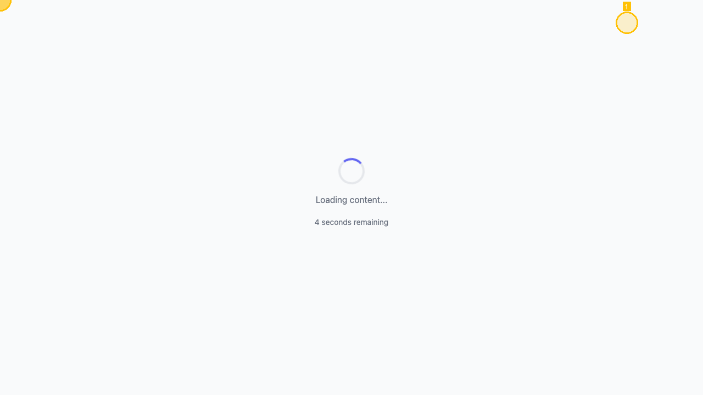

## Agent: mobile_commuter

- **Status:** gave_up
- **Elapsed:** 18.7s

### Navigation Path

1. http://localhost:5173
2. http://localhost:5173/stress/broken-forms/
3. http://localhost:5173/
4. http://localhost:5173/stress/rage-decoy/
5. http://localhost:5173/shop/

### Frustration Events

- 🔴 **unmet_goal** (critical): Unmet goal (gave up): Quickly check order status while on the go
- 🟠 **accessibility_failure** (high): Accessibility issue: missing_label
- 🟠 **accessibility_failure** (high): Accessibility issue: missing_label
- 🟠 **accessibility_failure** (high): Accessibility issue: missing_label
- 🟡 **rage_decoy** (medium): Rage decoy: element 'div:has-text('Persona	Patience	Tech	Target F')' looks clickable (clickable class name, button-like styling) but is not interactive
- 🟡 **mobile_tap_target** (medium): Mobile issue: horizontal_scroll
- 🟡 **rage_decoy** (medium): Rage decoy: element 'div:has-text('Scenario Goal: Each form has a')' looks clickable (button-like styling) but is not interactive
- 🟡 **rage_decoy** (medium): Rage decoy: element 'div:has-text('Contact Form (Broken Labels)  ')' looks clickable (clickable class name, button-like styling) but is not interactive
- 🟡 **rage_decoy** (medium): Rage decoy: element 'div:has-text('Terms Agreement (Scroll to Ena')' looks clickable (clickable class name, button-like styling) but is not interactive
- 🟡 **rage_decoy** (medium): Rage decoy: element 'div:has-text('Subscription Form (Hidden Requ')' looks clickable (clickable class name, button-like styling) but is not interactive
- 🟡 **rage_decoy** (medium): Rage decoy: element 'div:has-text('Newsletter Preferences (Self-U')' looks clickable (clickable class name, button-like styling) but is not interactive
- 🟡 **rage_decoy** (medium): Rage decoy: element 'div:has-text('Shipping Options (Bad Default)')' looks clickable (clickable class name, button-like styling) but is not interactive
- 🟡 **rage_decoy** (medium): Rage decoy: element 'div:has-text('Payment Method (Broken Radio G')' looks clickable (clickable class name, button-like styling) but is not interactive
- 🟡 **mobile_tap_target** (medium): Mobile issue: small_tap_target
- 🟡 **mobile_tap_target** (medium): Mobile issue: small_tap_target
- 🟡 **mobile_tap_target** (medium): Mobile issue: small_tap_target
- 🟡 **mobile_tap_target** (medium): Mobile issue: small_tap_target
- 🟡 **mobile_tap_target** (medium): Mobile issue: small_tap_target
- 🟡 **mobile_tap_target** (medium): Mobile issue: small_tap_target
- 🟡 **mobile_tap_target** (medium): Mobile issue: small_tap_target
- 🟡 **mobile_tap_target** (medium): Mobile issue: small_tap_target
- 🟡 **mobile_tap_target** (medium): Mobile issue: small_tap_target
- 🟡 **mobile_tap_target** (medium): Mobile issue: small_tap_target
- 🟡 **rage_decoy** (medium): Rage decoy: element 'div:has-text('Persona	Patience	Tech	Target F')' looks clickable (clickable class name, button-like styling) but is not interactive
- 🟡 **mobile_tap_target** (medium): Mobile issue: horizontal_scroll
- 🟡 **rage_decoy** (medium): Rage decoy: element 'div:has-text('Scenario Goal: The decoy eleme')' looks clickable (button-like styling) but is not interactive
- 🟡 **rage_decoy** (medium): Rage decoy: element 'div:has-text('Click to Continue')' looks clickable (cursor:pointer, clickable class name, box-shadow with pointer, interactive transition) but is not interactive
- 🟡 **rage_decoy** (medium): Rage decoy: element 'div:has-text('Submit Order')' looks clickable (cursor:pointer, clickable class name, box-shadow with pointer, interactive transition) but is not interactive
- 🟡 **rage_decoy** (medium): Rage decoy: element 'div:has-text('Delete Item')' looks clickable (cursor:pointer, clickable class name, box-shadow with pointer, interactive transition) but is not interactive
- 🟡 **rage_decoy** (medium): Rage decoy: element 'div:has-text('Special Offer!  Click here to ')' looks clickable (cursor:pointer, clickable class name, button-like styling) but is not interactive
- 🟡 **rage_decoy** (medium): Rage decoy: element 'p:has-text('Click here to claim your disco')' looks clickable (cursor:pointer) but is not interactive
- 🟡 **rage_decoy** (medium): Rage decoy: element 'span:has-text('click this link')' looks clickable (cursor:pointer, clickable class name) but is not interactive
- 🟡 **rage_decoy** (medium): Rage decoy: element 'span:has-text('contact support')' looks clickable (cursor:pointer, clickable class name) but is not interactive
- 🟡 **mobile_tap_target** (medium): Mobile issue: small_tap_target
- 🟡 **mobile_tap_target** (medium): Mobile issue: small_tap_target
- 🟡 **mobile_tap_target** (medium): Mobile issue: small_tap_target
- 🟡 **mobile_tap_target** (medium): Mobile issue: small_tap_target
- 🟡 **mobile_tap_target** (medium): Mobile issue: small_tap_target
- 🟡 **rage_decoy** (medium): Rage decoy: element 'div:has-text('Categories All Products Widget')' looks clickable (clickable class name, button-like styling) but is not interactive
- 🟡 **rage_decoy** (medium): Rage decoy: element 'div:has-text('Filter By Price Range Any Pric')' looks clickable (clickable class name, button-like styling) but is not interactive
- 🟡 **rage_decoy** (medium): Rage decoy: element 'div:has-text('HOT Widget Pro  The ultimate w')' looks clickable (clickable class name, button-like styling) but is not interactive
- 🟡 **rage_decoy** (medium): Rage decoy: element 'span:has-text('HOT')' looks clickable (button-like styling) but is not interactive
- 🟡 **rage_decoy** (medium): Rage decoy: element 'div:has-text('SALE Gadget Plus  Enhanced gad')' looks clickable (clickable class name, button-like styling) but is not interactive
- 🟡 **rage_decoy** (medium): Rage decoy: element 'span:has-text('SALE')' looks clickable (button-like styling) but is not interactive
- 🟡 **rage_decoy** (medium): Rage decoy: element 'div:has-text('Doohickey Basic  Essential doo')' looks clickable (clickable class name, button-like styling) but is not interactive
- 🟡 **rage_decoy** (medium): Rage decoy: element 'div:has-text('NEW Thingamajig XL  Extra larg')' looks clickable (clickable class name, button-like styling) but is not interactive
- 🟡 **rage_decoy** (medium): Rage decoy: element 'span:has-text('NEW')' looks clickable (button-like styling) but is not interactive
- 🟡 **rage_decoy** (medium): Rage decoy: element 'div:has-text('Gizmo Deluxe  Premium gizmo wi')' looks clickable (clickable class name, button-like styling) but is not interactive
- 🟡 **mobile_tap_target** (medium): Mobile issue: small_tap_target
- 🟡 **mobile_tap_target** (medium): Mobile issue: small_tap_target
- 🟡 **mobile_tap_target** (medium): Mobile issue: small_tap_target
- 🟡 **mobile_tap_target** (medium): Mobile issue: small_tap_target
- 🟡 **mobile_tap_target** (medium): Mobile issue: small_tap_target
- 🟡 **mobile_tap_target** (medium): Mobile issue: small_tap_target
- 🟡 **mobile_tap_target** (medium): Mobile issue: small_tap_target
- 🟡 **mobile_tap_target** (medium): Mobile issue: small_tap_target
- 🟡 **mobile_tap_target** (medium): Mobile issue: small_tap_target
- 🟡 **mobile_tap_target** (medium): Mobile issue: small_tap_target

### Visual Evidence

**Page 1:** http://localhost:5173 (2 issues)

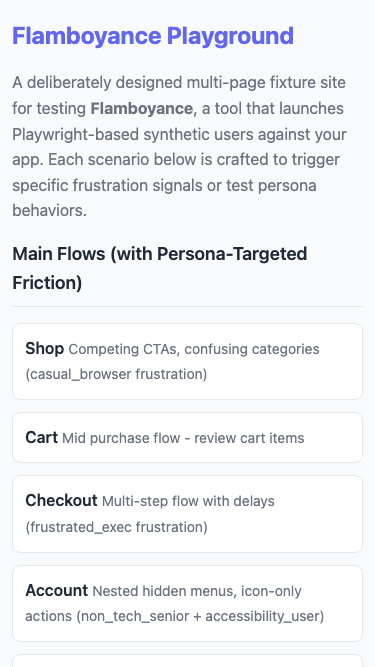

**Page 2:** http://localhost:5173/stress/broken-forms/ (20 issues)

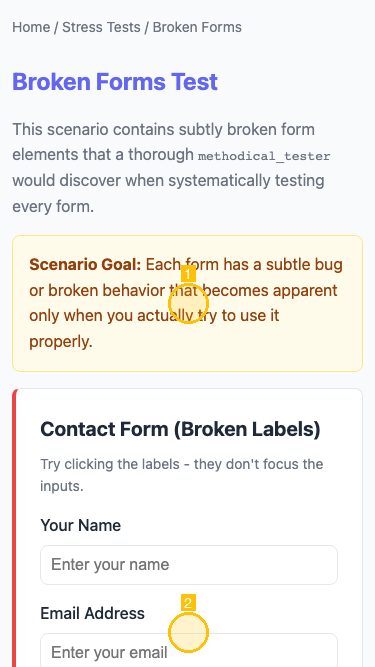

**Page 3:** http://localhost:5173/ (2 issues)

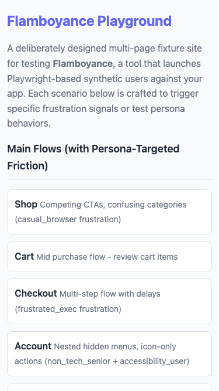

**Page 4:** http://localhost:5173/stress/rage-decoy/ (13 issues)

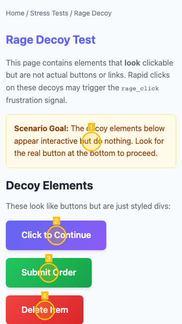

**Page 5:** http://localhost:5173/shop/ (20 issues)

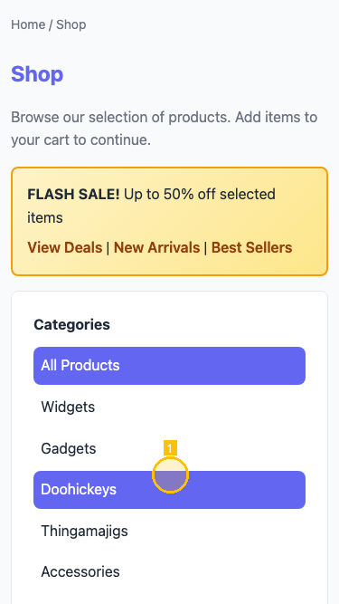

## Agent: accessibility_user

- **Status:** done
- **Elapsed:** 60.2s

### Navigation Path

1. http://localhost:5173
2. http://localhost:5173/account/settings/
3. http://localhost:5173/
4. http://localhost:5173/stress/many-links/
5. http://localhost:5173/stress/many-links/#item-15
6. http://localhost:5173/stress/many-links/#item-3
7. http://localhost:5173/stress/many-links/#item-16
8. http://localhost:5173/stress/many-links/#item-14
9. http://localhost:5173/stress/many-links/#item-17
10. http://localhost:5173/stress/many-links/#item-10
11. http://localhost:5173/stress/many-links/#item-15
12. http://localhost:5173/stress/many-links/#item-18
13. http://localhost:5173/stress/many-links/#item-7
14. http://localhost:5173/stress/many-links/#item-12
15. http://localhost:5173/stress/many-links/#item-15
16. http://localhost:5173/stress/many-links/#item-6
17. http://localhost:5173/stress/many-links/#item-14
18. http://localhost:5173/stress/many-links/#item-17
19. http://localhost:5173/stress/many-links/#item-12
20. http://localhost:5173/stress/many-links/#item-6
21. http://localhost:5173/stress/many-links/#item-9
22. http://localhost:5173/stress/many-links/#item-4
23. http://localhost:5173/stress/many-links/#item-6
24. http://localhost:5173/stress/many-links/#item-4
25. http://localhost:5173/stress/many-links/#item-14
26. http://localhost:5173/stress/many-links/#item-17
27. http://localhost:5173/stress/many-links/#item-6
28. http://localhost:5173/stress/many-links/#item-12

### Frustration Events

- 🔴 **unmet_goal** (critical): Unmet goal (timeout): Navigate using visible labels and clear affordances
- 🟡 **rage_decoy** (medium): Rage decoy: element 'div:has-text('Persona	Patience	Tech	Target F')' looks clickable (clickable class name, button-like styling) but is not interactive
- 🟡 **rage_decoy** (medium): Rage decoy: element 'div:has-text('Basic Mode Advanced Mode')' looks clickable (button-like styling) but is not interactive
- 🟡 **rage_decoy** (medium): Rage decoy: element 'div:has-text('Notification Preferences  Emai')' looks clickable (clickable class name, button-like styling) but is not interactive
- 🟡 **rage_decoy** (medium): Rage decoy: element 'div:has-text('Change Password Current Passwo')' looks clickable (clickable class name, button-like styling) but is not interactive
- 🟡 **rage_decoy** (medium): Rage decoy: element 'div:has-text('Looking for more options?  Swi')' looks clickable (button-like styling) but is not interactive
- 🟡 **rage_decoy** (medium): Rage decoy: element 'div:has-text('Settings Categories         Ex')' looks clickable (clickable class name, button-like styling) but is not interactive
- 🟡 **rage_decoy** (medium): Rage decoy: element 'div:has-text('Danger Zone             ▼     ')' looks clickable (clickable class name, button-like styling) but is not interactive
- 🟡 **rage_decoy** (medium): Rage decoy: element 'div:has-text('Persona	Patience	Tech	Target F')' looks clickable (clickable class name, button-like styling) but is not interactive
- 🟡 **rage_decoy** (medium): Rage decoy: element 'div:has-text('Scenario Goal: The agent can o')' looks clickable (button-like styling) but is not interactive
- 🟡 **rage_decoy** (medium): Rage decoy: element 'div:has-text('Link 1 Link 2 Link 3 Link 4 Li')' looks clickable (clickable class name) but is not interactive
- 🟡 **rage_decoy** (medium): Rage decoy: element 'div:has-text('Total Interactive Elements  Th')' looks clickable (clickable class name, button-like styling) but is not interactive
- 🟡 **rage_decoy** (medium): Rage decoy: element 'div:has-text('Scenario Goal: The agent can o')' looks clickable (button-like styling) but is not interactive
- 🟡 **rage_decoy** (medium): Rage decoy: element 'div:has-text('Link 1 Link 2 Link 3 Link 4 Li')' looks clickable (clickable class name) but is not interactive
- 🟡 **rage_decoy** (medium): Rage decoy: element 'div:has-text('Total Interactive Elements  Th')' looks clickable (clickable class name, button-like styling) but is not interactive
- 🟡 **rage_decoy** (medium): Rage decoy: element 'div:has-text('Scenario Goal: The agent can o')' looks clickable (button-like styling) but is not interactive
- 🟡 **rage_decoy** (medium): Rage decoy: element 'div:has-text('Link 1 Link 2 Link 3 Link 4 Li')' looks clickable (clickable class name) but is not interactive
- 🟡 **rage_decoy** (medium): Rage decoy: element 'div:has-text('Total Interactive Elements  Th')' looks clickable (clickable class name, button-like styling) but is not interactive
- 🟡 **rage_decoy** (medium): Rage decoy: element 'div:has-text('Scenario Goal: The agent can o')' looks clickable (button-like styling) but is not interactive
- 🟡 **rage_decoy** (medium): Rage decoy: element 'div:has-text('Link 1 Link 2 Link 3 Link 4 Li')' looks clickable (clickable class name) but is not interactive
- 🟡 **rage_decoy** (medium): Rage decoy: element 'div:has-text('Total Interactive Elements  Th')' looks clickable (clickable class name, button-like styling) but is not interactive
- 🟡 **rage_decoy** (medium): Rage decoy: element 'div:has-text('Scenario Goal: The agent can o')' looks clickable (button-like styling) but is not interactive
- 🟡 **rage_decoy** (medium): Rage decoy: element 'div:has-text('Link 1 Link 2 Link 3 Link 4 Li')' looks clickable (clickable class name) but is not interactive
- 🟡 **rage_decoy** (medium): Rage decoy: element 'div:has-text('Total Interactive Elements  Th')' looks clickable (clickable class name, button-like styling) but is not interactive
- 🟡 **rage_decoy** (medium): Rage decoy: element 'div:has-text('Scenario Goal: The agent can o')' looks clickable (button-like styling) but is not interactive
- 🟡 **rage_decoy** (medium): Rage decoy: element 'div:has-text('Link 1 Link 2 Link 3 Link 4 Li')' looks clickable (clickable class name) but is not interactive
- 🟡 **rage_decoy** (medium): Rage decoy: element 'div:has-text('Total Interactive Elements  Th')' looks clickable (clickable class name, button-like styling) but is not interactive
- 🟡 **rage_decoy** (medium): Rage decoy: element 'div:has-text('Scenario Goal: The agent can o')' looks clickable (button-like styling) but is not interactive
- 🟡 **rage_decoy** (medium): Rage decoy: element 'div:has-text('Link 1 Link 2 Link 3 Link 4 Li')' looks clickable (clickable class name) but is not interactive
- 🟡 **rage_decoy** (medium): Rage decoy: element 'div:has-text('Total Interactive Elements  Th')' looks clickable (clickable class name, button-like styling) but is not interactive
- 🟡 **rage_decoy** (medium): Rage decoy: element 'div:has-text('Scenario Goal: The agent can o')' looks clickable (button-like styling) but is not interactive
- 🟡 **rage_decoy** (medium): Rage decoy: element 'div:has-text('Link 1 Link 2 Link 3 Link 4 Li')' looks clickable (clickable class name) but is not interactive
- 🟡 **rage_decoy** (medium): Rage decoy: element 'div:has-text('Total Interactive Elements  Th')' looks clickable (clickable class name, button-like styling) but is not interactive
- 🟡 **rage_decoy** (medium): Rage decoy: element 'div:has-text('Scenario Goal: The agent can o')' looks clickable (button-like styling) but is not interactive
- 🟡 **rage_decoy** (medium): Rage decoy: element 'div:has-text('Link 1 Link 2 Link 3 Link 4 Li')' looks clickable (clickable class name) but is not interactive
- 🟡 **rage_decoy** (medium): Rage decoy: element 'div:has-text('Total Interactive Elements  Th')' looks clickable (clickable class name, button-like styling) but is not interactive
- 🟡 **rage_decoy** (medium): Rage decoy: element 'div:has-text('Scenario Goal: The agent can o')' looks clickable (button-like styling) but is not interactive
- 🟡 **rage_decoy** (medium): Rage decoy: element 'div:has-text('Link 1 Link 2 Link 3 Link 4 Li')' looks clickable (clickable class name) but is not interactive
- 🟡 **rage_decoy** (medium): Rage decoy: element 'div:has-text('Total Interactive Elements  Th')' looks clickable (clickable class name, button-like styling) but is not interactive
- 🟡 **rage_decoy** (medium): Rage decoy: element 'div:has-text('Scenario Goal: The agent can o')' looks clickable (button-like styling) but is not interactive
- 🟡 **rage_decoy** (medium): Rage decoy: element 'div:has-text('Link 1 Link 2 Link 3 Link 4 Li')' looks clickable (clickable class name) but is not interactive
- 🟡 **rage_decoy** (medium): Rage decoy: element 'div:has-text('Total Interactive Elements  Th')' looks clickable (clickable class name, button-like styling) but is not interactive
- 🟡 **rage_decoy** (medium): Rage decoy: element 'div:has-text('Scenario Goal: The agent can o')' looks clickable (button-like styling) but is not interactive
- 🟡 **rage_decoy** (medium): Rage decoy: element 'div:has-text('Link 1 Link 2 Link 3 Link 4 Li')' looks clickable (clickable class name) but is not interactive
- 🟡 **rage_decoy** (medium): Rage decoy: element 'div:has-text('Total Interactive Elements  Th')' looks clickable (clickable class name, button-like styling) but is not interactive
- 🟡 **rage_decoy** (medium): Rage decoy: element 'div:has-text('Scenario Goal: The agent can o')' looks clickable (button-like styling) but is not interactive
- 🟡 **rage_decoy** (medium): Rage decoy: element 'div:has-text('Link 1 Link 2 Link 3 Link 4 Li')' looks clickable (clickable class name) but is not interactive
- 🟡 **rage_decoy** (medium): Rage decoy: element 'div:has-text('Total Interactive Elements  Th')' looks clickable (clickable class name, button-like styling) but is not interactive
- 🟡 **rage_decoy** (medium): Rage decoy: element 'div:has-text('Scenario Goal: The agent can o')' looks clickable (button-like styling) but is not interactive
- 🟡 **rage_decoy** (medium): Rage decoy: element 'div:has-text('Link 1 Link 2 Link 3 Link 4 Li')' looks clickable (clickable class name) but is not interactive
- 🟡 **rage_decoy** (medium): Rage decoy: element 'div:has-text('Total Interactive Elements  Th')' looks clickable (clickable class name, button-like styling) but is not interactive
- 🟡 **rage_decoy** (medium): Rage decoy: element 'div:has-text('Scenario Goal: The agent can o')' looks clickable (button-like styling) but is not interactive
- 🟡 **rage_decoy** (medium): Rage decoy: element 'div:has-text('Link 1 Link 2 Link 3 Link 4 Li')' looks clickable (clickable class name) but is not interactive
- 🟡 **rage_decoy** (medium): Rage decoy: element 'div:has-text('Total Interactive Elements  Th')' looks clickable (clickable class name, button-like styling) but is not interactive
- 🟡 **rage_decoy** (medium): Rage decoy: element 'div:has-text('Scenario Goal: The agent can o')' looks clickable (button-like styling) but is not interactive
- 🟡 **rage_decoy** (medium): Rage decoy: element 'div:has-text('Link 1 Link 2 Link 3 Link 4 Li')' looks clickable (clickable class name) but is not interactive
- 🟡 **rage_decoy** (medium): Rage decoy: element 'div:has-text('Total Interactive Elements  Th')' looks clickable (clickable class name, button-like styling) but is not interactive
- 🟡 **rage_decoy** (medium): Rage decoy: element 'div:has-text('Scenario Goal: The agent can o')' looks clickable (button-like styling) but is not interactive
- 🟡 **rage_decoy** (medium): Rage decoy: element 'div:has-text('Link 1 Link 2 Link 3 Link 4 Li')' looks clickable (clickable class name) but is not interactive
- 🟡 **rage_decoy** (medium): Rage decoy: element 'div:has-text('Total Interactive Elements  Th')' looks clickable (clickable class name, button-like styling) but is not interactive
- 🟡 **rage_decoy** (medium): Rage decoy: element 'div:has-text('Scenario Goal: The agent can o')' looks clickable (button-like styling) but is not interactive
- 🟡 **rage_decoy** (medium): Rage decoy: element 'div:has-text('Link 1 Link 2 Link 3 Link 4 Li')' looks clickable (clickable class name) but is not interactive
- 🟡 **rage_decoy** (medium): Rage decoy: element 'div:has-text('Total Interactive Elements  Th')' looks clickable (clickable class name, button-like styling) but is not interactive
- 🟡 **rage_decoy** (medium): Rage decoy: element 'div:has-text('Scenario Goal: The agent can o')' looks clickable (button-like styling) but is not interactive
- 🟡 **rage_decoy** (medium): Rage decoy: element 'div:has-text('Link 1 Link 2 Link 3 Link 4 Li')' looks clickable (clickable class name) but is not interactive
- 🟡 **rage_decoy** (medium): Rage decoy: element 'div:has-text('Total Interactive Elements  Th')' looks clickable (clickable class name, button-like styling) but is not interactive
- 🟡 **rage_decoy** (medium): Rage decoy: element 'div:has-text('Scenario Goal: The agent can o')' looks clickable (button-like styling) but is not interactive
- 🟡 **rage_decoy** (medium): Rage decoy: element 'div:has-text('Link 1 Link 2 Link 3 Link 4 Li')' looks clickable (clickable class name) but is not interactive
- 🟡 **rage_decoy** (medium): Rage decoy: element 'div:has-text('Total Interactive Elements  Th')' looks clickable (clickable class name, button-like styling) but is not interactive
- 🟡 **circular_navigation** (medium): Circular navigation detected: http://localhost:5173/stress/many-links/#item-4 → http://localhost:5173/stress/many-links/#item-6 → http://localhost:5173/stress/many-links/#item-4
- 🟡 **rage_decoy** (medium): Rage decoy: element 'div:has-text('Scenario Goal: The agent can o')' looks clickable (button-like styling) but is not interactive
- 🟡 **rage_decoy** (medium): Rage decoy: element 'div:has-text('Link 1 Link 2 Link 3 Link 4 Li')' looks clickable (clickable class name) but is not interactive
- 🟡 **rage_decoy** (medium): Rage decoy: element 'div:has-text('Total Interactive Elements  Th')' looks clickable (clickable class name, button-like styling) but is not interactive
- 🟡 **rage_decoy** (medium): Rage decoy: element 'div:has-text('Scenario Goal: The agent can o')' looks clickable (button-like styling) but is not interactive
- 🟡 **rage_decoy** (medium): Rage decoy: element 'div:has-text('Link 1 Link 2 Link 3 Link 4 Li')' looks clickable (clickable class name) but is not interactive
- 🟡 **rage_decoy** (medium): Rage decoy: element 'div:has-text('Total Interactive Elements  Th')' looks clickable (clickable class name, button-like styling) but is not interactive
- 🟡 **rage_decoy** (medium): Rage decoy: element 'div:has-text('Scenario Goal: The agent can o')' looks clickable (button-like styling) but is not interactive
- 🟡 **rage_decoy** (medium): Rage decoy: element 'div:has-text('Link 1 Link 2 Link 3 Link 4 Li')' looks clickable (clickable class name) but is not interactive
- 🟡 **rage_decoy** (medium): Rage decoy: element 'div:has-text('Total Interactive Elements  Th')' looks clickable (clickable class name, button-like styling) but is not interactive
- 🟡 **rage_decoy** (medium): Rage decoy: element 'div:has-text('Scenario Goal: The agent can o')' looks clickable (button-like styling) but is not interactive
- 🟡 **rage_decoy** (medium): Rage decoy: element 'div:has-text('Link 1 Link 2 Link 3 Link 4 Li')' looks clickable (clickable class name) but is not interactive
- 🟡 **rage_decoy** (medium): Rage decoy: element 'div:has-text('Total Interactive Elements  Th')' looks clickable (clickable class name, button-like styling) but is not interactive
- 🟡 **rage_decoy** (medium): Rage decoy: element 'div:has-text('Scenario Goal: The agent can o')' looks clickable (button-like styling) but is not interactive
- 🟡 **rage_decoy** (medium): Rage decoy: element 'div:has-text('Link 1 Link 2 Link 3 Link 4 Li')' looks clickable (clickable class name) but is not interactive
- 🟡 **rage_decoy** (medium): Rage decoy: element 'div:has-text('Total Interactive Elements  Th')' looks clickable (clickable class name, button-like styling) but is not interactive

### Visual Evidence

**Page 1:** http://localhost:5173 (1 issue)

**Page 2:** http://localhost:5173/account/settings/ (6 issues)

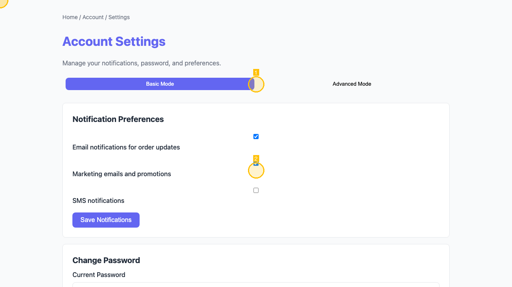

**Page 3:** http://localhost:5173/ (1 issue)

**Page 4:** http://localhost:5173/stress/many-links/ (3 issues)

**Page 5:** http://localhost:5173/stress/many-links/#item-15 (9 issues)

**Page 6:** http://localhost:5173/stress/many-links/#item-3 (3 issues)

**Page 7:** http://localhost:5173/stress/many-links/#item-16 (3 issues)

**Page 8:** http://localhost:5173/stress/many-links/#item-14 (9 issues)

**Page 9:** http://localhost:5173/stress/many-links/#item-17 (9 issues)

**Page 10:** http://localhost:5173/stress/many-links/#item-10 (3 issues)

**Page 11:** http://localhost:5173/stress/many-links/#item-18 (3 issues)

**Page 12:** http://localhost:5173/stress/many-links/#item-7 (3 issues)

**Page 13:** http://localhost:5173/stress/many-links/#item-12 (9 issues)

**Page 14:** http://localhost:5173/stress/many-links/#item-6 (12 issues)

**Page 15:** http://localhost:5173/stress/many-links/#item-9 (3 issues)

**Page 16:** http://localhost:5173/stress/many-links/#item-4 (7 issues)

## Agent: form_filler

- **Status:** done
- **Elapsed:** 41.5s

### Navigation Path

1. http://localhost:5173
2. http://localhost:5173/stress/edge-cases/
3. http://localhost:5173/features/premium-dashboard/
4. http://localhost:5173/checkout/shipping/
5. http://localhost:5173/cart/
6. http://localhost:5173/
7. http://localhost:5173/stress/many-links/
8. http://localhost:5173/stress/many-links/#item-13
9. http://localhost:5173/stress/many-links/#item-17
10. http://localhost:5173/stress/many-links/#item-14
11. http://localhost:5173/stress/many-links/#item-12
12. http://localhost:5173/stress/many-links/#item-20
13. http://localhost:5173/stress/many-links/#item-17
14. http://localhost:5173/stress/many-links/#item-4
15. http://localhost:5173/stress/many-links/#item-9
16. http://localhost:5173/stress/many-links/#item-20
17. http://localhost:5173/stress/many-links/#item-6
18. http://localhost:5173/
19. http://localhost:5173/stress/circular/
20. http://localhost:5173/stress/circular/a/
21. http://localhost:5173/stress/circular/
22. http://localhost:5173/stress/circular/a/
23. http://localhost:5173/stress/circular/b/
24. http://localhost:5173/stress/circular/
25. http://localhost:5173/stress/circular/b/
26. http://localhost:5173/stress/circular/
27. http://localhost:5173/
28. http://localhost:5173/order-status/

### Frustration Events

- 🔴 **unmet_goal** (critical): Unmet goal (gave up): Complete a multi-step form without errors
- 🟠 **cart_abandonment** (high): Cart abandonment: user left cart page without completing checkout
- 🟠 **dead_end** (high): Dead end: no clickable elements found on page
- 🟡 **rage_decoy** (medium): Rage decoy: element 'div:has-text('Persona	Patience	Tech	Target F')' looks clickable (clickable class name, button-like styling) but is not interactive
- 🟡 **rage_decoy** (medium): Rage decoy: element 'div:has-text('Scenario Goal: Test edge cases')' looks clickable (button-like styling) but is not interactive
- 🟡 **rage_decoy** (medium): Rage decoy: element 'div:has-text('Inconsistent Button  This butt')' looks clickable (clickable class name, button-like styling) but is not interactive
- 🟡 **rage_decoy** (medium): Rage decoy: element 'div:has-text('Dead End Link  This link appea')' looks clickable (clickable class name, button-like styling) but is not interactive
- 🟡 **rage_decoy** (medium): Rage decoy: element 'div:has-text('Silent Failure Form  This form')' looks clickable (clickable class name, button-like styling) but is not interactive
- 🟡 **rage_decoy** (medium): Rage decoy: element 'div:has-text('Resetting Dropdown  This dropd')' looks clickable (clickable class name, button-like styling) but is not interactive
- 🟡 **rage_decoy** (medium): Rage decoy: element 'div:has-text('Load More (Duplicates)  The "L')' looks clickable (clickable class name, button-like styling) but is not interactive
- 🟡 **rage_decoy** (medium): Rage decoy: element 'div:has-text('Item 1: Widget Pro')' looks clickable (button-like styling) but is not interactive
- 🟡 **rage_decoy** (medium): Rage decoy: element 'div:has-text('Item 2: Gadget Plus')' looks clickable (button-like styling) but is not interactive
- 🟡 **rage_decoy** (medium): Rage decoy: element 'div:has-text('Item 3: Doohickey Basic')' looks clickable (button-like styling) but is not interactive
- 🟡 **rage_decoy** (medium): Rage decoy: element 'div:has-text('Non-Persistent Toggle  This to')' looks clickable (clickable class name, button-like styling) but is not interactive
- 🟡 **rage_decoy** (medium): Rage decoy: element 'div:has-text('Persona	Patience	Tech	Target F')' looks clickable (clickable class name, button-like styling) but is not interactive
- 🟡 **rage_decoy** (medium): Rage decoy: element 'div:has-text('Full Name * Address Line 1 * A')' looks clickable (clickable class name, button-like styling) but is not interactive
- 🟡 **rage_decoy** (medium): Rage decoy: element 'div:has-text('Order Summary Widget Pro × 1 $')' looks clickable (clickable class name, button-like styling) but is not interactive
- 🟡 **rage_decoy** (medium): Rage decoy: element 'div:has-text('Widget Pro Qty: 1 $49.99 Remov')' looks clickable (clickable class name, button-like styling) but is not interactive
- 🟡 **rage_decoy** (medium): Rage decoy: element 'div:has-text('Persona	Patience	Tech	Target F')' looks clickable (clickable class name, button-like styling) but is not interactive
- 🟡 **rage_decoy** (medium): Rage decoy: element 'div:has-text('Scenario Goal: The agent can o')' looks clickable (button-like styling) but is not interactive
- 🟡 **rage_decoy** (medium): Rage decoy: element 'div:has-text('Link 1 Link 2 Link 3 Link 4 Li')' looks clickable (clickable class name) but is not interactive
- 🟡 **rage_decoy** (medium): Rage decoy: element 'div:has-text('Total Interactive Elements  Th')' looks clickable (clickable class name, button-like styling) but is not interactive
- 🟡 **rage_decoy** (medium): Rage decoy: element 'div:has-text('Scenario Goal: The agent can o')' looks clickable (button-like styling) but is not interactive
- 🟡 **rage_decoy** (medium): Rage decoy: element 'div:has-text('Link 1 Link 2 Link 3 Link 4 Li')' looks clickable (clickable class name) but is not interactive
- 🟡 **rage_decoy** (medium): Rage decoy: element 'div:has-text('Total Interactive Elements  Th')' looks clickable (clickable class name, button-like styling) but is not interactive
- 🟡 **rage_decoy** (medium): Rage decoy: element 'div:has-text('Scenario Goal: The agent can o')' looks clickable (button-like styling) but is not interactive
- 🟡 **rage_decoy** (medium): Rage decoy: element 'div:has-text('Link 1 Link 2 Link 3 Link 4 Li')' looks clickable (clickable class name) but is not interactive
- 🟡 **rage_decoy** (medium): Rage decoy: element 'div:has-text('Total Interactive Elements  Th')' looks clickable (clickable class name, button-like styling) but is not interactive
- 🟡 **rage_decoy** (medium): Rage decoy: element 'div:has-text('Scenario Goal: The agent can o')' looks clickable (button-like styling) but is not interactive
- 🟡 **rage_decoy** (medium): Rage decoy: element 'div:has-text('Link 1 Link 2 Link 3 Link 4 Li')' looks clickable (clickable class name) but is not interactive
- 🟡 **rage_decoy** (medium): Rage decoy: element 'div:has-text('Total Interactive Elements  Th')' looks clickable (clickable class name, button-like styling) but is not interactive
- 🟡 **rage_decoy** (medium): Rage decoy: element 'div:has-text('Scenario Goal: The agent can o')' looks clickable (button-like styling) but is not interactive
- 🟡 **rage_decoy** (medium): Rage decoy: element 'div:has-text('Link 1 Link 2 Link 3 Link 4 Li')' looks clickable (clickable class name) but is not interactive
- 🟡 **rage_decoy** (medium): Rage decoy: element 'div:has-text('Total Interactive Elements  Th')' looks clickable (clickable class name, button-like styling) but is not interactive
- 🟡 **rage_decoy** (medium): Rage decoy: element 'div:has-text('Scenario Goal: The agent can o')' looks clickable (button-like styling) but is not interactive
- 🟡 **rage_decoy** (medium): Rage decoy: element 'div:has-text('Link 1 Link 2 Link 3 Link 4 Li')' looks clickable (clickable class name) but is not interactive
- 🟡 **rage_decoy** (medium): Rage decoy: element 'div:has-text('Total Interactive Elements  Th')' looks clickable (clickable class name, button-like styling) but is not interactive
- 🟡 **rage_decoy** (medium): Rage decoy: element 'div:has-text('Scenario Goal: The agent can o')' looks clickable (button-like styling) but is not interactive
- 🟡 **rage_decoy** (medium): Rage decoy: element 'div:has-text('Link 1 Link 2 Link 3 Link 4 Li')' looks clickable (clickable class name) but is not interactive
- 🟡 **rage_decoy** (medium): Rage decoy: element 'div:has-text('Total Interactive Elements  Th')' looks clickable (clickable class name, button-like styling) but is not interactive
- 🟡 **rage_decoy** (medium): Rage decoy: element 'div:has-text('Scenario Goal: The agent can o')' looks clickable (button-like styling) but is not interactive
- 🟡 **rage_decoy** (medium): Rage decoy: element 'div:has-text('Link 1 Link 2 Link 3 Link 4 Li')' looks clickable (clickable class name) but is not interactive
- 🟡 **rage_decoy** (medium): Rage decoy: element 'div:has-text('Total Interactive Elements  Th')' looks clickable (clickable class name, button-like styling) but is not interactive
- 🟡 **rage_decoy** (medium): Rage decoy: element 'div:has-text('Scenario Goal: The agent can o')' looks clickable (button-like styling) but is not interactive
- 🟡 **rage_decoy** (medium): Rage decoy: element 'div:has-text('Link 1 Link 2 Link 3 Link 4 Li')' looks clickable (clickable class name) but is not interactive
- 🟡 **rage_decoy** (medium): Rage decoy: element 'div:has-text('Total Interactive Elements  Th')' looks clickable (clickable class name, button-like styling) but is not interactive
- 🟡 **rage_decoy** (medium): Rage decoy: element 'div:has-text('Scenario Goal: The agent can o')' looks clickable (button-like styling) but is not interactive
- 🟡 **rage_decoy** (medium): Rage decoy: element 'div:has-text('Link 1 Link 2 Link 3 Link 4 Li')' looks clickable (clickable class name) but is not interactive
- 🟡 **rage_decoy** (medium): Rage decoy: element 'div:has-text('Total Interactive Elements  Th')' looks clickable (clickable class name, button-like styling) but is not interactive
- 🟡 **rage_decoy** (medium): Rage decoy: element 'div:has-text('Scenario Goal: The agent can o')' looks clickable (button-like styling) but is not interactive
- 🟡 **rage_decoy** (medium): Rage decoy: element 'div:has-text('Link 1 Link 2 Link 3 Link 4 Li')' looks clickable (clickable class name) but is not interactive
- 🟡 **rage_decoy** (medium): Rage decoy: element 'div:has-text('Total Interactive Elements  Th')' looks clickable (clickable class name, button-like styling) but is not interactive
- 🟡 **rage_decoy** (medium): Rage decoy: element 'div:has-text('Persona	Patience	Tech	Target F')' looks clickable (clickable class name, button-like styling) but is not interactive
- 🟡 **rage_decoy** (medium): Rage decoy: element 'div:has-text('Scenario Goal: Navigate betwee')' looks clickable (button-like styling) but is not interactive
- 🟡 **rage_decoy** (medium): Rage decoy: element 'div:has-text('Page A  Start the loop from Pa')' looks clickable (clickable class name, button-like styling) but is not interactive
- 🟡 **rage_decoy** (medium): Rage decoy: element 'div:has-text('Page B  Or start from Page B i')' looks clickable (clickable class name, button-like styling) but is not interactive
- 🟡 **rage_decoy** (medium): Rage decoy: element 'div:has-text('Current Location: A  This page')' looks clickable (clickable class name, button-like styling) but is not interactive
- 🟡 **rage_decoy** (medium): Rage decoy: element 'div:has-text('Escape Route: Use the link bel')' looks clickable (button-like styling) but is not interactive
- 🟡 **circular_navigation** (medium): Circular navigation detected: http://localhost:5173/stress/circular/ → http://localhost:5173/stress/circular/a/ → http://localhost:5173/stress/circular/
- 🟡 **rage_decoy** (medium): Rage decoy: element 'div:has-text('Scenario Goal: Navigate betwee')' looks clickable (button-like styling) but is not interactive
- 🟡 **rage_decoy** (medium): Rage decoy: element 'div:has-text('Page A  Start the loop from Pa')' looks clickable (clickable class name, button-like styling) but is not interactive
- 🟡 **rage_decoy** (medium): Rage decoy: element 'div:has-text('Page B  Or start from Page B i')' looks clickable (clickable class name, button-like styling) but is not interactive
- 🟡 **circular_navigation** (medium): Circular navigation detected: http://localhost:5173/stress/circular/a/ → http://localhost:5173/stress/circular/ → http://localhost:5173/stress/circular/a/
- 🟡 **rage_decoy** (medium): Rage decoy: element 'div:has-text('Current Location: A  This page')' looks clickable (clickable class name, button-like styling) but is not interactive
- 🟡 **rage_decoy** (medium): Rage decoy: element 'div:has-text('Escape Route: Use the link bel')' looks clickable (button-like styling) but is not interactive
- 🟡 **rage_decoy** (medium): Rage decoy: element 'div:has-text('Current Location: B  This page')' looks clickable (clickable class name, button-like styling) but is not interactive
- 🟡 **rage_decoy** (medium): Rage decoy: element 'div:has-text('Escape Route: Use the link bel')' looks clickable (button-like styling) but is not interactive
- 🟡 **rage_decoy** (medium): Rage decoy: element 'div:has-text('Scenario Goal: Navigate betwee')' looks clickable (button-like styling) but is not interactive
- 🟡 **rage_decoy** (medium): Rage decoy: element 'div:has-text('Page A  Start the loop from Pa')' looks clickable (clickable class name, button-like styling) but is not interactive
- 🟡 **rage_decoy** (medium): Rage decoy: element 'div:has-text('Page B  Or start from Page B i')' looks clickable (clickable class name, button-like styling) but is not interactive
- 🟡 **circular_navigation** (medium): Circular navigation detected: http://localhost:5173/stress/circular/b/ → http://localhost:5173/stress/circular/ → http://localhost:5173/stress/circular/b/
- 🟡 **rage_decoy** (medium): Rage decoy: element 'div:has-text('Current Location: B  This page')' looks clickable (clickable class name, button-like styling) but is not interactive
- 🟡 **rage_decoy** (medium): Rage decoy: element 'div:has-text('Escape Route: Use the link bel')' looks clickable (button-like styling) but is not interactive
- 🟡 **circular_navigation** (medium): Circular navigation detected: http://localhost:5173/stress/circular/ → http://localhost:5173/stress/circular/b/ → http://localhost:5173/stress/circular/
- 🟡 **rage_decoy** (medium): Rage decoy: element 'div:has-text('Scenario Goal: Navigate betwee')' looks clickable (button-like styling) but is not interactive
- 🟡 **rage_decoy** (medium): Rage decoy: element 'div:has-text('Page A  Start the loop from Pa')' looks clickable (clickable class name, button-like styling) but is not interactive
- 🟡 **rage_decoy** (medium): Rage decoy: element 'div:has-text('Page B  Or start from Page B i')' looks clickable (clickable class name, button-like styling) but is not interactive
- 🟡 **rage_decoy** (medium): Rage decoy: element 'div:has-text('Persona	Patience	Tech	Target F')' looks clickable (clickable class name, button-like styling) but is not interactive
- 🟡 **rage_decoy** (medium): Rage decoy: element 'div:has-text('Special Offer for Returning Cu')' looks clickable (clickable class name) but is not interactive
- 🟡 **rage_decoy** (medium): Rage decoy: element 'div:has-text('Look Up Order       ↓ Scroll d')' looks clickable (clickable class name, button-like styling) but is not interactive
- 🟡 **rage_decoy** (medium): Rage decoy: element 'div:has-text('Order Details       ← Scroll h')' looks clickable (clickable class name, button-like styling) but is not interactive
- 🟡 **rage_decoy** (medium): Rage decoy: element 'div:has-text('Order #FP-2024-8847 - Tracking')' looks clickable (clickable class name, button-like styling) but is not interactive
- 🟡 **rage_decoy** (medium): Rage decoy: element 'div:has-text('✓')' looks clickable (button-like styling) but is not interactive
- 🟡 **rage_decoy** (medium): Rage decoy: element 'div:has-text('✓')' looks clickable (button-like styling) but is not interactive
- 🟡 **rage_decoy** (medium): Rage decoy: element 'div:has-text('✓')' looks clickable (button-like styling) but is not interactive
- 🟡 **rage_decoy** (medium): Rage decoy: element 'div:has-text('4')' looks clickable (button-like styling) but is not interactive

### Visual Evidence

**Page 1:** http://localhost:5173 (1 issue)

**Page 2:** http://localhost:5173/stress/edge-cases/ (10 issues)

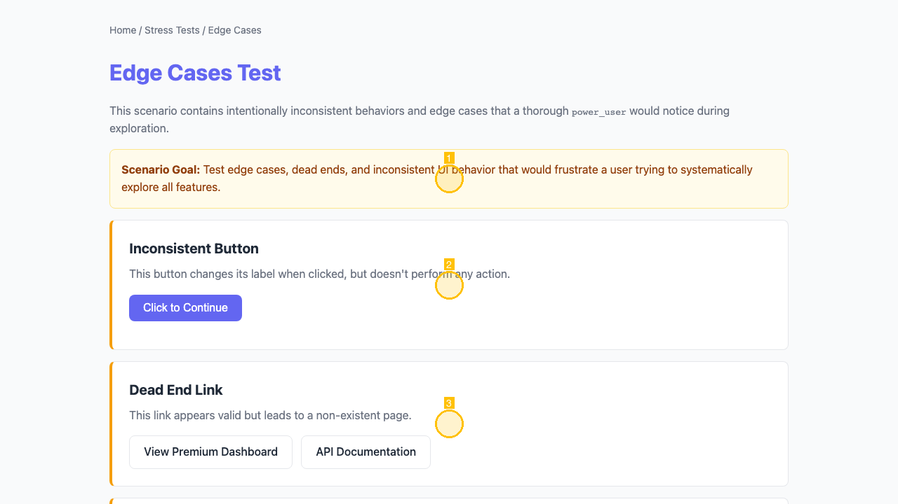

**Page 3:** http://localhost:5173/features/premium-dashboard/ (1 issue)

**Page 4:** http://localhost:5173/checkout/shipping/ (2 issues)

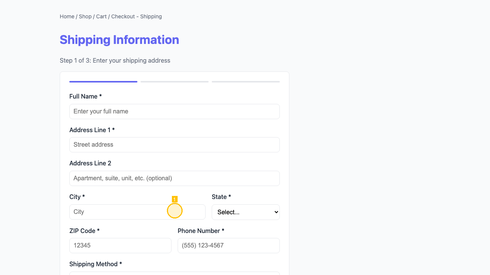

**Page 5:** http://localhost:5173/cart/ (1 issue)

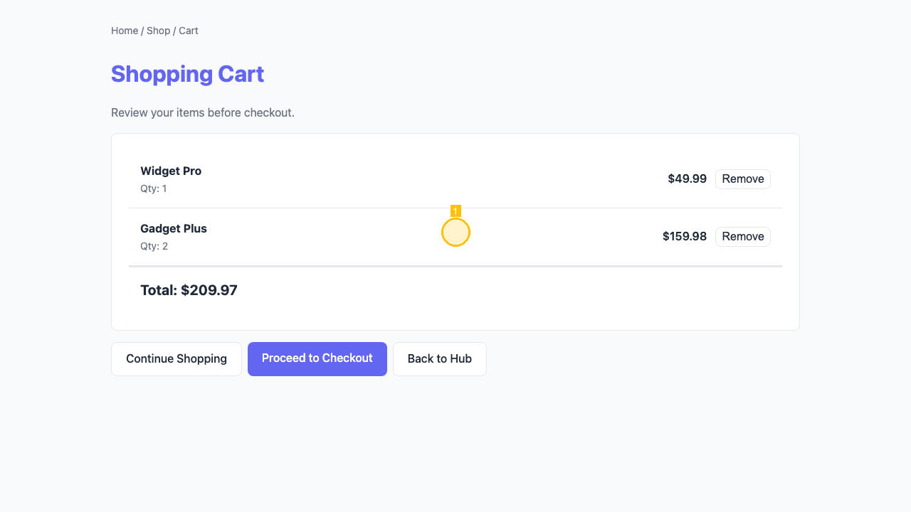

**Page 6:** http://localhost:5173/ (4 issues)

**Page 7:** http://localhost:5173/stress/many-links/ (3 issues)

**Page 8:** http://localhost:5173/stress/many-links/#item-13 (3 issues)

**Page 9:** http://localhost:5173/stress/many-links/#item-17 (6 issues)

**Page 10:** http://localhost:5173/stress/many-links/#item-14 (3 issues)

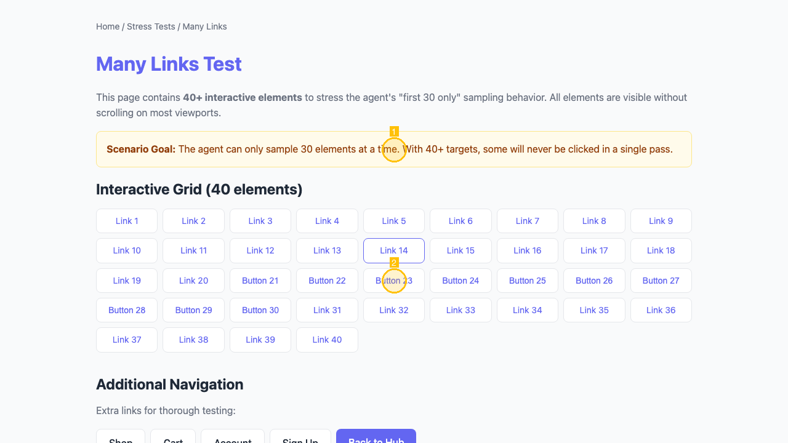

**Page 11:** http://localhost:5173/stress/many-links/#item-12 (3 issues)

**Page 12:** http://localhost:5173/stress/many-links/#item-20 (6 issues)

**Page 13:** http://localhost:5173/stress/many-links/#item-4 (3 issues)

**Page 14:** http://localhost:5173/stress/many-links/#item-9 (3 issues)

**Page 15:** http://localhost:5173/stress/many-links/#item-6 (3 issues)

**Page 16:** http://localhost:5173/stress/circular/ (14 issues)

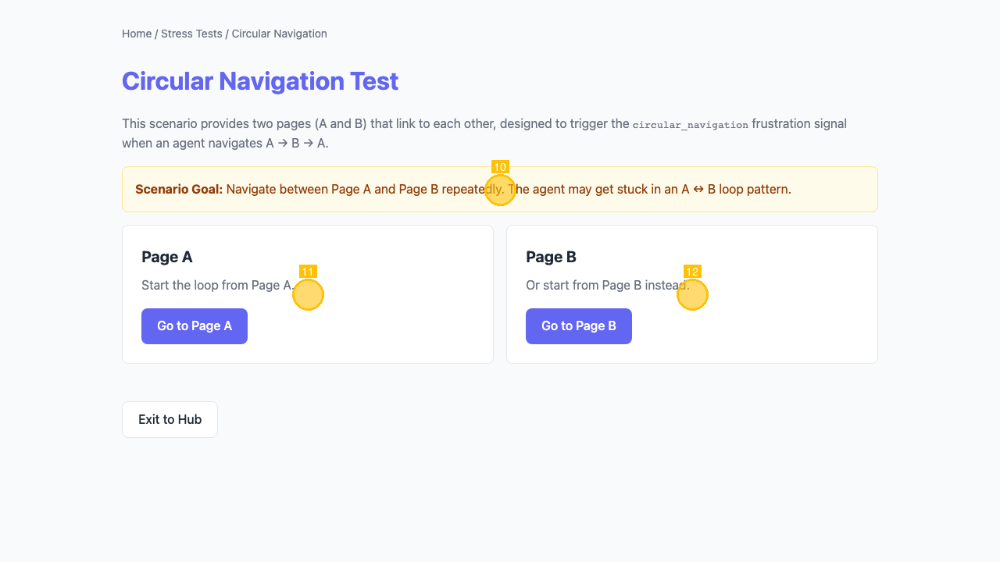

**Page 17:** http://localhost:5173/stress/circular/a/ (5 issues)

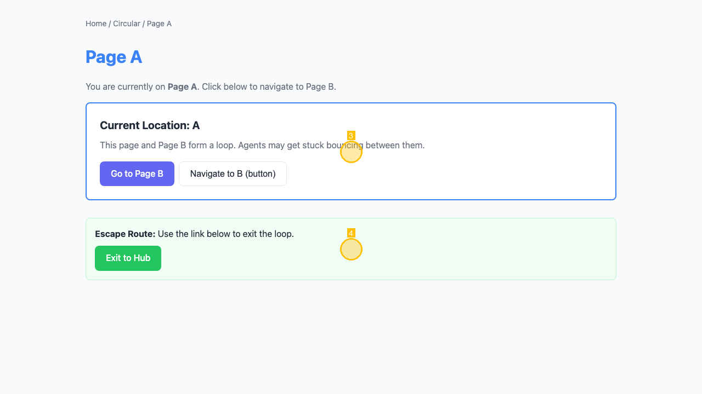

**Page 18:** http://localhost:5173/stress/circular/b/ (5 issues)

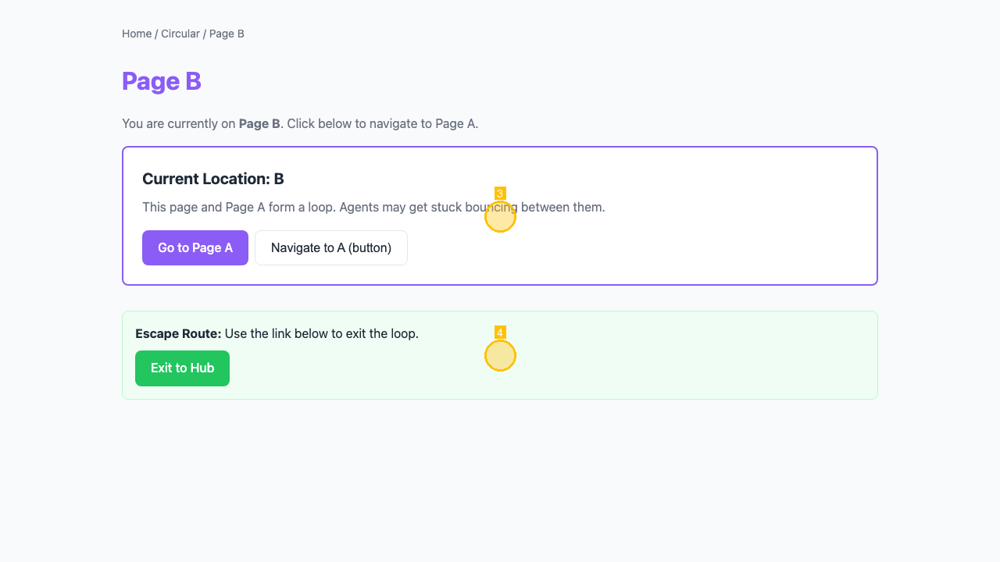

**Page 19:** http://localhost:5173/order-status/ (9 issues)

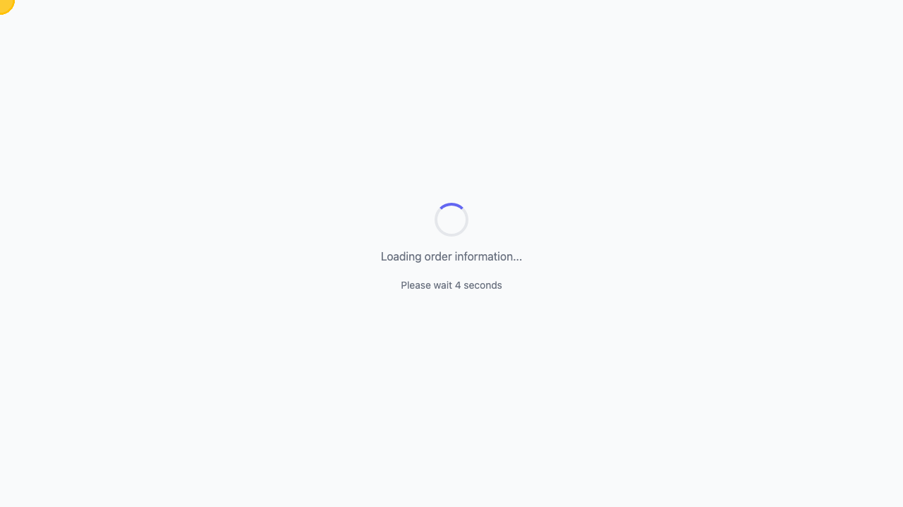

## Agent: search_user

- **Status:** gave_up
- **Elapsed:** 27.2s

### Navigation Path

1. http://localhost:5173
2. http://localhost:5173/stress/broken-forms/
3. http://localhost:5173/
4. http://localhost:5173/signup/
5. http://localhost:5173/signup/#

### Frustration Events

- 🔴 **unmet_goal** (critical): Unmet goal (gave up): Find a specific product or information using search
- 🟠 **accessibility_failure** (high): Accessibility issue: missing_label
- 🟠 **accessibility_failure** (high): Accessibility issue: missing_label
- 🟠 **accessibility_failure** (high): Accessibility issue: missing_label
- 🟡 **rage_decoy** (medium): Rage decoy: element 'div:has-text('Persona	Patience	Tech	Target F')' looks clickable (clickable class name, button-like styling) but is not interactive
- 🟡 **rage_decoy** (medium): Rage decoy: element 'div:has-text('Scenario Goal: Each form has a')' looks clickable (button-like styling) but is not interactive
- 🟡 **rage_decoy** (medium): Rage decoy: element 'div:has-text('Contact Form (Broken Labels)  ')' looks clickable (clickable class name, button-like styling) but is not interactive
- 🟡 **rage_decoy** (medium): Rage decoy: element 'div:has-text('Terms Agreement (Scroll to Ena')' looks clickable (clickable class name, button-like styling) but is not interactive
- 🟡 **rage_decoy** (medium): Rage decoy: element 'div:has-text('Subscription Form (Hidden Requ')' looks clickable (clickable class name, button-like styling) but is not interactive
- 🟡 **rage_decoy** (medium): Rage decoy: element 'div:has-text('Newsletter Preferences (Self-U')' looks clickable (clickable class name, button-like styling) but is not interactive
- 🟡 **rage_decoy** (medium): Rage decoy: element 'div:has-text('Shipping Options (Bad Default)')' looks clickable (clickable class name, button-like styling) but is not interactive
- 🟡 **rage_decoy** (medium): Rage decoy: element 'div:has-text('Payment Method (Broken Radio G')' looks clickable (clickable class name, button-like styling) but is not interactive
- 🟡 **rage_decoy** (medium): Rage decoy: element 'div:has-text('Persona	Patience	Tech	Target F')' looks clickable (clickable class name, button-like styling) but is not interactive
- 🟡 **rage_decoy** (medium): Rage decoy: element 'div:has-text('Your session will expire in: 5')' looks clickable (button-like styling) but is not interactive
- 🟡 **rage_decoy** (medium): Rage decoy: element 'div:has-text('Full Name * Email Address * Pa')' looks clickable (clickable class name, button-like styling) but is not interactive
- 🟡 **rage_decoy** (medium): Rage decoy: element 'div:has-text('⚠️ This email may already be r')' looks clickable (button-like styling) but is not interactive
- 🟡 **rage_decoy** (medium): Rage decoy: element 'div:has-text('I'm not a robot')' looks clickable (button-like styling) but is not interactive
- 🟡 **rage_decoy** (medium): Rage decoy: element 'div:has-text('Important: By creating an acco')' looks clickable (button-like styling) but is not interactive
- 🟡 **rage_decoy** (medium): Rage decoy: element 'div:has-text('Account Created!              ')' looks clickable (button-like styling) but is not interactive
- 🟡 **rage_decoy** (medium): Rage decoy: element 'div:has-text('Your session will expire in: 4')' looks clickable (button-like styling) but is not interactive
- 🟡 **rage_decoy** (medium): Rage decoy: element 'div:has-text('Full Name * Please enter your ')' looks clickable (clickable class name, button-like styling) but is not interactive
- 🟡 **rage_decoy** (medium): Rage decoy: element 'div:has-text('⚠️ This email may already be r')' looks clickable (button-like styling) but is not interactive
- 🟡 **rage_decoy** (medium): Rage decoy: element 'div:has-text('I'm not a robot')' looks clickable (button-like styling) but is not interactive
- 🟡 **rage_decoy** (medium): Rage decoy: element 'div:has-text('Important: By creating an acco')' looks clickable (button-like styling) but is not interactive
- 🟡 **rage_decoy** (medium): Rage decoy: element 'div:has-text('Account Created!              ')' looks clickable (button-like styling) but is not interactive
- 🟡 **error_message_visible** (medium): Error message visible: Please enter your full name (first and last name required)
- 🟡 **error_message_visible** (medium): Error message visible: Please enter a valid email address
- 🟡 **error_message_visible** (medium): Error message visible: You must agree to the terms to continue
- 🟡 **error_message_visible** (medium): Error message visible: Full Name * Please enter your full name (first and last name required)
- 🟡 **error_message_visible** (medium): Error message visible: Email Address * Please enter a valid email address
- 🟡 **error_message_visible** (medium): Error message visible: I agree to the Terms of Service and Privacy Policy * You must agree to the terms to continue
- 🟡 **error_message_visible** (medium): Error message visible: Full Name * Please enter your full name (first and last name required)
- 🟡 **error_message_visible** (medium): Error message visible: Please enter your full name (first and last name required)
- 🟡 **error_message_visible** (medium): Error message visible: Email Address * Please enter a valid email address
- 🟡 **error_message_visible** (medium): Error message visible: Please enter a valid email address

### Visual Evidence

**Page 1:** http://localhost:5173 (1 issue)

**Page 2:** http://localhost:5173/stress/broken-forms/ (10 issues)

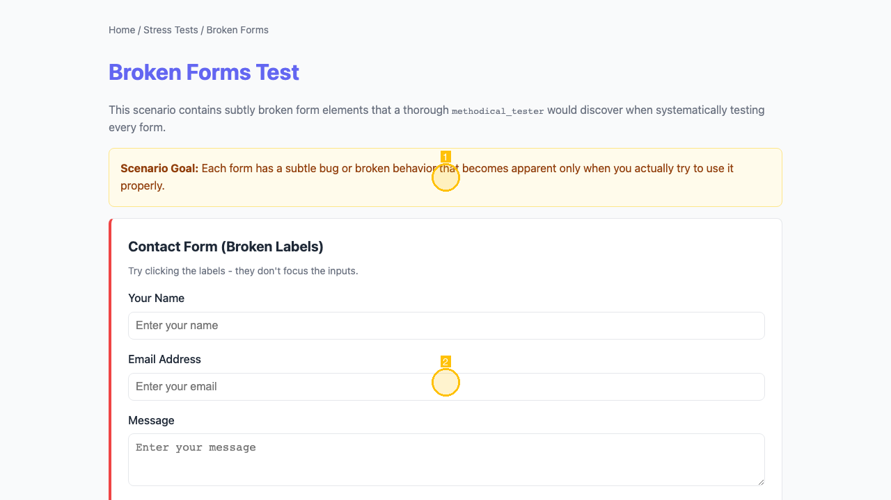

**Page 3:** http://localhost:5173/ (1 issue)

**Page 4:** http://localhost:5173/signup/ (6 issues)

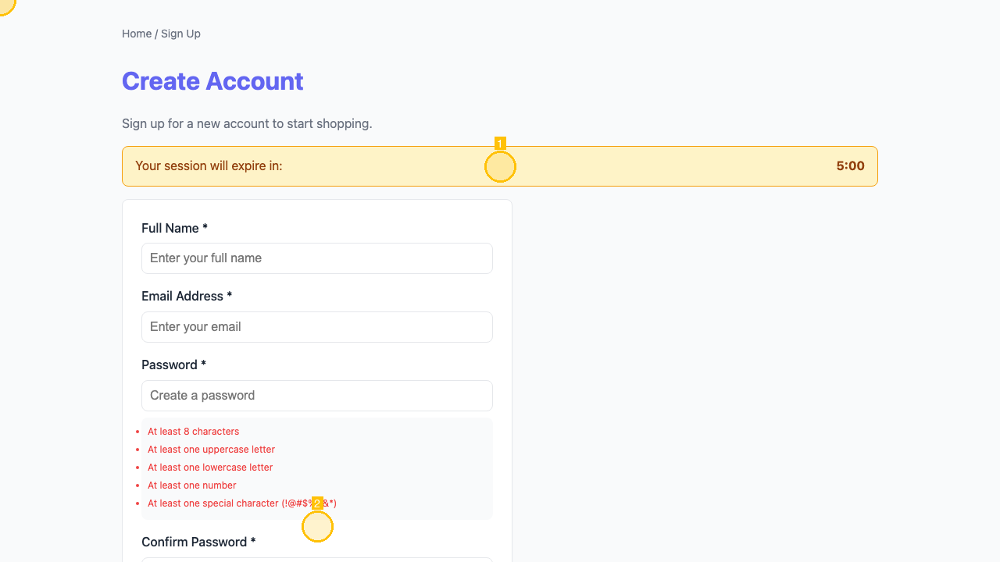

**Page 5:** http://localhost:5173/signup/# (16 issues)

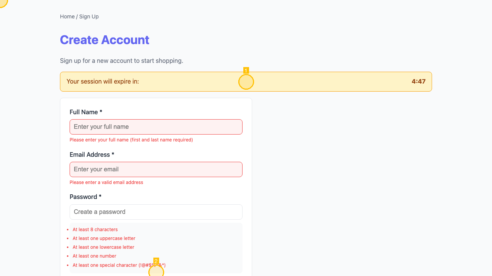

## Agent: checkout_user

- **Status:** gave_up
- **Elapsed:** 24.8s

### Navigation Path

1. http://localhost:5173
2. http://localhost:5173/stress/icon-bar/
3. http://localhost:5173/
4. http://localhost:5173/stress/rage-decoy/
5. http://localhost:5173/
6. http://localhost:5173/stress/rage-decoy/
7. http://localhost:5173/shop/

### Frustration Events

- 🔴 **unmet_goal** (critical): Unmet goal (gave up): Complete a purchase from cart to confirmation
- 🟡 **rage_decoy** (medium): Rage decoy: element 'div:has-text('Persona	Patience	Tech	Target F')' looks clickable (clickable class name, button-like styling) but is not interactive
- 🟡 **rage_decoy** (medium): Rage decoy: element 'div:has-text('Scenario Goal: Complete the wo')' looks clickable (button-like styling) but is not interactive
- 🟡 **rage_decoy** (medium): Rage decoy: element 'div:has-text('📄 📂 💾 ✂️ 📋 📌 ↩️ ↪️ B I U')' looks clickable (button-like styling) but is not interactive
- 🟡 **rage_decoy** (medium): Rage decoy: element 'div:has-text('Critical Actions (Icon-Only)  ')' looks clickable (clickable class name, button-like styling) but is not interactive
- 🟡 **rage_decoy** (medium): Rage decoy: element 'div:has-text('✓ → 👍 👎 ✕')' looks clickable (button-like styling) but is not interactive
- 🟡 **rage_decoy** (medium): Rage decoy: element 'div:has-text('💾 Save (text) 📂 Open (text) ')' looks clickable (clickable class name) but is not interactive
- 🟡 **rage_decoy** (medium): Rage decoy: element 'div:has-text('Document: Report_Q4_2024.docx ')' looks clickable (clickable class name, button-like styling) but is not interactive
- 🟡 **rage_decoy** (medium): Rage decoy: element 'div:has-text('Action performed:')' looks clickable (button-like styling) but is not interactive
- 🟡 **rage_decoy** (medium): Rage decoy: element 'div:has-text('Persona	Patience	Tech	Target F')' looks clickable (clickable class name, button-like styling) but is not interactive
- 🟡 **rage_decoy** (medium): Rage decoy: element 'div:has-text('Scenario Goal: The decoy eleme')' looks clickable (button-like styling) but is not interactive
- 🟡 **rage_decoy** (medium): Rage decoy: element 'div:has-text('Click to Continue')' looks clickable (cursor:pointer, clickable class name, box-shadow with pointer, interactive transition) but is not interactive
- 🟡 **rage_decoy** (medium): Rage decoy: element 'div:has-text('Submit Order')' looks clickable (cursor:pointer, clickable class name, box-shadow with pointer, interactive transition) but is not interactive
- 🟡 **rage_decoy** (medium): Rage decoy: element 'div:has-text('Delete Item')' looks clickable (cursor:pointer, clickable class name, box-shadow with pointer, interactive transition) but is not interactive
- 🟡 **rage_decoy** (medium): Rage decoy: element 'div:has-text('Special Offer!  Click here to ')' looks clickable (cursor:pointer, clickable class name, button-like styling) but is not interactive
- 🟡 **rage_decoy** (medium): Rage decoy: element 'p:has-text('Click here to claim your disco')' looks clickable (cursor:pointer) but is not interactive
- 🟡 **rage_decoy** (medium): Rage decoy: element 'span:has-text('click this link')' looks clickable (cursor:pointer, clickable class name) but is not interactive
- 🟡 **rage_decoy** (medium): Rage decoy: element 'span:has-text('contact support')' looks clickable (cursor:pointer, clickable class name) but is not interactive
- 🟡 **circular_navigation** (medium): Circular navigation detected: http://localhost:5173/ → http://localhost:5173/stress/rage-decoy/ → http://localhost:5173/
- 🟡 **rage_decoy** (medium): Rage decoy: element 'div:has-text('Persona	Patience	Tech	Target F')' looks clickable (clickable class name, button-like styling) but is not interactive
- 🟡 **circular_navigation** (medium): Circular navigation detected: http://localhost:5173/stress/rage-decoy/ → http://localhost:5173/ → http://localhost:5173/stress/rage-decoy/
- 🟡 **rage_decoy** (medium): Rage decoy: element 'div:has-text('Scenario Goal: The decoy eleme')' looks clickable (button-like styling) but is not interactive
- 🟡 **rage_decoy** (medium): Rage decoy: element 'div:has-text('Click to Continue')' looks clickable (cursor:pointer, clickable class name, box-shadow with pointer, interactive transition) but is not interactive
- 🟡 **rage_decoy** (medium): Rage decoy: element 'div:has-text('Submit Order')' looks clickable (cursor:pointer, clickable class name, box-shadow with pointer, interactive transition) but is not interactive
- 🟡 **rage_decoy** (medium): Rage decoy: element 'div:has-text('Delete Item')' looks clickable (cursor:pointer, clickable class name, box-shadow with pointer, interactive transition) but is not interactive
- 🟡 **rage_decoy** (medium): Rage decoy: element 'div:has-text('Special Offer!  Click here to ')' looks clickable (cursor:pointer, clickable class name, button-like styling) but is not interactive
- 🟡 **rage_decoy** (medium): Rage decoy: element 'p:has-text('Click here to claim your disco')' looks clickable (cursor:pointer) but is not interactive
- 🟡 **rage_decoy** (medium): Rage decoy: element 'span:has-text('click this link')' looks clickable (cursor:pointer, clickable class name) but is not interactive
- 🟡 **rage_decoy** (medium): Rage decoy: element 'span:has-text('contact support')' looks clickable (cursor:pointer, clickable class name) but is not interactive
- 🟡 **rage_decoy** (medium): Rage decoy: element 'div:has-text('Categories All Products Widget')' looks clickable (clickable class name, button-like styling) but is not interactive
- 🟡 **rage_decoy** (medium): Rage decoy: element 'div:has-text('Filter By Price Range Any Pric')' looks clickable (clickable class name, button-like styling) but is not interactive
- 🟡 **rage_decoy** (medium): Rage decoy: element 'div:has-text('HOT Widget Pro  The ultimate w')' looks clickable (clickable class name, button-like styling) but is not interactive
- 🟡 **rage_decoy** (medium): Rage decoy: element 'span:has-text('HOT')' looks clickable (button-like styling) but is not interactive
- 🟡 **rage_decoy** (medium): Rage decoy: element 'div:has-text('SALE Gadget Plus  Enhanced gad')' looks clickable (clickable class name, button-like styling) but is not interactive
- 🟡 **rage_decoy** (medium): Rage decoy: element 'span:has-text('SALE')' looks clickable (button-like styling) but is not interactive
- 🟡 **rage_decoy** (medium): Rage decoy: element 'div:has-text('Doohickey Basic  Essential doo')' looks clickable (clickable class name, button-like styling) but is not interactive
- 🟡 **rage_decoy** (medium): Rage decoy: element 'div:has-text('NEW Thingamajig XL  Extra larg')' looks clickable (clickable class name, button-like styling) but is not interactive
- 🟡 **rage_decoy** (medium): Rage decoy: element 'span:has-text('NEW')' looks clickable (button-like styling) but is not interactive
- 🟡 **rage_decoy** (medium): Rage decoy: element 'div:has-text('Gizmo Deluxe  Premium gizmo wi')' looks clickable (clickable class name, button-like styling) but is not interactive

### Visual Evidence

**Page 1:** http://localhost:5173 (1 issue)

**Page 2:** http://localhost:5173/stress/icon-bar/ (7 issues)

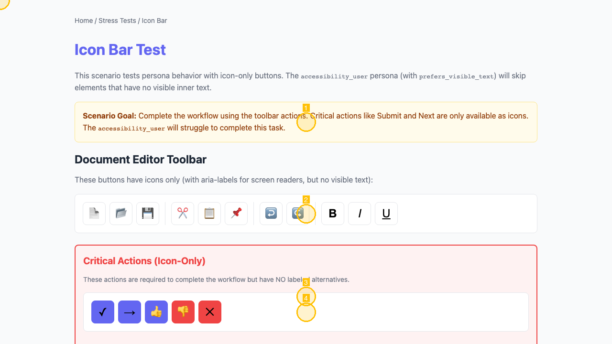

**Page 3:** http://localhost:5173/ (3 issues)

**Page 4:** http://localhost:5173/stress/rage-decoy/ (17 issues)

**Page 5:** http://localhost:5173/shop/ (10 issues)

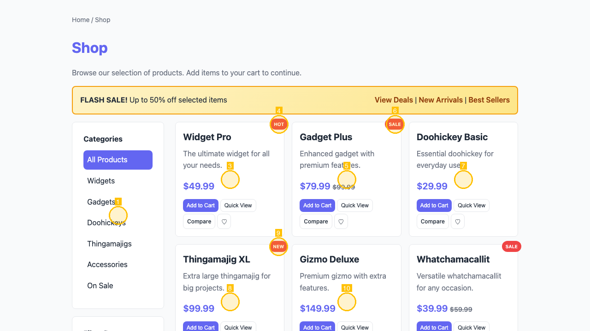
