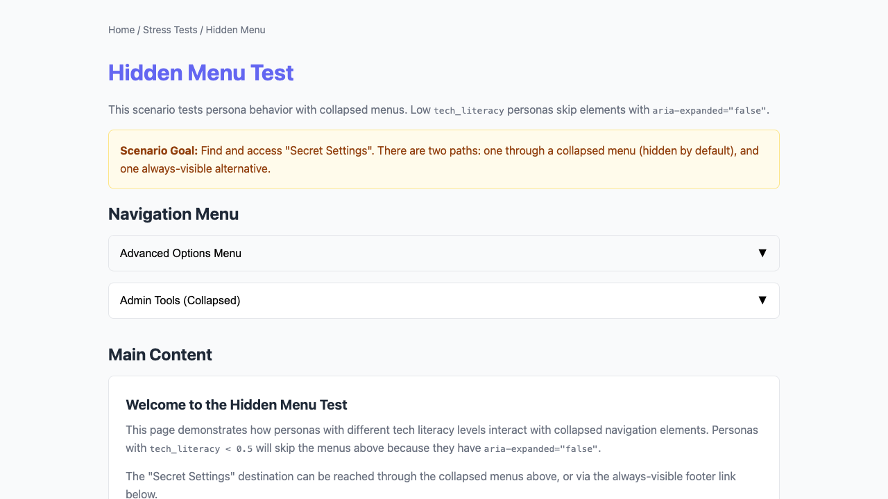
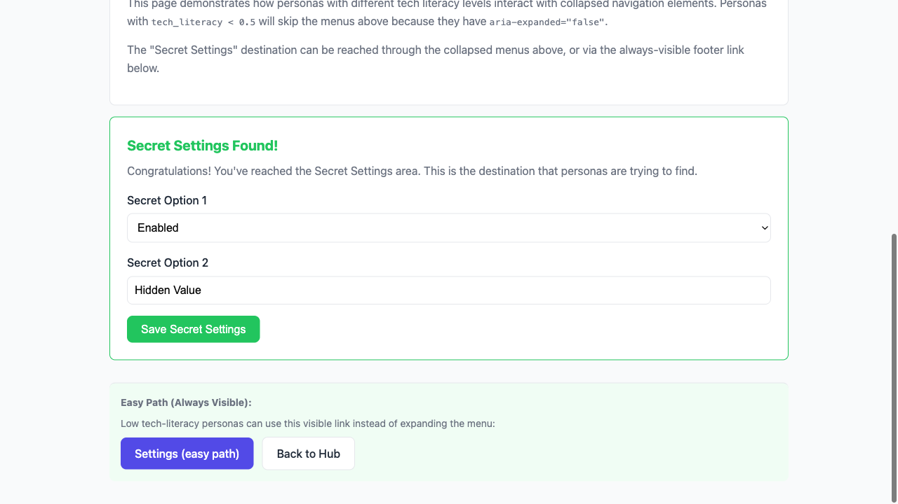
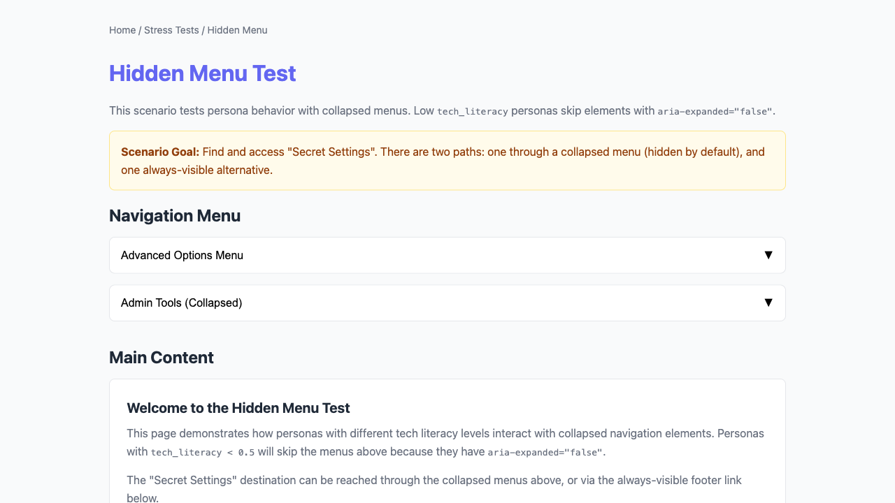
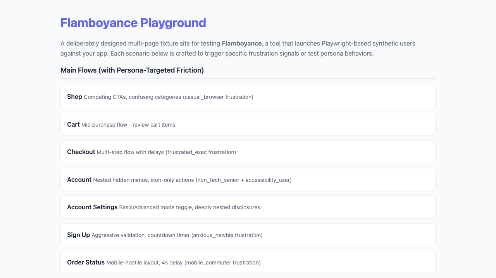
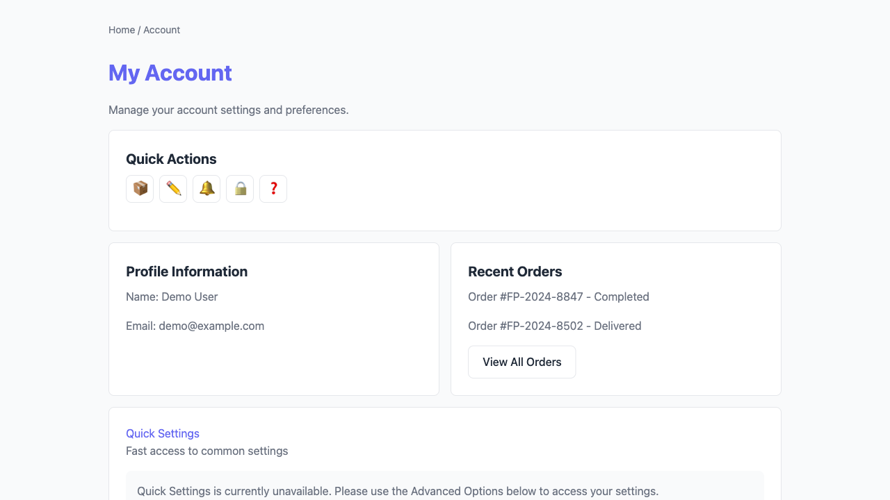
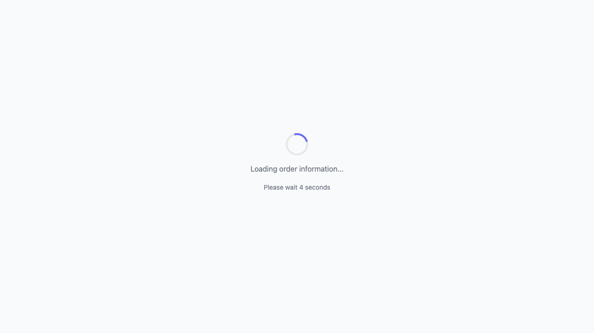

# Flamboyance UX Friction Report

- **Run ID:** `e77a1047-dd7d-4a97-869b-d596487143c9`
- **Target URL:** http://localhost:5173
- **Status:** done
- **Agents:** 2
- **Total friction events:** 13
- **Generated:** 2026-04-26 10:01:00 UTC

## Executive Summary

**Issues found:** 🔴 2 critical | 🟠 11 high

**Top issues to address:**

1. 🔴 **unmet_goal**: Unmet goal (gave up): Complete a purchase flow quickly
2. 🔴 **unmet_goal**: Unmet goal (gave up): Navigate all features and check edge cases
3. 🟠 **js_error**: JavaScript error: Failed to load resource: the server responded with a status of 404 (Not Found) (so

## Recommendations

- **accessibility_failure** (8x): Add missing alt text, labels, or ARIA attributes. Ensure WCAG 2.1 AA compliance.
- **js_error** (2x): Fix the JavaScript error. Check the browser console for stack traces.
- **unmet_goal** (2x): Review the user flow for this goal and remove friction points.
- **dead_end** (1x): Add navigation options or call-to-action buttons to this page.

## Issues by Severity

### 🔴 Critical (2)

| Event | Description | Count | URL |
|-------|-------------|-------|-----|
| unmet_goal | Unmet goal (gave up): Complete a purchase flow quickly | 1 | http://localhost:5173/stress/hidden |
| unmet_goal | Unmet goal (gave up): Navigate all features and check edge c | 1 | http://localhost:5173/order-status/ |

### 🟠 High (11 total, 4 unique)

| Event | Description | Count | URL |
|-------|-------------|-------|-----|
| accessibility_failure | Accessibility issue: missing_label | ×4 | http://localhost:5173/stress/hidden |
| accessibility_failure | Accessibility issue: missing_label | ×4 | http://localhost:5173/stress/hidden |
| js_error | JavaScript error: Failed to load resource: the server respon | ×2 | http://localhost:5173/ |
| dead_end | Dead end: no clickable elements found on page | 1 | http://localhost:5173/order-status/ |

## Agent Summary

| Persona | Status | Events | Critical | High | Elapsed |
|---------|--------|--------|----------|------|---------|
| frustrated_exec | gave_up | 6 | 1 | 5 | 9.1s |
| power_user | done | 7 | 1 | 6 | 9.4s |

## Agent: frustrated_exec

- **Status:** gave_up
- **Elapsed:** 9.1s

### Navigation Path

1. http://localhost:5173
2. http://localhost:5173/stress/hidden-menu/
3. http://localhost:5173/stress/hidden-menu/#secret-settings

### Frustration Events (6 total, 4 unique)

- 🟠 **accessibility_failure** (high): Accessibility issue: missing_label (×2)
- 🟠 **accessibility_failure** (high): Accessibility issue: missing_label (×2)
- 🔴 **unmet_goal** (critical): Unmet goal (gave up): Complete a purchase flow quickly
- 🟠 **js_error** (high): JavaScript error: Failed to load resource: the server responded with a status of

### Visual Evidence

**Page 1:** http://localhost:5173

**Page 2:** http://localhost:5173/stress/hidden-menu/ (2 issues)

- 🟠 **accessibility_failure**: Accessibility issue: missing_label
- 🟠 **accessibility_failure**: Accessibility issue: missing_label

**Page 3:** http://localhost:5173/stress/hidden-menu/#secret-settings (3 issues)

- 🔴 **unmet_goal**: Unmet goal (gave up): Complete a purchase flow quickly
- 🟠 **accessibility_failure**: Accessibility issue: missing_label
- 🟠 **accessibility_failure**: Accessibility issue: missing_label

## Agent: power_user

- **Status:** done
- **Elapsed:** 9.4s

### Navigation Path

1. http://localhost:5173
2. http://localhost:5173/stress/hidden-menu/
3. http://localhost:5173/stress/hidden-menu/#secret-settings
4. http://localhost:5173/
5. http://localhost:5173/account/
6. http://localhost:5173/order-status/

### Frustration Events (7 total, 5 unique)

- 🟠 **accessibility_failure** (high): Accessibility issue: missing_label (×2)
- 🟠 **accessibility_failure** (high): Accessibility issue: missing_label (×2)
- 🔴 **unmet_goal** (critical): Unmet goal (gave up): Navigate all features and check edge cases
- 🟠 **js_error** (high): JavaScript error: Failed to load resource: the server responded with a status of
- 🟠 **dead_end** (high): Dead end: no clickable elements found on page

### Visual Evidence

**Page 1:** http://localhost:5173

**Page 2:** http://localhost:5173/stress/hidden-menu/ (2 issues)

- 🟠 **accessibility_failure**: Accessibility issue: missing_label
- 🟠 **accessibility_failure**: Accessibility issue: missing_label

**Page 3:** http://localhost:5173/stress/hidden-menu/#secret-settings (2 issues)

- 🟠 **accessibility_failure**: Accessibility issue: missing_label
- 🟠 **accessibility_failure**: Accessibility issue: missing_label

**Page 4:** http://localhost:5173/ (1 issue)

- 🟠 **js_error**: JavaScript error: Failed to load resource: the server responded with a status of 404 (Not Found) (source: http://localhost:5173/favicon.ico)

**Page 5:** http://localhost:5173/account/

**Page 6:** http://localhost:5173/order-status/ (2 issues)

- 🔴 **unmet_goal**: Unmet goal (gave up): Navigate all features and check edge cases
- 🟠 **dead_end**: Dead end: no clickable elements found on page
