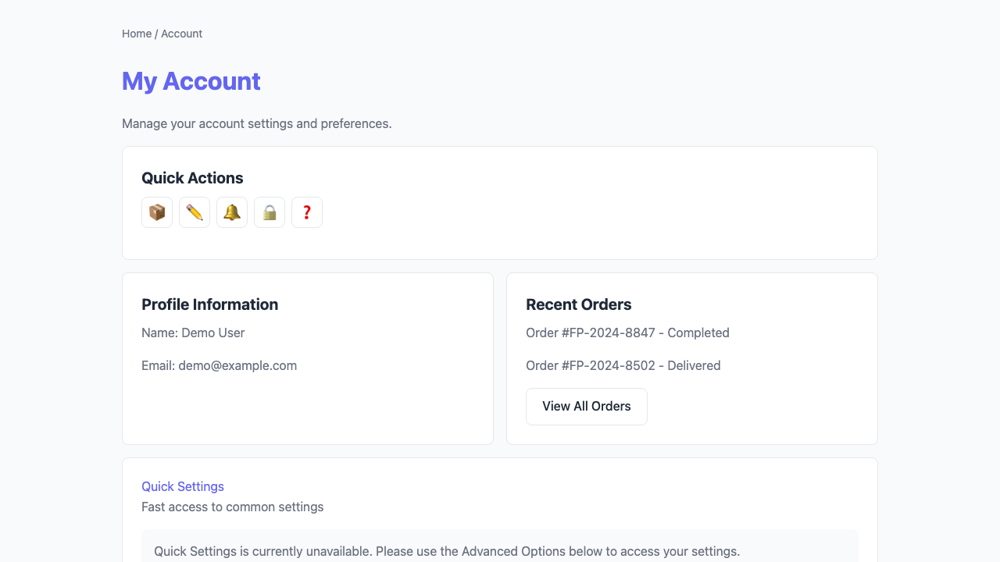
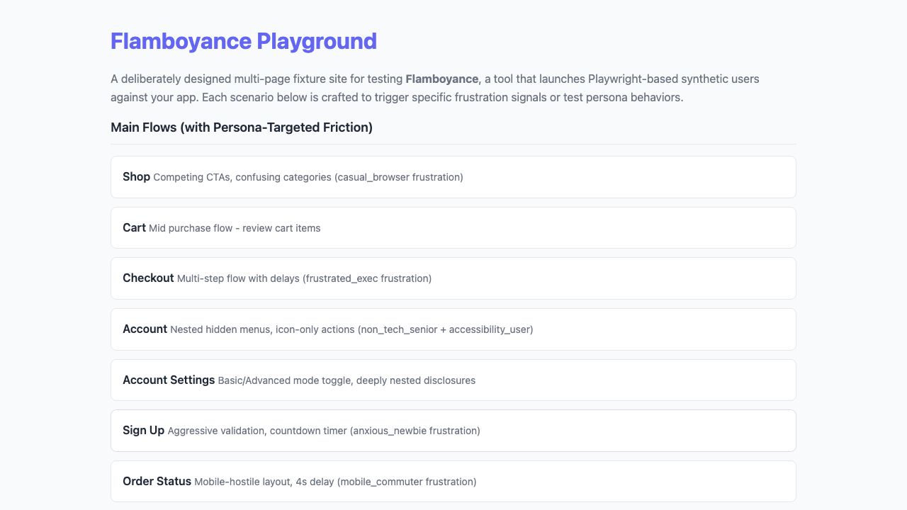
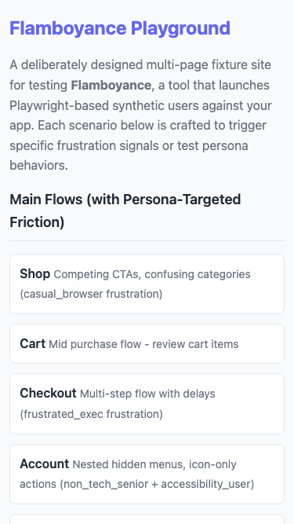
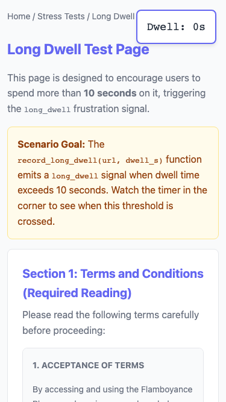
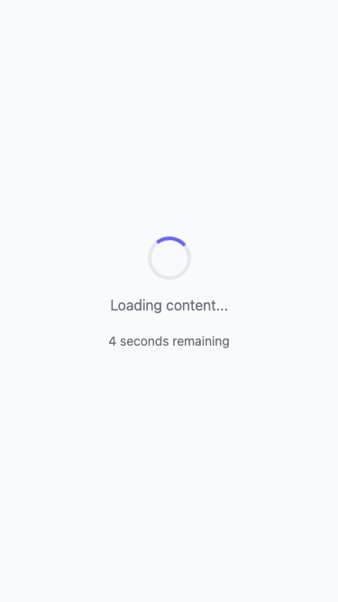

# Flamboyance UX Friction Report

- **Run ID:** `ef2e0a89-bb3b-485d-a696-b77efed9987d`
- **Target URL:** http://localhost:5173
- **Status:** done
- **Agents:** 8
- **Total friction events:** 162
- **Generated:** 2026-04-25 21:28:42 UTC

## Executive Summary

**Issues found:** 🔴 8 critical | 🟠 8 high | 🟡 146 medium

**Top issues to address:**

1. 🔴 **unmet_goal**: Unmet goal (gave up): Complete a purchase flow quickly
2. 🔴 **unmet_goal**: Unmet goal (gave up): Find and read account settings
3. 🔴 **unmet_goal**: Unmet goal (gave up): Navigate all features and check edge cases

## Recommendations

- **rage_decoy** (142x): Either make this element interactive or remove clickable styling (cursor:pointer, hover effects).
- **dead_end** (8x): Add navigation options or call-to-action buttons to this page.
- **unmet_goal** (8x): Review the user flow for this goal and remove friction points.
- **circular_navigation** (4x): Improve navigation flow to prevent users from going in circles.

## Issues by Severity

### 🔴 Critical (8)

| Event | Description | URL | Persona |
|-------|-------------|-----|---------|
| unmet_goal | Unmet goal (gave up): Complete a purchase flow quickly |  | frustrated_exec |
| unmet_goal | Unmet goal (gave up): Find and read account settings |  | non_tech_senior |
| unmet_goal | Unmet goal (gave up): Navigate all features and check edge cases |  | power_user |
| unmet_goal | Unmet goal (gave up): Browse around and see what's available |  | casual_browser |
| unmet_goal | Unmet goal (gave up): Sign up for an account without getting confused |  | anxious_newbie |
| unmet_goal | Unmet goal (gave up): Systematically check every link and form |  | methodical_tester |
| unmet_goal | Unmet goal (gave up): Quickly check order status while on the go |  | mobile_commuter |
| unmet_goal | Unmet goal (gave up): Navigate using visible labels and clear affordances |  | accessibility_user |

### 🟠 High (8)

| Event | Description | URL | Persona |
|-------|-------------|-----|---------|
| dead_end | Dead end: no clickable elements found on page | http://localhost:5173/order-status/ | frustrated_exec |
| dead_end | Dead end: no clickable elements found on page | http://localhost:5173/stress/dead-end/ | non_tech_senior |
| dead_end | Dead end: no clickable elements found on page | http://localhost:5173/stress/dead-end/ | power_user |
| dead_end | Dead end: no clickable elements found on page | http://localhost:5173/stress/dead-end/ | casual_browser |
| dead_end | Dead end: no clickable elements found on page | http://localhost:5173/order-status/ | anxious_newbie |
| dead_end | Dead end: no clickable elements found on page | http://localhost:5173/stress/dead-end/ | methodical_tester |
| dead_end | Dead end: no clickable elements found on page | http://localhost:5173/stress/slow/ | mobile_commuter |
| dead_end | Dead end: no clickable elements found on page | http://localhost:5173/order-status/ | accessibility_user |

### 🟡 Medium (146)

| Event | Description | URL | Persona |
|-------|-------------|-----|---------|
| rage_decoy | Rage decoy: element 'div:has-text('Persona	Patience	Tech	Target F')' looks click | http://localhost:5173 | frustrated_exec |
| rage_decoy | Rage decoy: element 'div:has-text('Basic Mode Advanced Mode')' looks clickable ( | http://localhost:5173/account/settings/ | frustrated_exec |
| rage_decoy | Rage decoy: element 'div:has-text('Notification Preferences  Emai')' looks click | http://localhost:5173/account/settings/ | frustrated_exec |
| rage_decoy | Rage decoy: element 'div:has-text('Change Password Current Passwo')' looks click | http://localhost:5173/account/settings/ | frustrated_exec |
| rage_decoy | Rage decoy: element 'div:has-text('Looking for more options?  Swi')' looks click | http://localhost:5173/account/settings/ | frustrated_exec |
| rage_decoy | Rage decoy: element 'div:has-text('Settings Categories         Ex')' looks click | http://localhost:5173/account/settings/ | frustrated_exec |
| rage_decoy | Rage decoy: element 'div:has-text('Danger Zone             ▼     ')' looks click | http://localhost:5173/account/settings/ | frustrated_exec |
| rage_decoy | Rage decoy: element 'div:has-text('Quick Actions 📦 ✏️ 🔔 🔒 ❓')' looks clickable ( | http://localhost:5173/account/ | frustrated_exec |
| rage_decoy | Rage decoy: element 'div:has-text('Profile Information  Name: Dem')' looks click | http://localhost:5173/account/ | frustrated_exec |
| rage_decoy | Rage decoy: element 'div:has-text('Recent Orders  Order #FP-2024-')' looks click | http://localhost:5173/account/ | frustrated_exec |
| rage_decoy | Rage decoy: element 'div:has-text('Quick Settings Fast access to ')' looks click | http://localhost:5173/account/ | frustrated_exec |
| rage_decoy | Rage decoy: element 'div:has-text('Quick Settings is currently un')' looks click | http://localhost:5173/account/ | frustrated_exec |
| rage_decoy | Rage decoy: element 'div:has-text('Account Options Advanced Accou')' looks click | http://localhost:5173/account/ | frustrated_exec |
| rage_decoy | Rage decoy: element 'div:has-text('Need help finding something?  ')' looks click | http://localhost:5173/account/ | frustrated_exec |
| rage_decoy | Rage decoy: element 'div:has-text('Special Offer for Returning Cu')' looks click | http://localhost:5173/order-status/ | frustrated_exec |
| rage_decoy | Rage decoy: element 'div:has-text('Look Up Order       ↓ Scroll d')' looks click | http://localhost:5173/order-status/ | frustrated_exec |
| rage_decoy | Rage decoy: element 'div:has-text('Order Details       ← Scroll h')' looks click | http://localhost:5173/order-status/ | frustrated_exec |
| rage_decoy | Rage decoy: element 'div:has-text('Order #FP-2024-8847 - Tracking')' looks click | http://localhost:5173/order-status/ | frustrated_exec |
| rage_decoy | Rage decoy: element 'div:has-text('✓')' looks clickable (button-like styling) bu | http://localhost:5173/order-status/ | frustrated_exec |
| rage_decoy | Rage decoy: element 'div:has-text('✓')' looks clickable (button-like styling) bu | http://localhost:5173/order-status/ | frustrated_exec |
| rage_decoy | Rage decoy: element 'div:has-text('✓')' looks clickable (button-like styling) bu | http://localhost:5173/order-status/ | frustrated_exec |
| rage_decoy | Rage decoy: element 'div:has-text('4')' looks clickable (button-like styling) bu | http://localhost:5173/order-status/ | frustrated_exec |
| rage_decoy | Rage decoy: element 'div:has-text('Persona	Patience	Tech	Target F')' looks click | http://localhost:5173 | non_tech_senior |
| rage_decoy | Rage decoy: element 'div:has-text('Scenario Goal: The decoy eleme')' looks click | http://localhost:5173/stress/rage-decoy/ | non_tech_senior |
| rage_decoy | Rage decoy: element 'div:has-text('Click to Continue')' looks clickable (cursor: | http://localhost:5173/stress/rage-decoy/ | non_tech_senior |
| rage_decoy | Rage decoy: element 'div:has-text('Submit Order')' looks clickable (cursor:point | http://localhost:5173/stress/rage-decoy/ | non_tech_senior |
| rage_decoy | Rage decoy: element 'div:has-text('Delete Item')' looks clickable (cursor:pointe | http://localhost:5173/stress/rage-decoy/ | non_tech_senior |
| rage_decoy | Rage decoy: element 'div:has-text('Special Offer!  Click here to ')' looks click | http://localhost:5173/stress/rage-decoy/ | non_tech_senior |
| rage_decoy | Rage decoy: element 'p:has-text('Click here to claim your disco')' looks clickab | http://localhost:5173/stress/rage-decoy/ | non_tech_senior |
| rage_decoy | Rage decoy: element 'span:has-text('click this link')' looks clickable (cursor:p | http://localhost:5173/stress/rage-decoy/ | non_tech_senior |
| rage_decoy | Rage decoy: element 'span:has-text('contact support')' looks clickable (cursor:p | http://localhost:5173/stress/rage-decoy/ | non_tech_senior |
| rage_decoy | Rage decoy: element 'div:has-text('Persona	Patience	Tech	Target F')' looks click | http://localhost:5173/ | non_tech_senior |
| rage_decoy | Rage decoy: element 'div:has-text('Dead End Detection  The record')' looks click | http://localhost:5173/stress/dead-end/ | non_tech_senior |
| rage_decoy | Rage decoy: element 'div:has-text('How to Escape  Since there are')' looks click | http://localhost:5173/stress/dead-end/ | non_tech_senior |
| rage_decoy | Rage decoy: element 'div:has-text('Persona	Patience	Tech	Target F')' looks click | http://localhost:5173 | power_user |
| rage_decoy | Rage decoy: element 'div:has-text('Dead End Detection  The record')' looks click | http://localhost:5173/stress/dead-end/ | power_user |
| rage_decoy | Rage decoy: element 'div:has-text('How to Escape  Since there are')' looks click | http://localhost:5173/stress/dead-end/ | power_user |
| rage_decoy | Rage decoy: element 'div:has-text('Persona	Patience	Tech	Target F')' looks click | http://localhost:5173 | casual_browser |
| rage_decoy | Rage decoy: element 'div:has-text('Scenario Goal: Each form has a')' looks click | http://localhost:5173/stress/broken-form | casual_browser |
| rage_decoy | Rage decoy: element 'div:has-text('Contact Form (Broken Labels)  ')' looks click | http://localhost:5173/stress/broken-form | casual_browser |
| rage_decoy | Rage decoy: element 'div:has-text('Terms Agreement (Scroll to Ena')' looks click | http://localhost:5173/stress/broken-form | casual_browser |
| rage_decoy | Rage decoy: element 'div:has-text('Subscription Form (Hidden Requ')' looks click | http://localhost:5173/stress/broken-form | casual_browser |
| rage_decoy | Rage decoy: element 'div:has-text('Newsletter Preferences (Self-U')' looks click | http://localhost:5173/stress/broken-form | casual_browser |
| rage_decoy | Rage decoy: element 'div:has-text('Shipping Options (Bad Default)')' looks click | http://localhost:5173/stress/broken-form | casual_browser |
| rage_decoy | Rage decoy: element 'div:has-text('Payment Method (Broken Radio G')' looks click | http://localhost:5173/stress/broken-form | casual_browser |
| rage_decoy | Rage decoy: element 'div:has-text('Persona	Patience	Tech	Target F')' looks click | http://localhost:5173/ | casual_browser |
| rage_decoy | Rage decoy: element 'div:has-text('Dead End Detection  The record')' looks click | http://localhost:5173/stress/dead-end/ | casual_browser |
| rage_decoy | Rage decoy: element 'div:has-text('How to Escape  Since there are')' looks click | http://localhost:5173/stress/dead-end/ | casual_browser |
| rage_decoy | Rage decoy: element 'div:has-text('Persona	Patience	Tech	Target F')' looks click | http://localhost:5173 | anxious_newbie |
| rage_decoy | Rage decoy: element 'div:has-text('Quick Actions 📦 ✏️ 🔔 🔒 ❓')' looks clickable ( | http://localhost:5173/account/ | anxious_newbie |
| rage_decoy | Rage decoy: element 'div:has-text('Profile Information  Name: Dem')' looks click | http://localhost:5173/account/ | anxious_newbie |
| rage_decoy | Rage decoy: element 'div:has-text('Recent Orders  Order #FP-2024-')' looks click | http://localhost:5173/account/ | anxious_newbie |
| rage_decoy | Rage decoy: element 'div:has-text('Quick Settings Fast access to ')' looks click | http://localhost:5173/account/ | anxious_newbie |
| rage_decoy | Rage decoy: element 'div:has-text('Quick Settings is currently un')' looks click | http://localhost:5173/account/ | anxious_newbie |
| rage_decoy | Rage decoy: element 'div:has-text('Account Options Advanced Accou')' looks click | http://localhost:5173/account/ | anxious_newbie |
| rage_decoy | Rage decoy: element 'div:has-text('Need help finding something?  ')' looks click | http://localhost:5173/account/ | anxious_newbie |
| rage_decoy | Rage decoy: element 'div:has-text('Special Offer for Returning Cu')' looks click | http://localhost:5173/order-status/ | anxious_newbie |
| rage_decoy | Rage decoy: element 'div:has-text('Look Up Order       ↓ Scroll d')' looks click | http://localhost:5173/order-status/ | anxious_newbie |
| rage_decoy | Rage decoy: element 'div:has-text('Order Details       ← Scroll h')' looks click | http://localhost:5173/order-status/ | anxious_newbie |
| rage_decoy | Rage decoy: element 'div:has-text('Order #FP-2024-8847 - Tracking')' looks click | http://localhost:5173/order-status/ | anxious_newbie |
| rage_decoy | Rage decoy: element 'div:has-text('✓')' looks clickable (button-like styling) bu | http://localhost:5173/order-status/ | anxious_newbie |
| rage_decoy | Rage decoy: element 'div:has-text('✓')' looks clickable (button-like styling) bu | http://localhost:5173/order-status/ | anxious_newbie |
| rage_decoy | Rage decoy: element 'div:has-text('✓')' looks clickable (button-like styling) bu | http://localhost:5173/order-status/ | anxious_newbie |
| rage_decoy | Rage decoy: element 'div:has-text('4')' looks clickable (button-like styling) bu | http://localhost:5173/order-status/ | anxious_newbie |
| rage_decoy | Rage decoy: element 'div:has-text('Persona	Patience	Tech	Target F')' looks click | http://localhost:5173 | methodical_tester |
| rage_decoy | Rage decoy: element 'div:has-text('Widget Pro Qty: 1 $49.99 Remov')' looks click | http://localhost:5173/cart/ | methodical_tester |
| rage_decoy | Rage decoy: element 'div:has-text('Persona	Patience	Tech	Target F')' looks click | http://localhost:5173/ | methodical_tester |
| rage_decoy | Rage decoy: element 'div:has-text('Scenario Goal: Each form has a')' looks click | http://localhost:5173/stress/broken-form | methodical_tester |
| rage_decoy | Rage decoy: element 'div:has-text('Contact Form (Broken Labels)  ')' looks click | http://localhost:5173/stress/broken-form | methodical_tester |
| rage_decoy | Rage decoy: element 'div:has-text('Terms Agreement (Scroll to Ena')' looks click | http://localhost:5173/stress/broken-form | methodical_tester |
| rage_decoy | Rage decoy: element 'div:has-text('Subscription Form (Hidden Requ')' looks click | http://localhost:5173/stress/broken-form | methodical_tester |
| rage_decoy | Rage decoy: element 'div:has-text('Newsletter Preferences (Self-U')' looks click | http://localhost:5173/stress/broken-form | methodical_tester |
| rage_decoy | Rage decoy: element 'div:has-text('Shipping Options (Bad Default)')' looks click | http://localhost:5173/stress/broken-form | methodical_tester |
| rage_decoy | Rage decoy: element 'div:has-text('Payment Method (Broken Radio G')' looks click | http://localhost:5173/stress/broken-form | methodical_tester |
| circular_navigation | Circular navigation detected: http://localhost:5173/ → http://localhost:5173/str | http://localhost:5173/ | methodical_tester |
| rage_decoy | Rage decoy: element 'div:has-text('Persona	Patience	Tech	Target F')' looks click | http://localhost:5173/ | methodical_tester |
| rage_decoy | Rage decoy: element 'div:has-text('Scenario Goal: Find and access')' looks click | http://localhost:5173/stress/hidden-menu | methodical_tester |
| rage_decoy | Rage decoy: element 'div:has-text('Welcome to the Hidden Menu Tes')' looks click | http://localhost:5173/stress/hidden-menu | methodical_tester |
| rage_decoy | Rage decoy: element 'div:has-text('Secret Settings Found!  Congra')' looks click | http://localhost:5173/stress/hidden-menu | methodical_tester |
| rage_decoy | Rage decoy: element 'div:has-text('Easy Path (Always Visible):  L')' looks click | http://localhost:5173/stress/hidden-menu | methodical_tester |
| circular_navigation | Circular navigation detected: http://localhost:5173/ → http://localhost:5173/str | http://localhost:5173/ | methodical_tester |
| rage_decoy | Rage decoy: element 'div:has-text('Persona	Patience	Tech	Target F')' looks click | http://localhost:5173/ | methodical_tester |
| rage_decoy | Rage decoy: element 'div:has-text('Dead End Detection  The record')' looks click | http://localhost:5173/stress/dead-end/ | methodical_tester |
| rage_decoy | Rage decoy: element 'div:has-text('How to Escape  Since there are')' looks click | http://localhost:5173/stress/dead-end/ | methodical_tester |
| rage_decoy | Rage decoy: element 'div:has-text('Persona	Patience	Tech	Target F')' looks click | http://localhost:5173 | mobile_commuter |
| rage_decoy | Rage decoy: element 'div:has-text('Dwell: 0s')' looks clickable (button-like sty | http://localhost:5173/stress/long-dwell/ | mobile_commuter |
| rage_decoy | Rage decoy: element 'div:has-text('Scenario Goal: The record_long')' looks click | http://localhost:5173/stress/long-dwell/ | mobile_commuter |
| rage_decoy | Rage decoy: element 'div:has-text('Section 1: Terms and Condition')' looks click | http://localhost:5173/stress/long-dwell/ | mobile_commuter |
| rage_decoy | Rage decoy: element 'div:has-text('1. ACCEPTANCE OF TERMS  By acc')' looks click | http://localhost:5173/stress/long-dwell/ | mobile_commuter |
| rage_decoy | Rage decoy: element 'div:has-text('Section 2: Comprehension Quiz ')' looks click | http://localhost:5173/stress/long-dwell/ | mobile_commuter |
| rage_decoy | Rage decoy: element 'div:has-text('Question 1: What happens if yo')' looks click | http://localhost:5173/stress/long-dwell/ | mobile_commuter |
| rage_decoy | Rage decoy: element 'div:has-text('Question 2: What type of warra')' looks click | http://localhost:5173/stress/long-dwell/ | mobile_commuter |
| rage_decoy | Rage decoy: element 'div:has-text('Question 3: Who owns the intel')' looks click | http://localhost:5173/stress/long-dwell/ | mobile_commuter |
| rage_decoy | Rage decoy: element 'div:has-text('Section 3: Understanding Long ')' looks click | http://localhost:5173/stress/long-dwell/ | mobile_commuter |
| rage_decoy | Rage decoy: element 'div:has-text('Reading Progress:  Keep readin')' looks click | http://localhost:5173/stress/long-dwell/ | mobile_commuter |
| rage_decoy | Rage decoy: element 'div:has-text('Load time: calculating...')' looks clickable  | http://localhost:5173/stress/slow/ | mobile_commuter |
| rage_decoy | Rage decoy: element 'div:has-text('slow_load Signal: The record_s')' looks click | http://localhost:5173/stress/slow/ | mobile_commuter |
| rage_decoy | Rage decoy: element 'div:has-text('Test Different Load Times     ')' looks click | http://localhost:5173/stress/slow/ | mobile_commuter |
| rage_decoy | Rage decoy: element 'div:has-text('2s (under threshold)         4')' looks click | http://localhost:5173/stress/slow/ | mobile_commuter |
| rage_decoy | Rage decoy: element 'div:has-text('Content Loaded!               ')' looks click | http://localhost:5173/stress/slow/ | mobile_commuter |
| rage_decoy | Rage decoy: element 'div:has-text('Slow Page Information         ')' looks click | http://localhost:5173/stress/slow/ | mobile_commuter |
| rage_decoy | Rage decoy: element 'div:has-text('Persona	Patience	Tech	Target F')' looks click | http://localhost:5173 | accessibility_user |
| rage_decoy | Rage decoy: element 'div:has-text('Basic Mode Advanced Mode')' looks clickable ( | http://localhost:5173/account/settings/ | accessibility_user |
| rage_decoy | Rage decoy: element 'div:has-text('Notification Preferences  Emai')' looks click | http://localhost:5173/account/settings/ | accessibility_user |
| rage_decoy | Rage decoy: element 'div:has-text('Change Password Current Passwo')' looks click | http://localhost:5173/account/settings/ | accessibility_user |
| rage_decoy | Rage decoy: element 'div:has-text('Looking for more options?  Swi')' looks click | http://localhost:5173/account/settings/ | accessibility_user |
| rage_decoy | Rage decoy: element 'div:has-text('Settings Categories         Ex')' looks click | http://localhost:5173/account/settings/ | accessibility_user |
| rage_decoy | Rage decoy: element 'div:has-text('Danger Zone             ▼     ')' looks click | http://localhost:5173/account/settings/ | accessibility_user |
| rage_decoy | Rage decoy: element 'div:has-text('Quick Actions 📦 ✏️ 🔔 🔒 ❓')' looks clickable ( | http://localhost:5173/account/ | accessibility_user |
| rage_decoy | Rage decoy: element 'div:has-text('Profile Information  Name: Dem')' looks click | http://localhost:5173/account/ | accessibility_user |
| rage_decoy | Rage decoy: element 'div:has-text('Recent Orders  Order #FP-2024-')' looks click | http://localhost:5173/account/ | accessibility_user |
| rage_decoy | Rage decoy: element 'div:has-text('Quick Settings Fast access to ')' looks click | http://localhost:5173/account/ | accessibility_user |
| rage_decoy | Rage decoy: element 'div:has-text('Quick Settings is currently un')' looks click | http://localhost:5173/account/ | accessibility_user |
| rage_decoy | Rage decoy: element 'div:has-text('Account Options Advanced Accou')' looks click | http://localhost:5173/account/ | accessibility_user |
| rage_decoy | Rage decoy: element 'div:has-text('Need help finding something?  ')' looks click | http://localhost:5173/account/ | accessibility_user |
| rage_decoy | Rage decoy: element 'div:has-text('Persona	Patience	Tech	Target F')' looks click | http://localhost:5173/ | accessibility_user |
| circular_navigation | Circular navigation detected: http://localhost:5173/account/ → http://localhost: | http://localhost:5173/account/ | accessibility_user |
| rage_decoy | Rage decoy: element 'div:has-text('Quick Actions 📦 ✏️ 🔔 🔒 ❓')' looks clickable ( | http://localhost:5173/account/ | accessibility_user |
| rage_decoy | Rage decoy: element 'div:has-text('Profile Information  Name: Dem')' looks click | http://localhost:5173/account/ | accessibility_user |
| rage_decoy | Rage decoy: element 'div:has-text('Recent Orders  Order #FP-2024-')' looks click | http://localhost:5173/account/ | accessibility_user |
| rage_decoy | Rage decoy: element 'div:has-text('Quick Settings Fast access to ')' looks click | http://localhost:5173/account/ | accessibility_user |
| rage_decoy | Rage decoy: element 'div:has-text('Quick Settings is currently un')' looks click | http://localhost:5173/account/ | accessibility_user |
| rage_decoy | Rage decoy: element 'div:has-text('Account Options Advanced Accou')' looks click | http://localhost:5173/account/ | accessibility_user |
| rage_decoy | Rage decoy: element 'div:has-text('Need help finding something?  ')' looks click | http://localhost:5173/account/ | accessibility_user |
| rage_decoy | Rage decoy: element 'div:has-text('Basic Mode Advanced Mode')' looks clickable ( | http://localhost:5173/account/settings/ | accessibility_user |
| rage_decoy | Rage decoy: element 'div:has-text('Notification Preferences  Emai')' looks click | http://localhost:5173/account/settings/ | accessibility_user |
| rage_decoy | Rage decoy: element 'div:has-text('Change Password Current Passwo')' looks click | http://localhost:5173/account/settings/ | accessibility_user |
| rage_decoy | Rage decoy: element 'div:has-text('Looking for more options?  Swi')' looks click | http://localhost:5173/account/settings/ | accessibility_user |
| rage_decoy | Rage decoy: element 'div:has-text('Settings Categories         Ex')' looks click | http://localhost:5173/account/settings/ | accessibility_user |
| rage_decoy | Rage decoy: element 'div:has-text('Danger Zone             ▼     ')' looks click | http://localhost:5173/account/settings/ | accessibility_user |
| circular_navigation | Circular navigation detected: http://localhost:5173/account/ → http://localhost: | http://localhost:5173/account/ | accessibility_user |
| rage_decoy | Rage decoy: element 'div:has-text('Quick Actions 📦 ✏️ 🔔 🔒 ❓')' looks clickable ( | http://localhost:5173/account/ | accessibility_user |
| rage_decoy | Rage decoy: element 'div:has-text('Profile Information  Name: Dem')' looks click | http://localhost:5173/account/ | accessibility_user |
| rage_decoy | Rage decoy: element 'div:has-text('Recent Orders  Order #FP-2024-')' looks click | http://localhost:5173/account/ | accessibility_user |
| rage_decoy | Rage decoy: element 'div:has-text('Quick Settings Fast access to ')' looks click | http://localhost:5173/account/ | accessibility_user |
| rage_decoy | Rage decoy: element 'div:has-text('Quick Settings is currently un')' looks click | http://localhost:5173/account/ | accessibility_user |
| rage_decoy | Rage decoy: element 'div:has-text('Account Options Advanced Accou')' looks click | http://localhost:5173/account/ | accessibility_user |
| rage_decoy | Rage decoy: element 'div:has-text('Need help finding something?  ')' looks click | http://localhost:5173/account/ | accessibility_user |
| rage_decoy | Rage decoy: element 'div:has-text('Special Offer for Returning Cu')' looks click | http://localhost:5173/order-status/ | accessibility_user |
| rage_decoy | Rage decoy: element 'div:has-text('Look Up Order       ↓ Scroll d')' looks click | http://localhost:5173/order-status/ | accessibility_user |
| rage_decoy | Rage decoy: element 'div:has-text('Order Details       ← Scroll h')' looks click | http://localhost:5173/order-status/ | accessibility_user |
| rage_decoy | Rage decoy: element 'div:has-text('Order #FP-2024-8847 - Tracking')' looks click | http://localhost:5173/order-status/ | accessibility_user |
| rage_decoy | Rage decoy: element 'div:has-text('✓')' looks clickable (button-like styling) bu | http://localhost:5173/order-status/ | accessibility_user |
| rage_decoy | Rage decoy: element 'div:has-text('✓')' looks clickable (button-like styling) bu | http://localhost:5173/order-status/ | accessibility_user |
| rage_decoy | Rage decoy: element 'div:has-text('✓')' looks clickable (button-like styling) bu | http://localhost:5173/order-status/ | accessibility_user |
| rage_decoy | Rage decoy: element 'div:has-text('4')' looks clickable (button-like styling) bu | http://localhost:5173/order-status/ | accessibility_user |

## Agent Summary

| Persona | Status | Events | Critical | High | Elapsed |
|---------|--------|--------|----------|------|---------|
| frustrated_exec | done | 24 | 1 | 1 | 5.9s |
| non_tech_senior | done | 14 | 1 | 1 | 6.0s |
| power_user | done | 5 | 1 | 1 | 2.8s |
| casual_browser | done | 13 | 1 | 1 | 12.6s |
| anxious_newbie | done | 18 | 1 | 1 | 6.9s |
| methodical_tester | done | 22 | 1 | 1 | 12.5s |
| mobile_commuter | done | 19 | 1 | 1 | 5.5s |
| accessibility_user | done | 47 | 1 | 1 | 19.9s |

## Agent: frustrated_exec

- **Status:** done
- **Elapsed:** 5.9s

### Navigation Path

1. http://localhost:5173
2. http://localhost:5173/account/settings/
3. http://localhost:5173/account/
4. http://localhost:5173/order-status/

### Frustration Events

- 🔴 **unmet_goal** (critical): Unmet goal (gave up): Complete a purchase flow quickly
- 🟠 **dead_end** (high): Dead end: no clickable elements found on page
- 🟡 **rage_decoy** (medium): Rage decoy: element 'div:has-text('Persona	Patience	Tech	Target F')' looks clickable (clickable class name, button-like styling) but is not interactive
- 🟡 **rage_decoy** (medium): Rage decoy: element 'div:has-text('Basic Mode Advanced Mode')' looks clickable (button-like styling) but is not interactive
- 🟡 **rage_decoy** (medium): Rage decoy: element 'div:has-text('Notification Preferences  Emai')' looks clickable (clickable class name, button-like styling) but is not interactive
- 🟡 **rage_decoy** (medium): Rage decoy: element 'div:has-text('Change Password Current Passwo')' looks clickable (clickable class name, button-like styling) but is not interactive
- 🟡 **rage_decoy** (medium): Rage decoy: element 'div:has-text('Looking for more options?  Swi')' looks clickable (button-like styling) but is not interactive
- 🟡 **rage_decoy** (medium): Rage decoy: element 'div:has-text('Settings Categories         Ex')' looks clickable (clickable class name, button-like styling) but is not interactive
- 🟡 **rage_decoy** (medium): Rage decoy: element 'div:has-text('Danger Zone             ▼     ')' looks clickable (clickable class name, button-like styling) but is not interactive
- 🟡 **rage_decoy** (medium): Rage decoy: element 'div:has-text('Quick Actions 📦 ✏️ 🔔 🔒 ❓')' looks clickable (clickable class name, button-like styling) but is not interactive
- 🟡 **rage_decoy** (medium): Rage decoy: element 'div:has-text('Profile Information  Name: Dem')' looks clickable (clickable class name, button-like styling) but is not interactive
- 🟡 **rage_decoy** (medium): Rage decoy: element 'div:has-text('Recent Orders  Order #FP-2024-')' looks clickable (clickable class name, button-like styling) but is not interactive
- 🟡 **rage_decoy** (medium): Rage decoy: element 'div:has-text('Quick Settings Fast access to ')' looks clickable (clickable class name, button-like styling) but is not interactive
- 🟡 **rage_decoy** (medium): Rage decoy: element 'div:has-text('Quick Settings is currently un')' looks clickable (button-like styling) but is not interactive
- 🟡 **rage_decoy** (medium): Rage decoy: element 'div:has-text('Account Options Advanced Accou')' looks clickable (clickable class name, button-like styling) but is not interactive
- 🟡 **rage_decoy** (medium): Rage decoy: element 'div:has-text('Need help finding something?  ')' looks clickable (button-like styling) but is not interactive
- 🟡 **rage_decoy** (medium): Rage decoy: element 'div:has-text('Special Offer for Returning Cu')' looks clickable (clickable class name) but is not interactive
- 🟡 **rage_decoy** (medium): Rage decoy: element 'div:has-text('Look Up Order       ↓ Scroll d')' looks clickable (clickable class name, button-like styling) but is not interactive
- 🟡 **rage_decoy** (medium): Rage decoy: element 'div:has-text('Order Details       ← Scroll h')' looks clickable (clickable class name, button-like styling) but is not interactive
- 🟡 **rage_decoy** (medium): Rage decoy: element 'div:has-text('Order #FP-2024-8847 - Tracking')' looks clickable (clickable class name, button-like styling) but is not interactive
- 🟡 **rage_decoy** (medium): Rage decoy: element 'div:has-text('✓')' looks clickable (button-like styling) but is not interactive
- 🟡 **rage_decoy** (medium): Rage decoy: element 'div:has-text('✓')' looks clickable (button-like styling) but is not interactive
- 🟡 **rage_decoy** (medium): Rage decoy: element 'div:has-text('✓')' looks clickable (button-like styling) but is not interactive
- 🟡 **rage_decoy** (medium): Rage decoy: element 'div:has-text('4')' looks clickable (button-like styling) but is not interactive

### Visual Evidence

**Page 1:** http://localhost:5173 (1 issue)

**Page 2:** http://localhost:5173/account/settings/ (6 issues)

**Page 3:** http://localhost:5173/account/ (7 issues)

**Page 4:** http://localhost:5173/order-status/ (9 issues)

## Agent: non_tech_senior

- **Status:** done
- **Elapsed:** 6.0s

### Navigation Path

1. http://localhost:5173
2. http://localhost:5173/stress/rage-decoy/
3. http://localhost:5173/
4. http://localhost:5173/stress/dead-end/

### Frustration Events

- 🔴 **unmet_goal** (critical): Unmet goal (gave up): Find and read account settings
- 🟠 **dead_end** (high): Dead end: no clickable elements found on page
- 🟡 **rage_decoy** (medium): Rage decoy: element 'div:has-text('Persona	Patience	Tech	Target F')' looks clickable (clickable class name, button-like styling) but is not interactive
- 🟡 **rage_decoy** (medium): Rage decoy: element 'div:has-text('Scenario Goal: The decoy eleme')' looks clickable (button-like styling) but is not interactive
- 🟡 **rage_decoy** (medium): Rage decoy: element 'div:has-text('Click to Continue')' looks clickable (cursor:pointer, clickable class name, box-shadow with pointer, interactive transition) but is not interactive
- 🟡 **rage_decoy** (medium): Rage decoy: element 'div:has-text('Submit Order')' looks clickable (cursor:pointer, clickable class name, box-shadow with pointer, interactive transition) but is not interactive
- 🟡 **rage_decoy** (medium): Rage decoy: element 'div:has-text('Delete Item')' looks clickable (cursor:pointer, clickable class name, box-shadow with pointer, interactive transition) but is not interactive
- 🟡 **rage_decoy** (medium): Rage decoy: element 'div:has-text('Special Offer!  Click here to ')' looks clickable (cursor:pointer, clickable class name, button-like styling) but is not interactive
- 🟡 **rage_decoy** (medium): Rage decoy: element 'p:has-text('Click here to claim your disco')' looks clickable (cursor:pointer) but is not interactive
- 🟡 **rage_decoy** (medium): Rage decoy: element 'span:has-text('click this link')' looks clickable (cursor:pointer, clickable class name) but is not interactive
- 🟡 **rage_decoy** (medium): Rage decoy: element 'span:has-text('contact support')' looks clickable (cursor:pointer, clickable class name) but is not interactive
- 🟡 **rage_decoy** (medium): Rage decoy: element 'div:has-text('Persona	Patience	Tech	Target F')' looks clickable (clickable class name, button-like styling) but is not interactive
- 🟡 **rage_decoy** (medium): Rage decoy: element 'div:has-text('Dead End Detection  The record')' looks clickable (button-like styling) but is not interactive
- 🟡 **rage_decoy** (medium): Rage decoy: element 'div:has-text('How to Escape  Since there are')' looks clickable (button-like styling) but is not interactive

### Visual Evidence

**Page 1:** http://localhost:5173 (1 issue)

**Page 2:** http://localhost:5173/stress/rage-decoy/ (8 issues)

**Page 3:** http://localhost:5173/ (1 issue)

**Page 4:** http://localhost:5173/stress/dead-end/ (3 issues)

## Agent: power_user

- **Status:** done
- **Elapsed:** 2.8s

### Navigation Path

1. http://localhost:5173
2. http://localhost:5173/stress/dead-end/

### Frustration Events

- 🔴 **unmet_goal** (critical): Unmet goal (gave up): Navigate all features and check edge cases
- 🟠 **dead_end** (high): Dead end: no clickable elements found on page
- 🟡 **rage_decoy** (medium): Rage decoy: element 'div:has-text('Persona	Patience	Tech	Target F')' looks clickable (clickable class name, button-like styling) but is not interactive
- 🟡 **rage_decoy** (medium): Rage decoy: element 'div:has-text('Dead End Detection  The record')' looks clickable (button-like styling) but is not interactive
- 🟡 **rage_decoy** (medium): Rage decoy: element 'div:has-text('How to Escape  Since there are')' looks clickable (button-like styling) but is not interactive

### Visual Evidence

**Page 1:** http://localhost:5173 (1 issue)

**Page 2:** http://localhost:5173/stress/dead-end/ (3 issues)

## Agent: casual_browser

- **Status:** done
- **Elapsed:** 12.6s

### Navigation Path

1. http://localhost:5173
2. http://localhost:5173/stress/broken-forms/
3. http://localhost:5173/
4. http://localhost:5173/stress/dead-end/

### Frustration Events

- 🔴 **unmet_goal** (critical): Unmet goal (gave up): Browse around and see what's available
- 🟠 **dead_end** (high): Dead end: no clickable elements found on page
- 🟡 **rage_decoy** (medium): Rage decoy: element 'div:has-text('Persona	Patience	Tech	Target F')' looks clickable (clickable class name, button-like styling) but is not interactive
- 🟡 **rage_decoy** (medium): Rage decoy: element 'div:has-text('Scenario Goal: Each form has a')' looks clickable (button-like styling) but is not interactive
- 🟡 **rage_decoy** (medium): Rage decoy: element 'div:has-text('Contact Form (Broken Labels)  ')' looks clickable (clickable class name, button-like styling) but is not interactive
- 🟡 **rage_decoy** (medium): Rage decoy: element 'div:has-text('Terms Agreement (Scroll to Ena')' looks clickable (clickable class name, button-like styling) but is not interactive
- 🟡 **rage_decoy** (medium): Rage decoy: element 'div:has-text('Subscription Form (Hidden Requ')' looks clickable (clickable class name, button-like styling) but is not interactive
- 🟡 **rage_decoy** (medium): Rage decoy: element 'div:has-text('Newsletter Preferences (Self-U')' looks clickable (clickable class name, button-like styling) but is not interactive
- 🟡 **rage_decoy** (medium): Rage decoy: element 'div:has-text('Shipping Options (Bad Default)')' looks clickable (clickable class name, button-like styling) but is not interactive
- 🟡 **rage_decoy** (medium): Rage decoy: element 'div:has-text('Payment Method (Broken Radio G')' looks clickable (clickable class name, button-like styling) but is not interactive
- 🟡 **rage_decoy** (medium): Rage decoy: element 'div:has-text('Persona	Patience	Tech	Target F')' looks clickable (clickable class name, button-like styling) but is not interactive
- 🟡 **rage_decoy** (medium): Rage decoy: element 'div:has-text('Dead End Detection  The record')' looks clickable (button-like styling) but is not interactive
- 🟡 **rage_decoy** (medium): Rage decoy: element 'div:has-text('How to Escape  Since there are')' looks clickable (button-like styling) but is not interactive

### Visual Evidence

**Page 1:** http://localhost:5173 (1 issue)

**Page 2:** http://localhost:5173/stress/broken-forms/ (7 issues)

**Page 3:** http://localhost:5173/ (1 issue)

**Page 4:** http://localhost:5173/stress/dead-end/ (3 issues)

## Agent: anxious_newbie

- **Status:** done
- **Elapsed:** 6.9s

### Navigation Path

1. http://localhost:5173
2. http://localhost:5173/account/
3. http://localhost:5173/order-status/

### Frustration Events

- 🔴 **unmet_goal** (critical): Unmet goal (gave up): Sign up for an account without getting confused
- 🟠 **dead_end** (high): Dead end: no clickable elements found on page
- 🟡 **rage_decoy** (medium): Rage decoy: element 'div:has-text('Persona	Patience	Tech	Target F')' looks clickable (clickable class name, button-like styling) but is not interactive
- 🟡 **rage_decoy** (medium): Rage decoy: element 'div:has-text('Quick Actions 📦 ✏️ 🔔 🔒 ❓')' looks clickable (clickable class name, button-like styling) but is not interactive
- 🟡 **rage_decoy** (medium): Rage decoy: element 'div:has-text('Profile Information  Name: Dem')' looks clickable (clickable class name, button-like styling) but is not interactive
- 🟡 **rage_decoy** (medium): Rage decoy: element 'div:has-text('Recent Orders  Order #FP-2024-')' looks clickable (clickable class name, button-like styling) but is not interactive
- 🟡 **rage_decoy** (medium): Rage decoy: element 'div:has-text('Quick Settings Fast access to ')' looks clickable (clickable class name, button-like styling) but is not interactive
- 🟡 **rage_decoy** (medium): Rage decoy: element 'div:has-text('Quick Settings is currently un')' looks clickable (button-like styling) but is not interactive
- 🟡 **rage_decoy** (medium): Rage decoy: element 'div:has-text('Account Options Advanced Accou')' looks clickable (clickable class name, button-like styling) but is not interactive
- 🟡 **rage_decoy** (medium): Rage decoy: element 'div:has-text('Need help finding something?  ')' looks clickable (button-like styling) but is not interactive
- 🟡 **rage_decoy** (medium): Rage decoy: element 'div:has-text('Special Offer for Returning Cu')' looks clickable (clickable class name) but is not interactive
- 🟡 **rage_decoy** (medium): Rage decoy: element 'div:has-text('Look Up Order       ↓ Scroll d')' looks clickable (clickable class name, button-like styling) but is not interactive
- 🟡 **rage_decoy** (medium): Rage decoy: element 'div:has-text('Order Details       ← Scroll h')' looks clickable (clickable class name, button-like styling) but is not interactive
- 🟡 **rage_decoy** (medium): Rage decoy: element 'div:has-text('Order #FP-2024-8847 - Tracking')' looks clickable (clickable class name, button-like styling) but is not interactive
- 🟡 **rage_decoy** (medium): Rage decoy: element 'div:has-text('✓')' looks clickable (button-like styling) but is not interactive
- 🟡 **rage_decoy** (medium): Rage decoy: element 'div:has-text('✓')' looks clickable (button-like styling) but is not interactive
- 🟡 **rage_decoy** (medium): Rage decoy: element 'div:has-text('✓')' looks clickable (button-like styling) but is not interactive
- 🟡 **rage_decoy** (medium): Rage decoy: element 'div:has-text('4')' looks clickable (button-like styling) but is not interactive

### Visual Evidence

**Page 1:** http://localhost:5173 (1 issue)

**Page 2:** http://localhost:5173/account/ (7 issues)

**Page 3:** http://localhost:5173/order-status/ (9 issues)

## Agent: methodical_tester

- **Status:** done
- **Elapsed:** 12.5s

### Navigation Path

1. http://localhost:5173
2. http://localhost:5173/cart/
3. http://localhost:5173/
4. http://localhost:5173/stress/broken-forms/
5. http://localhost:5173/
6. http://localhost:5173/stress/hidden-menu/
7. http://localhost:5173/
8. http://localhost:5173/stress/dead-end/

### Frustration Events

- 🔴 **unmet_goal** (critical): Unmet goal (gave up): Systematically check every link and form
- 🟠 **dead_end** (high): Dead end: no clickable elements found on page
- 🟡 **rage_decoy** (medium): Rage decoy: element 'div:has-text('Persona	Patience	Tech	Target F')' looks clickable (clickable class name, button-like styling) but is not interactive
- 🟡 **rage_decoy** (medium): Rage decoy: element 'div:has-text('Widget Pro Qty: 1 $49.99 Remov')' looks clickable (clickable class name, button-like styling) but is not interactive
- 🟡 **rage_decoy** (medium): Rage decoy: element 'div:has-text('Persona	Patience	Tech	Target F')' looks clickable (clickable class name, button-like styling) but is not interactive
- 🟡 **rage_decoy** (medium): Rage decoy: element 'div:has-text('Scenario Goal: Each form has a')' looks clickable (button-like styling) but is not interactive
- 🟡 **rage_decoy** (medium): Rage decoy: element 'div:has-text('Contact Form (Broken Labels)  ')' looks clickable (clickable class name, button-like styling) but is not interactive
- 🟡 **rage_decoy** (medium): Rage decoy: element 'div:has-text('Terms Agreement (Scroll to Ena')' looks clickable (clickable class name, button-like styling) but is not interactive
- 🟡 **rage_decoy** (medium): Rage decoy: element 'div:has-text('Subscription Form (Hidden Requ')' looks clickable (clickable class name, button-like styling) but is not interactive
- 🟡 **rage_decoy** (medium): Rage decoy: element 'div:has-text('Newsletter Preferences (Self-U')' looks clickable (clickable class name, button-like styling) but is not interactive
- 🟡 **rage_decoy** (medium): Rage decoy: element 'div:has-text('Shipping Options (Bad Default)')' looks clickable (clickable class name, button-like styling) but is not interactive
- 🟡 **rage_decoy** (medium): Rage decoy: element 'div:has-text('Payment Method (Broken Radio G')' looks clickable (clickable class name, button-like styling) but is not interactive
- 🟡 **circular_navigation** (medium): Circular navigation detected: http://localhost:5173/ → http://localhost:5173/stress/broken-forms/ → http://localhost:5173/
- 🟡 **rage_decoy** (medium): Rage decoy: element 'div:has-text('Persona	Patience	Tech	Target F')' looks clickable (clickable class name, button-like styling) but is not interactive
- 🟡 **rage_decoy** (medium): Rage decoy: element 'div:has-text('Scenario Goal: Find and access')' looks clickable (button-like styling) but is not interactive
- 🟡 **rage_decoy** (medium): Rage decoy: element 'div:has-text('Welcome to the Hidden Menu Tes')' looks clickable (clickable class name, button-like styling) but is not interactive
- 🟡 **rage_decoy** (medium): Rage decoy: element 'div:has-text('Secret Settings Found!  Congra')' looks clickable (clickable class name, button-like styling) but is not interactive
- 🟡 **rage_decoy** (medium): Rage decoy: element 'div:has-text('Easy Path (Always Visible):  L')' looks clickable (button-like styling) but is not interactive
- 🟡 **circular_navigation** (medium): Circular navigation detected: http://localhost:5173/ → http://localhost:5173/stress/hidden-menu/ → http://localhost:5173/
- 🟡 **rage_decoy** (medium): Rage decoy: element 'div:has-text('Persona	Patience	Tech	Target F')' looks clickable (clickable class name, button-like styling) but is not interactive
- 🟡 **rage_decoy** (medium): Rage decoy: element 'div:has-text('Dead End Detection  The record')' looks clickable (button-like styling) but is not interactive
- 🟡 **rage_decoy** (medium): Rage decoy: element 'div:has-text('How to Escape  Since there are')' looks clickable (button-like styling) but is not interactive

### Visual Evidence

**Page 1:** http://localhost:5173 (1 issue)

**Page 2:** http://localhost:5173/cart/ (1 issue)

**Page 3:** http://localhost:5173/ (5 issues)

**Page 4:** http://localhost:5173/stress/broken-forms/ (7 issues)

**Page 5:** http://localhost:5173/stress/hidden-menu/ (4 issues)

**Page 6:** http://localhost:5173/stress/dead-end/ (3 issues)

## Agent: mobile_commuter

- **Status:** done
- **Elapsed:** 5.5s

### Navigation Path

1. http://localhost:5173
2. http://localhost:5173/stress/long-dwell/
3. http://localhost:5173/stress/slow/

### Frustration Events

- 🔴 **unmet_goal** (critical): Unmet goal (gave up): Quickly check order status while on the go
- 🟠 **dead_end** (high): Dead end: no clickable elements found on page
- 🟡 **rage_decoy** (medium): Rage decoy: element 'div:has-text('Persona	Patience	Tech	Target F')' looks clickable (clickable class name, button-like styling) but is not interactive
- 🟡 **rage_decoy** (medium): Rage decoy: element 'div:has-text('Dwell: 0s')' looks clickable (button-like styling) but is not interactive
- 🟡 **rage_decoy** (medium): Rage decoy: element 'div:has-text('Scenario Goal: The record_long')' looks clickable (button-like styling) but is not interactive
- 🟡 **rage_decoy** (medium): Rage decoy: element 'div:has-text('Section 1: Terms and Condition')' looks clickable (button-like styling) but is not interactive
- 🟡 **rage_decoy** (medium): Rage decoy: element 'div:has-text('1. ACCEPTANCE OF TERMS  By acc')' looks clickable (button-like styling) but is not interactive
- 🟡 **rage_decoy** (medium): Rage decoy: element 'div:has-text('Section 2: Comprehension Quiz ')' looks clickable (button-like styling) but is not interactive
- 🟡 **rage_decoy** (medium): Rage decoy: element 'div:has-text('Question 1: What happens if yo')' looks clickable (button-like styling) but is not interactive
- 🟡 **rage_decoy** (medium): Rage decoy: element 'div:has-text('Question 2: What type of warra')' looks clickable (button-like styling) but is not interactive
- 🟡 **rage_decoy** (medium): Rage decoy: element 'div:has-text('Question 3: Who owns the intel')' looks clickable (button-like styling) but is not interactive
- 🟡 **rage_decoy** (medium): Rage decoy: element 'div:has-text('Section 3: Understanding Long ')' looks clickable (button-like styling) but is not interactive
- 🟡 **rage_decoy** (medium): Rage decoy: element 'div:has-text('Reading Progress:  Keep readin')' looks clickable (button-like styling) but is not interactive
- 🟡 **rage_decoy** (medium): Rage decoy: element 'div:has-text('Load time: calculating...')' looks clickable (button-like styling) but is not interactive
- 🟡 **rage_decoy** (medium): Rage decoy: element 'div:has-text('slow_load Signal: The record_s')' looks clickable (button-like styling) but is not interactive
- 🟡 **rage_decoy** (medium): Rage decoy: element 'div:has-text('Test Different Load Times     ')' looks clickable (clickable class name, button-like styling) but is not interactive
- 🟡 **rage_decoy** (medium): Rage decoy: element 'div:has-text('2s (under threshold)         4')' looks clickable (clickable class name) but is not interactive
- 🟡 **rage_decoy** (medium): Rage decoy: element 'div:has-text('Content Loaded!               ')' looks clickable (button-like styling) but is not interactive
- 🟡 **rage_decoy** (medium): Rage decoy: element 'div:has-text('Slow Page Information         ')' looks clickable (clickable class name, button-like styling) but is not interactive

### Visual Evidence

**Page 1:** http://localhost:5173 (1 issue)

**Page 2:** http://localhost:5173/stress/long-dwell/ (10 issues)

**Page 3:** http://localhost:5173/stress/slow/ (7 issues)

## Agent: accessibility_user

- **Status:** done
- **Elapsed:** 19.9s

### Navigation Path

1. http://localhost:5173
2. http://localhost:5173/account/settings/
3. http://localhost:5173/account/
4. http://localhost:5173/
5. http://localhost:5173/account/
6. http://localhost:5173/account/settings/
7. http://localhost:5173/account/
8. http://localhost:5173/order-status/

### Frustration Events

- 🔴 **unmet_goal** (critical): Unmet goal (gave up): Navigate using visible labels and clear affordances
- 🟠 **dead_end** (high): Dead end: no clickable elements found on page
- 🟡 **rage_decoy** (medium): Rage decoy: element 'div:has-text('Persona	Patience	Tech	Target F')' looks clickable (clickable class name, button-like styling) but is not interactive
- 🟡 **rage_decoy** (medium): Rage decoy: element 'div:has-text('Basic Mode Advanced Mode')' looks clickable (button-like styling) but is not interactive
- 🟡 **rage_decoy** (medium): Rage decoy: element 'div:has-text('Notification Preferences  Emai')' looks clickable (clickable class name, button-like styling) but is not interactive
- 🟡 **rage_decoy** (medium): Rage decoy: element 'div:has-text('Change Password Current Passwo')' looks clickable (clickable class name, button-like styling) but is not interactive
- 🟡 **rage_decoy** (medium): Rage decoy: element 'div:has-text('Looking for more options?  Swi')' looks clickable (button-like styling) but is not interactive
- 🟡 **rage_decoy** (medium): Rage decoy: element 'div:has-text('Settings Categories         Ex')' looks clickable (clickable class name, button-like styling) but is not interactive
- 🟡 **rage_decoy** (medium): Rage decoy: element 'div:has-text('Danger Zone             ▼     ')' looks clickable (clickable class name, button-like styling) but is not interactive
- 🟡 **rage_decoy** (medium): Rage decoy: element 'div:has-text('Quick Actions 📦 ✏️ 🔔 🔒 ❓')' looks clickable (clickable class name, button-like styling) but is not interactive
- 🟡 **rage_decoy** (medium): Rage decoy: element 'div:has-text('Profile Information  Name: Dem')' looks clickable (clickable class name, button-like styling) but is not interactive
- 🟡 **rage_decoy** (medium): Rage decoy: element 'div:has-text('Recent Orders  Order #FP-2024-')' looks clickable (clickable class name, button-like styling) but is not interactive
- 🟡 **rage_decoy** (medium): Rage decoy: element 'div:has-text('Quick Settings Fast access to ')' looks clickable (clickable class name, button-like styling) but is not interactive
- 🟡 **rage_decoy** (medium): Rage decoy: element 'div:has-text('Quick Settings is currently un')' looks clickable (button-like styling) but is not interactive
- 🟡 **rage_decoy** (medium): Rage decoy: element 'div:has-text('Account Options Advanced Accou')' looks clickable (clickable class name, button-like styling) but is not interactive
- 🟡 **rage_decoy** (medium): Rage decoy: element 'div:has-text('Need help finding something?  ')' looks clickable (button-like styling) but is not interactive
- 🟡 **rage_decoy** (medium): Rage decoy: element 'div:has-text('Persona	Patience	Tech	Target F')' looks clickable (clickable class name, button-like styling) but is not interactive
- 🟡 **circular_navigation** (medium): Circular navigation detected: http://localhost:5173/account/ → http://localhost:5173/ → http://localhost:5173/account/
- 🟡 **rage_decoy** (medium): Rage decoy: element 'div:has-text('Quick Actions 📦 ✏️ 🔔 🔒 ❓')' looks clickable (clickable class name, button-like styling) but is not interactive
- 🟡 **rage_decoy** (medium): Rage decoy: element 'div:has-text('Profile Information  Name: Dem')' looks clickable (clickable class name, button-like styling) but is not interactive
- 🟡 **rage_decoy** (medium): Rage decoy: element 'div:has-text('Recent Orders  Order #FP-2024-')' looks clickable (clickable class name, button-like styling) but is not interactive
- 🟡 **rage_decoy** (medium): Rage decoy: element 'div:has-text('Quick Settings Fast access to ')' looks clickable (clickable class name, button-like styling) but is not interactive
- 🟡 **rage_decoy** (medium): Rage decoy: element 'div:has-text('Quick Settings is currently un')' looks clickable (button-like styling) but is not interactive
- 🟡 **rage_decoy** (medium): Rage decoy: element 'div:has-text('Account Options Advanced Accou')' looks clickable (clickable class name, button-like styling) but is not interactive
- 🟡 **rage_decoy** (medium): Rage decoy: element 'div:has-text('Need help finding something?  ')' looks clickable (button-like styling) but is not interactive
- 🟡 **rage_decoy** (medium): Rage decoy: element 'div:has-text('Basic Mode Advanced Mode')' looks clickable (button-like styling) but is not interactive
- 🟡 **rage_decoy** (medium): Rage decoy: element 'div:has-text('Notification Preferences  Emai')' looks clickable (clickable class name, button-like styling) but is not interactive
- 🟡 **rage_decoy** (medium): Rage decoy: element 'div:has-text('Change Password Current Passwo')' looks clickable (clickable class name, button-like styling) but is not interactive
- 🟡 **rage_decoy** (medium): Rage decoy: element 'div:has-text('Looking for more options?  Swi')' looks clickable (button-like styling) but is not interactive
- 🟡 **rage_decoy** (medium): Rage decoy: element 'div:has-text('Settings Categories         Ex')' looks clickable (clickable class name, button-like styling) but is not interactive
- 🟡 **rage_decoy** (medium): Rage decoy: element 'div:has-text('Danger Zone             ▼     ')' looks clickable (clickable class name, button-like styling) but is not interactive
- 🟡 **circular_navigation** (medium): Circular navigation detected: http://localhost:5173/account/ → http://localhost:5173/account/settings/ → http://localhost:5173/account/
- 🟡 **rage_decoy** (medium): Rage decoy: element 'div:has-text('Quick Actions 📦 ✏️ 🔔 🔒 ❓')' looks clickable (clickable class name, button-like styling) but is not interactive
- 🟡 **rage_decoy** (medium): Rage decoy: element 'div:has-text('Profile Information  Name: Dem')' looks clickable (clickable class name, button-like styling) but is not interactive
- 🟡 **rage_decoy** (medium): Rage decoy: element 'div:has-text('Recent Orders  Order #FP-2024-')' looks clickable (clickable class name, button-like styling) but is not interactive
- 🟡 **rage_decoy** (medium): Rage decoy: element 'div:has-text('Quick Settings Fast access to ')' looks clickable (clickable class name, button-like styling) but is not interactive
- 🟡 **rage_decoy** (medium): Rage decoy: element 'div:has-text('Quick Settings is currently un')' looks clickable (button-like styling) but is not interactive
- 🟡 **rage_decoy** (medium): Rage decoy: element 'div:has-text('Account Options Advanced Accou')' looks clickable (clickable class name, button-like styling) but is not interactive
- 🟡 **rage_decoy** (medium): Rage decoy: element 'div:has-text('Need help finding something?  ')' looks clickable (button-like styling) but is not interactive
- 🟡 **rage_decoy** (medium): Rage decoy: element 'div:has-text('Special Offer for Returning Cu')' looks clickable (clickable class name) but is not interactive
- 🟡 **rage_decoy** (medium): Rage decoy: element 'div:has-text('Look Up Order       ↓ Scroll d')' looks clickable (clickable class name, button-like styling) but is not interactive
- 🟡 **rage_decoy** (medium): Rage decoy: element 'div:has-text('Order Details       ← Scroll h')' looks clickable (clickable class name, button-like styling) but is not interactive
- 🟡 **rage_decoy** (medium): Rage decoy: element 'div:has-text('Order #FP-2024-8847 - Tracking')' looks clickable (clickable class name, button-like styling) but is not interactive
- 🟡 **rage_decoy** (medium): Rage decoy: element 'div:has-text('✓')' looks clickable (button-like styling) but is not interactive
- 🟡 **rage_decoy** (medium): Rage decoy: element 'div:has-text('✓')' looks clickable (button-like styling) but is not interactive
- 🟡 **rage_decoy** (medium): Rage decoy: element 'div:has-text('✓')' looks clickable (button-like styling) but is not interactive
- 🟡 **rage_decoy** (medium): Rage decoy: element 'div:has-text('4')' looks clickable (button-like styling) but is not interactive

### Visual Evidence

**Page 1:** http://localhost:5173 (1 issue)

**Page 2:** http://localhost:5173/account/settings/ (12 issues)

**Page 3:** http://localhost:5173/account/ (23 issues)

**Page 4:** http://localhost:5173/ (1 issue)

**Page 5:** http://localhost:5173/order-status/ (9 issues)

